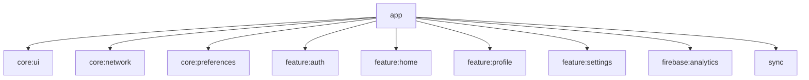

# Module :app

Main application module that coordinates feature modules and handles app-level configuration.

## Dependencies Graph



## Key Features

- Main application
- Feature coordination
- Analytics setup
- Splash screen
- Version management
- ProGuard rules

## MainActivity Responsibilities

The `MainActivity` (located at `app/src/main/kotlin/dev/atick/compose/MainActivity.kt`) serves as the entry point for the app and handles several critical responsibilities:

### Lifecycle Management

- **Splash Screen**: Manages the splash screen display using AndroidX SplashScreen API
  - Keeps splash visible until UI state is loaded (`viewModel.uiState.value.loading`)
  - Prevents jarring transitions on app launch

- **Theme Observation**: Monitors system theme changes and user preferences
  - Uses `repeatOnLifecycle(Lifecycle.State.STARTED)` to safely collect flows
  - Combines `isSystemInDarkTheme()` with user preferences
  - Automatically updates theme when system or user preference changes

- **Permission Requests**: Handles runtime permission requests
  - Android 13+ (Tiramisu): Requests `POST_NOTIFICATIONS` permission
  - Uses `checkForPermissions()` extension for clean permission handling

### Theme Application

The activity manages both system theme and user-controlled theme settings:

```kotlin
// Theme settings are mutable state tracked inside composition
var themeSettings by mutableStateOf(
    ThemeSettings(darkTheme = resources.configuration.isSystemInDarkTheme)
)

// Combine system theme with user preferences
combine(
    isSystemInDarkTheme(),
    viewModel.uiState,
) { isSystemDark, uiState ->
    ThemeSettings(
        darkTheme = shouldUseDarkTheme(isSystemDark, uiState),
        disableDynamicTheming = shouldDisableDynamicTheming(uiState),
    )
}
```

**Theme Resolution Logic**:
- `DarkThemeConfigPreferences.FOLLOW_SYSTEM` → Uses system theme
- `DarkThemeConfigPreferences.LIGHT` → Forces light theme
- `DarkThemeConfigPreferences.DARK` → Forces dark theme

**Dynamic Color Control**:
- Respects user's `useDynamicColor` preference from `UserDataPreferences`
- Enables/disables Material You dynamic theming based on user choice

### Navigation Setup

- **Root Composable**: Sets up `JetpackApp` with required state
  - Calculates window size class for adaptive layouts
  - Passes user authentication state
  - Passes user profile picture URI
  - Injects network utilities and crash reporter

- **App State Management**: Creates `JetpackAppState` with:
  ```kotlin
  val appState = rememberJetpackAppState(
      isUserLoggedIn = isUserLoggedIn(uiState),
      userProfilePictureUri = getUserProfilePictureUri(uiState),
      windowSizeClass = calculateWindowSizeClass(this),
      networkUtils = networkUtils,
      crashReporter = crashReporter,
  )
  ```

### System UI Configuration

- **Edge-to-Edge Display**: Enables edge-to-edge rendering with proper insets handling
  - Transparent status bar and navigation bar
  - Automatic light/dark scrim based on theme
  - Allows Compose to handle IME animations and system insets

```kotlin
enableEdgeToEdge(
    statusBarStyle = SystemBarStyle.auto(
        lightScrim = android.graphics.Color.TRANSPARENT,
        darkScrim = android.graphics.Color.TRANSPARENT,
    ) { darkTheme },
    navigationBarStyle = SystemBarStyle.auto(
        lightScrim = lightScrim,
        darkScrim = darkScrim,
    ) { darkTheme },
)
```

**System Bar Scrims**:
- Light scrim: `Color.argb(0xe6, 0xFF, 0xFF, 0xFF)` (90% white)
- Dark scrim: `Color.argb(0x80, 0x1b, 0x1b, 0x1b)` (50% dark gray)
- Scrims match AndroidX and platform defaults for consistency

### Dependency Injection

The activity uses Hilt to inject:
- `MainActivityViewModel` - Provides `UserDataPreferences` state
- `NetworkUtils` - Network connectivity monitoring
- `CrashReporter` - Firebase Crashlytics integration

> [!IMPORTANT]
> MainActivity extends `AppCompatActivity` (not `ComponentActivity`) to support `setApplicationLocales` for backward-compatible language selection. The activity uses `android:theme="@style/Theme.AppCompat"` in the manifest to prevent crashes. For Android 13+ (T+), you can use Framework APIs with `ComponentActivity`.

## Version Management

```kotlin
// ... build.gradle.kts ...
// ... Application Version ...
val majorUpdateVersion = 1
val minorUpdateVersion = 0
val patchVersion = 0

val mVersionCode = majorUpdateVersion.times(10_000)
    .plus(minorUpdateVersion.times(100))
    .plus(patchVersion)
```

## Related Documentation

- [Navigation Deep Dive](../docs/navigation.md) - Type-safe navigation patterns and implementation
- [Architecture Overview](../docs/architecture.md) - Overall application architecture and design decisions
- [Dependency Injection Guide](../docs/dependency-injection.md) - Comprehensive Hilt setup and patterns