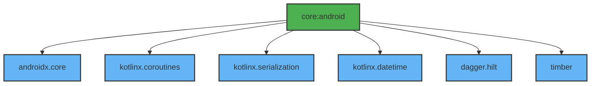

# Module :core:android

**Purpose:** Provides essential Android utilities, extension functions, coroutine utilities, and
dependency injection setup for the entire application.

## Overview

The `core:android` module serves as the foundation for common Android functionality across all
modules. It contains utilities that don't depend on UI or domain-specific logic, making it the
lowest-level shared module in the application.

## Key Concepts

### 1. Coroutine Utilities

- **`suspendRunCatching`**: Safer alternative to `runCatching` for suspend functions
- **`suspendCoroutineWithTimeout`**: Timeout-aware coroutine suspension
- Thread-safe error handling for asynchronous operations

### 2. State Management Primitives

- **`OneTimeEvent`**: Thread-safe wrapper for one-time events (navigation, messages)
- **`Resource`**: Offline-first data wrapper with Success/Error/Loading states
- **`networkBoundResource`**: Complete offline-first pattern implementation

### 3. Extension Functions

- **Flow Extensions**: `stateInDelayed` for performance optimization
- **String Extensions**: Email, password, full name validation
- **Number Extensions**: Formatting, timestamp conversion
- **Context Extensions**: Activity retrieval, resource access
- **Throwable Extensions**: Error message extraction, state management integration

### 4. Dependency Injection (Hilt)

- **Dispatcher Qualifiers**: `@IoDispatcher`, `@DefaultDispatcher`, `@MainDispatcher`
- Always use injected dispatchers for testability and consistency

## When to Use This Module

**Use `core:android` when:**

- You need Android-specific utilities (Context, Resources)
- Working with coroutines and need timeout or safe error handling
- Implementing repositories with offline-first patterns
- Validating user input (email, password, names)
- Managing one-time events (navigation, snackbar messages)
- Need thread-safe dispatchers for background work

**Don't use `core:android` for:**

- UI components or Compose utilities (use `core:ui`)
- Network operations (use `core:network`)
- Database operations (use `core:room`)
- Preferences/settings (use `core:preferences`)

## Common Patterns

### Repository with Offline-First Pattern

```kotlin
class MyRepositoryImpl @Inject constructor(
    private val localDataSource: LocalDataSource,
    private val networkDataSource: NetworkDataSource,
    @IoDispatcher private val ioDispatcher: CoroutineDispatcher
) : MyRepository {
    override fun getData(): Flow<Resource<List<Data>>> = networkBoundResource(
        query = { localDataSource.observeData() },
        fetch = { networkDataSource.getData() },
        saveFetchResult = { networkData ->
            localDataSource.saveData(networkData)
        },
        shouldFetch = { true }
    )
}
```

### ViewModel with OneTimeEvent

```kotlin
@HiltViewModel
class MyViewModel @Inject constructor(
    private val repository: MyRepository
) : ViewModel() {
    private val _uiState = MutableStateFlow(
        UiState(
            data = MyScreenData(),
            error = OneTimeEvent(null)
        )
    )
    val uiState = _uiState.asStateFlow()
}
```

### Using Injected Dispatchers

```kotlin
class MyDataSource @Inject constructor(
    @IoDispatcher private val ioDispatcher: CoroutineDispatcher
) {
    suspend fun fetchData() = withContext(ioDispatcher) {
        // IO operation
    }
}
```

## Dependencies Graph



## API Documentation

For detailed API documentation, see the [Dokka-generated API reference](../../docs/api/).

Key APIs:

- [CoroutineUtils](../../docs/api/core/android/dev.atick.core.android.utils/-coroutine-utils.html)
- [OneTimeEvent](../../docs/api/core/android/dev.atick.core.android.utils/-one-time-event.html)
- [Resource](../../docs/api/core/android/dev.atick.core.android.utils/-resource.html)
- [Extension Functions](../../docs/api/core/android/dev.atick.core.android.extensions/)

## Related Documentation

- [Quick Reference Guide](../../docs/quick-reference.md) - Common patterns and utilities
- [State Management Guide](../../docs/state-management.md) - UiState and state management patterns
- [Architecture Overview](../../docs/architecture.md) - Overall application architecture

## Usage

This module is typically used as a dependency in other modules that require Android functionality:

```kotlin
dependencies {
    implementation(project(":core:android"))
}
```

All dependencies in this module are exposed as `api` to make them available to dependent modules.