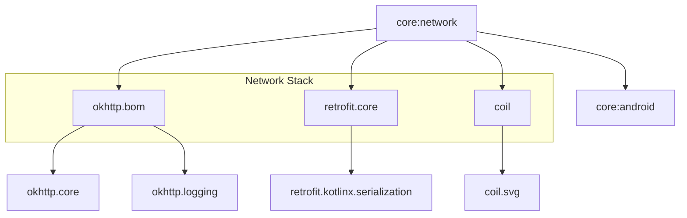

# Module :core:network

**Purpose:** Provides network communication infrastructure, REST API setup, and network monitoring
for the entire application.

## Overview

The `core:network` module handles all network-related operations including HTTP communication via
Retrofit and OkHttp. It provides standardized patterns for making API calls, handling network
errors, and managing network state.

## Key Concepts

### 1. Network Data Source Pattern

- **`NetworkDataSource`**: Interface for network operations
- Clean separation between network and repository layers
- Automatic error handling with Kotlin Result
- Thread-safe with injected IO dispatcher

### 2. Retrofit Configuration

- Kotlin serialization for JSON parsing
- OkHttp interceptors for logging and authentication
- Base URL configuration via BuildConfig
- Timeout and retry policies

### 3. Network Utilities

- **`NetworkUtils`**: Connectivity monitoring
- Network state observation with Flow
- Offline detection for caching strategies

## When to Use This Module

**Use `core:network` when:**

- Making REST API calls
- Need network connectivity monitoring
- Implementing remote data sources
- Need HTTP interceptors (auth, logging)
- Loading images from network

**Don't use `core:network` for:**

- Local database operations (use `core:room`)
- Local preferences (use `core:preferences`)
- UI components (use `core:ui`)
- Firebase operations (use `firebase:*` modules)

## Common Patterns

### Implementing a Network Data Source

```kotlin
interface UserNetworkDataSource {
    suspend fun getUsers(): List<UserDto>
    suspend fun getUserById(id: String): UserDto
    suspend fun updateUser(user: UserDto): UserDto
}

class RetrofitUserNetworkDataSource @Inject constructor(
    private val api: UserApi,
    @IoDispatcher private val ioDispatcher: CoroutineDispatcher
) : UserNetworkDataSource {
    override suspend fun getUsers(): List<UserDto> = withContext(ioDispatcher) {
        api.getUsers()
    }

    override suspend fun getUserById(id: String): UserDto = withContext(ioDispatcher) {
        api.getUserById(id)
    }

    override suspend fun updateUser(user: UserDto): UserDto = withContext(ioDispatcher) {
        api.updateUser(user)
    }
}
```

### Repository Using Network Data Source

```kotlin
class UserRepositoryImpl @Inject constructor(
    private val networkDataSource: UserNetworkDataSource,
    private val localDataSource: LocalDataSource
) : UserRepository {
    override suspend fun syncUsers(): Result<Unit> = suspendRunCatching {
        val networkUsers = networkDataSource.getUsers()
        localDataSource.saveUsers(networkUsers.map { it.toEntity() })
    }
}
```

### Network State Monitoring

```kotlin
@HiltViewModel
class MyViewModel @Inject constructor(
    private val networkUtils: NetworkUtils
) : ViewModel() {
    val isOnline: StateFlow<Boolean> = networkUtils.isNetworkAvailable
        .stateIn(viewModelScope, SharingStarted.WhileSubscribed(5000), false)
}
```

### Defining API Interface

```kotlin
interface UserApi {
    @GET("users")
    suspend fun getUsers(): List<UserDto>

    @GET("users/{id}")
    suspend fun getUserById(@Path("id") id: String): UserDto

    @PUT("users/{id}")
    suspend fun updateUser(@Body user: UserDto): UserDto
}
```

## Dependencies Graph



## Secret Management

This module uses the Gradle Secrets plugin to manage API keys and endpoints securely:

```properties
# secrets.defaults.properties (version controlled)
apiKey=dummy-key
apiEndpoint=https://example.com
# local.properties (not version controlled, add your real secrets)
apiKey=actual-secret-key
apiEndpoint=actual-endpoint
```

Access in code via BuildConfig:

```kotlin
BuildConfig.API_KEY
BuildConfig.API_ENDPOINT
```

## API Documentation

For detailed API documentation, see the [Dokka-generated API reference](../../docs/api/).

Key APIs:

- [NetworkUtils](../../docs/api/core/network/dev.atick.core.network.utils/-network-utils.html)
- [NetworkDataSource](../../docs/api/core/network/dev.atick.core.network.model/-network-data-source.html)

## Related Documentation

- [Quick Reference Guide](../../docs/quick-reference.md) - Common patterns and utilities
- [Architecture Overview](../../docs/architecture.md) - Overall application architecture

## Error Handling

Network data sources throw exceptions on errors, which are caught by repositories using `suspendRunCatching`:

```kotlin
override suspend fun getData(): Result<Data> = suspendRunCatching {
    networkDataSource.getData()  // Throws on network error
}
```

For comprehensive error handling patterns including HTTP error codes, error flow diagrams, and ViewModel/UI error handling, see:

> [!NOTE]
> Complete error handling documentation is available in the [Data Module README](../../data/README.md#error-handling).

## Best Practices

1. **Always use injected `@IoDispatcher`** for network operations
2. **Keep DTOs in network module**, convert to domain models in repositories
3. **Use `suspendRunCatching`** in repositories for error handling
4. **Check network state** before making non-critical requests
5. **Implement offline-first** patterns using `Resource` and `networkBoundResource`

## Usage

This module is used by the `data` module and feature modules that need network access:

```kotlin
dependencies {
    implementation(project(":core:network"))
}
```