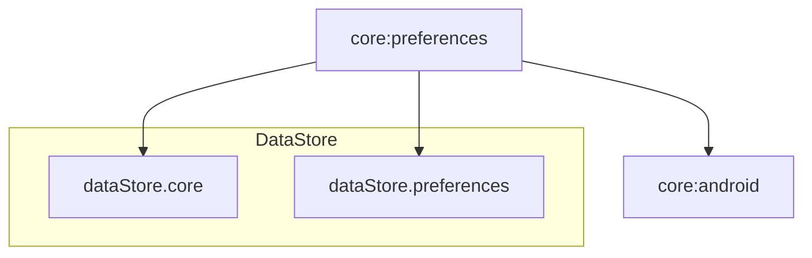

# Module :core:preferences

**Purpose:** Provides type-safe local preferences storage using DataStore for user settings and app
configuration.

## Overview

The `core:preferences` module handles lightweight data persistence using Jetpack DataStore. It
provides reactive, type-safe access to user preferences like theme settings, authentication tokens,
and app configuration.

## Key Concepts

### 1. DataStore Preferences

- **Type-safe** storage with Kotlin serialization
- **Reactive** updates with Flow
- **Transactional** updates (all-or-nothing)
- **No runtime exceptions** (unlike SharedPreferences)

### 2. User Preferences Data Source

- **`UserPreferencesDataSource`**: Interface for preference operations
- Centralized preference management
- Observable preference changes
- Clean separation from business logic

### 3. Preference Types

- Simple values (Boolean, Int, String)
- Enums (Theme, Language)
- Custom serializable objects
- Nullable preferences

## When to Use This Module

**Use `core:preferences` when:**

- Storing user settings (theme, language, notifications)
- Persisting authentication tokens
- Saving simple app configuration
- Need reactive preference updates
- Storing lightweight key-value data

**Don't use `core:preferences` for:**

- Large datasets (use `core:room`)
- Complex relational data (use `core:room`)
- Temporary state (use StateFlow in ViewModels)
- Sensitive data without encryption (use EncryptedSharedPreferences)

## Common Patterns

### Defining Preferences Data Class

```kotlin
@Serializable
data class UserPreferences(
    val themeMode: ThemeMode = ThemeMode.SYSTEM,
    val notificationsEnabled: Boolean = true,
    val authToken: String? = null,
    val userId: String? = null,
    val lastSyncTimestamp: Long? = null
)

@Serializable
enum class ThemeMode {
    LIGHT, DARK, SYSTEM
}
```

### Implementing Preferences Data Source

```kotlin
interface UserPreferencesDataSource {
    val preferences: Flow<UserPreferences>
    suspend fun updateThemeMode(mode: ThemeMode)
    suspend fun setAuthToken(token: String?)
    suspend fun setUserId(userId: String?)
    suspend fun clearAuthData()
}

class DataStoreUserPreferencesDataSource @Inject constructor(
    private val dataStore: DataStore<UserPreferences>
) : UserPreferencesDataSource {
    override val preferences: Flow<UserPreferences> = dataStore.data

    override suspend fun updateThemeMode(mode: ThemeMode) {
        dataStore.updateData { prefs ->
            prefs.copy(themeMode = mode)
        }
    }

    override suspend fun setAuthToken(token: String?) {
        dataStore.updateData { prefs ->
            prefs.copy(authToken = token)
        }
    }

    override suspend fun setUserId(userId: String?) {
        dataStore.updateData { prefs ->
            prefs.copy(userId = userId)
        }
    }

    override suspend fun clearAuthData() {
        dataStore.updateData { prefs ->
            prefs.copy(
                authToken = null,
                userId = null
            )
        }
    }
}
```

### Using Preferences in Repository

```kotlin
class SettingsRepositoryImpl @Inject constructor(
    private val preferencesDataSource: UserPreferencesDataSource
) : SettingsRepository {
    override fun observeThemeMode(): Flow<ThemeMode> =
        preferencesDataSource.preferences.map { it.themeMode }

    override suspend fun setThemeMode(mode: ThemeMode): Result<Unit> = suspendRunCatching {
        preferencesDataSource.updateThemeMode(mode)
    }
}
```

### Using Preferences in ViewModel

```kotlin
@HiltViewModel
class SettingsViewModel @Inject constructor(
    private val repository: SettingsRepository
) : ViewModel() {
    val themeMode: StateFlow<ThemeMode> = repository.observeThemeMode()
        .stateIn(viewModelScope, SharingStarted.WhileSubscribed(5000), ThemeMode.SYSTEM)

    fun updateTheme(mode: ThemeMode) {
        _uiState.updateWith {
            repository.setThemeMode(mode)
        }
    }
}
```

### Authentication State Management

```kotlin
class AuthRepositoryImpl @Inject constructor(
    private val preferencesDataSource: UserPreferencesDataSource
) : AuthRepository {
    override fun isAuthenticated(): Flow<Boolean> =
        preferencesDataSource.preferences.map { prefs ->
            prefs.authToken != null && prefs.userId != null
        }

    override suspend fun saveAuthSession(token: String, userId: String): Result<Unit> =
        suspendRunCatching {
            preferencesDataSource.setAuthToken(token)
            preferencesDataSource.setUserId(userId)
        }

    override suspend fun clearAuthSession(): Result<Unit> = suspendRunCatching {
        preferencesDataSource.clearAuthData()
    }
}
```

## Dependencies Graph



## DataStore Setup

### Providing DataStore Instance

```kotlin
@Module
@InstallIn(SingletonComponent::class)
object PreferencesModule {
    @Provides
    @Singleton
    fun provideUserPreferencesDataStore(
        @ApplicationContext context: Context
    ): DataStore<UserPreferences> {
        return DataStoreFactory.create(
            serializer = UserPreferencesSerializer,
            produceFile = { context.dataStoreFile("user_preferences.json") }
        )
    }
}
```

### Custom Serializer

```kotlin
object UserPreferencesSerializer : Serializer<UserPreferences> {
    override val defaultValue: UserPreferences = UserPreferences()

    override suspend fun readFrom(input: InputStream): UserPreferences {
        return try {
            Json.decodeFromString(
                UserPreferences.serializer(),
                input.readBytes().decodeToString()
            )
        } catch (e: SerializationException) {
            defaultValue
        }
    }

    override suspend fun writeTo(t: UserPreferences, output: OutputStream) {
        output.write(
            Json.encodeToString(UserPreferences.serializer(), t).encodeToByteArray()
        )
    }
}
```

## API Documentation

For detailed API documentation, see the [Dokka-generated API reference](../../docs/api/).

Key APIs:

- [UserPreferencesDataSource](../../docs/api/core/preferences/dev.atick.core.preferences.utils/-user-preferences-data-source.html)
- [UserPreferences](../../docs/api/core/preferences/dev.atick.core.preferences.model/-user-preferences.html)

## Related Documentation

- [Quick Reference Guide](../../docs/quick-reference.md) - Common patterns and utilities
- [Architecture Overview](../../docs/architecture.md) - Overall application architecture

## DataStore vs SharedPreferences

**Use DataStore (this module) for:**

- Type safety
- Asynchronous operations
- Error handling with Flow
- Data consistency guarantees
- Support for complex objects

**Use SharedPreferences for:**

- Legacy code only
- Not recommended for new features

## Best Practices

1. **Define a single data class** for all preferences (avoid multiple DataStores)
2. **Use `updateData` for atomic updates** (multiple fields)
3. **Observe with Flow** for reactive UI updates
4. **Handle serialization errors** gracefully (return defaultValue)
5. **Keep preferences lightweight** (move large data to Room)
6. **Don't block UI thread** (DataStore is async-only)
7. **Use enum types** for limited option sets (theme, language)
8. **Provide sensible defaults** in data class

## ProGuard Rules

ProGuard rules are included for serialization support:

```proguard
-keep class dev.atick.core.preferences.model.** { *; }
-keepclassmembers class dev.atick.core.preferences.model.** {
    <init>(...);
}
```

## Usage

This module is used by the `data` module and feature modules that need preferences:

```kotlin
dependencies {
    implementation(project(":core:preferences"))
}
```