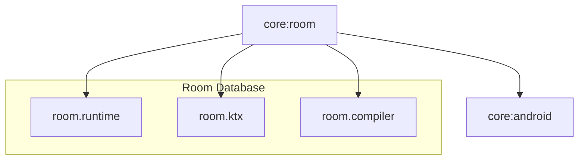

# Module :core:room

**Purpose:** Provides local database infrastructure using Room ORM for offline-first data
persistence and caching.

## Overview

The `core:room` module handles all local database operations using Room. It provides type-safe
database access, reactive queries with Flow, and supports the offline-first architecture pattern
with sync metadata.

## Key Concepts

### 1. Local Data Source Pattern

- **`LocalDataSource`**: Interface for database operations
- Clean separation between database and repository layers
- Observable queries with Kotlin Flow
- Thread-safe with injected IO dispatcher

### 2. Sync-Aware Entities

- **`JetpackEntity`**: Base entity with sync metadata
- Sync state tracking (`SyncAction`: NONE, CREATE, UPDATE, DELETE)
- Timestamp management (`lastUpdated`, `lastSynced`)
- Soft delete support with `deleted` flag

### 3. Room Database

- SQLite wrapper with compile-time query verification
- Type converters for complex data types
- Database migrations
- Automatic DAO generation

## When to Use This Module

**Use `core:room` when:**

- Storing data locally for offline access
- Implementing caching strategies
- Need reactive database queries
- Tracking sync state for bidirectional sync
- Implementing offline-first patterns

**Don't use `core:room` for:**

- Network operations (use `core:network`)
- Simple preferences (use `core:preferences`)
- UI state (use StateFlow in ViewModels)
- Temporary data (use in-memory collections)

## Common Patterns

### Defining an Entity with Sync Metadata

```kotlin
@Entity(tableName = "users")
data class UserEntity(
    @PrimaryKey val id: String,
    val name: String,
    val email: String,

    // Sync metadata (from JetpackEntity pattern)
    val lastUpdated: Long = System.currentTimeMillis(),
    val lastSynced: Long? = null,
    val deleted: Boolean = false,
    val syncAction: SyncAction = SyncAction.NONE
)
```

### Implementing a Local Data Source

```kotlin
interface UserLocalDataSource {
    fun observeUsers(): Flow<List<UserEntity>>
    fun observeUserById(id: String): Flow<UserEntity?>
    suspend fun saveUsers(users: List<UserEntity>)
    suspend fun markAsDeleted(id: String)
    fun getUnsyncedUsers(): Flow<List<UserEntity>>
}

class RoomUserLocalDataSource @Inject constructor(
    private val dao: UserDao,
    @IoDispatcher private val ioDispatcher: CoroutineDispatcher
) : UserLocalDataSource {
    override fun observeUsers(): Flow<List<UserEntity>> =
        dao.observeUsers()

    override fun observeUserById(id: String): Flow<UserEntity?> =
        dao.observeUserById(id)

    override suspend fun saveUsers(users: List<UserEntity>) = withContext(ioDispatcher) {
        dao.insertUsers(users)
    }

    override suspend fun markAsDeleted(id: String) = withContext(ioDispatcher) {
        dao.updateUser(
            dao.getUserById(id).copy(
                deleted = true,
                syncAction = SyncAction.DELETE,
                lastUpdated = System.currentTimeMillis()
            )
        )
    }

    override fun getUnsyncedUsers(): Flow<List<UserEntity>> =
        dao.observeUnsyncedUsers()
}
```

### Defining a DAO

```kotlin
@Dao
interface UserDao {
    @Query("SELECT * FROM users WHERE deleted = 0")
    fun observeUsers(): Flow<List<UserEntity>>

    @Query("SELECT * FROM users WHERE id = :id AND deleted = 0")
    fun observeUserById(id: String): Flow<UserEntity?>

    @Query("SELECT * FROM users WHERE syncAction != 'NONE'")
    fun observeUnsyncedUsers(): Flow<List<UserEntity>>

    @Insert(onConflict = OnConflictStrategy.REPLACE)
    suspend fun insertUsers(users: List<UserEntity>)

    @Update
    suspend fun updateUser(user: UserEntity)

    @Query("DELETE FROM users WHERE id = :id")
    suspend fun deleteUser(id: String)
}
```

### Repository with Offline-First Pattern

```kotlin
class UserRepositoryImpl @Inject constructor(
    private val localDataSource: UserLocalDataSource,
    private val networkDataSource: UserNetworkDataSource
) : UserRepository {
    // Observe local data (single source of truth)
    override fun observeUsers(): Flow<List<User>> =
        localDataSource.observeUsers()
            .map { entities -> entities.map { it.toDomain() } }

    // Sync with network
    override suspend fun syncUsers(): Result<Unit> = suspendRunCatching {
        // Pull from network
        val networkUsers = networkDataSource.getUsers()
        localDataSource.saveUsers(
            networkUsers.map { it.toEntity().copy(lastSynced = System.currentTimeMillis()) }
        )

        // Push local changes
        localDataSource.getUnsyncedUsers().first().forEach { entity ->
            when (entity.syncAction) {
                SyncAction.CREATE -> networkDataSource.createUser(entity.toDto())
                SyncAction.UPDATE -> networkDataSource.updateUser(entity.toDto())
                SyncAction.DELETE -> networkDataSource.deleteUser(entity.id)
                SyncAction.NONE -> Unit
            }
        }
    }
}
```

## Dependencies Graph



## Sync Metadata Explained

### SyncAction Enum

```kotlin
enum class SyncAction {
    NONE,     // No pending changes
    CREATE,   // Needs to be created on server
    UPDATE,   // Needs to be updated on server
    DELETE    // Needs to be deleted on server
}
```

### Timestamp Fields

- **`lastUpdated`**: Local modification timestamp
- **`lastSynced`**: Last successful server sync timestamp
- **`deleted`**: Soft delete flag (preserves data for sync)

### Soft Delete Pattern

Instead of deleting records immediately:

```kotlin
// Mark as deleted (preserves for sync)
suspend fun deleteUser(id: String) {
    val user = dao.getUserById(id)
    dao.updateUser(
        user.copy(
            deleted = true,
            syncAction = SyncAction.DELETE,
            lastUpdated = System.currentTimeMillis()
        )
    )
}

// After successful server sync, hard delete
suspend fun cleanupDeletedUsers() {
    dao.deleteDeletedUsers()  // WHERE deleted = 1 AND syncAction = 'NONE'
}
```

## Database Migrations

Room requires migrations when schema changes:

```kotlin
val MIGRATION_1_2 = object : Migration(1, 2) {
    override fun migrate(database: SupportSQLiteDatabase) {
        database.execSQL("ALTER TABLE users ADD COLUMN age INTEGER NOT NULL DEFAULT 0")
    }
}

@Provides
@Singleton
fun provideDatabase(@ApplicationContext context: Context): AppDatabase {
    return Room.databaseBuilder(
        context,
        AppDatabase::class.java,
        "app-database"
    )
        .addMigrations(MIGRATION_1_2)
        .build()
}
```

## API Documentation

For detailed API documentation, see the [Dokka-generated API reference](../../docs/api/).

Key APIs:

- [LocalDataSource](../../docs/api/core/room/dev.atick.core.room.utils/-local-data-source.html)
- [JetpackEntity](../../docs/api/core/room/dev.atick.core.room.entity/-jetpack-entity.html)
- [SyncAction](../../docs/api/core/room/dev.atick.core.room.utils/-sync-action.html)

## Related Documentation

- [Quick Reference Guide](../../docs/quick-reference.md) - Common patterns and utilities
- [Architecture Overview](../../docs/architecture.md) - Overall application architecture
- [Sync Module](../../sync/README.md) - WorkManager-based bidirectional sync

## Best Practices

1. **Always use injected `@IoDispatcher`** for database operations
2. **Use Flow for reactive queries**, StateFlow for single values
3. **Implement soft delete** for sync-enabled entities
4. **Track sync state** with SyncAction for bidirectional sync
5. **Query only non-deleted records** in DAOs (`WHERE deleted = 0`)
6. **Update `lastUpdated`** on every local modification
7. **Update `lastSynced`** after successful server sync
8. **Use `@Transaction`** for multi-step database operations

## Usage

This module is used by the `data` module for local data persistence:

```kotlin
dependencies {
    implementation(project(":core:room"))
}
```