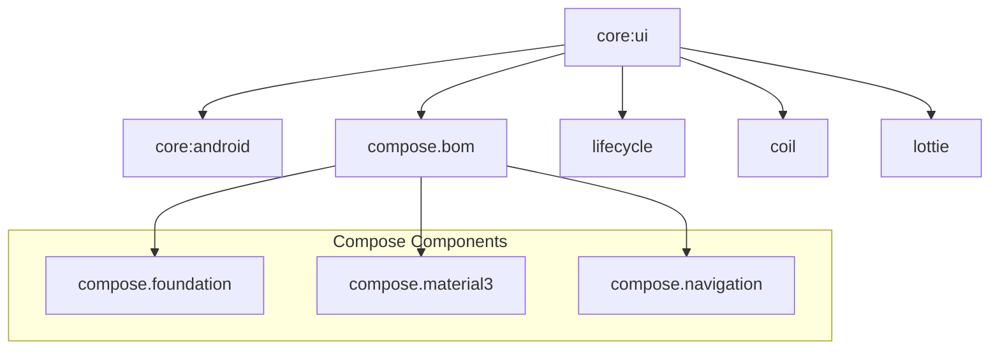

# Module :core:ui

**Purpose:** Provides UI components, state management utilities, Compose helpers, and Material3
theming for the entire application.

## Overview

The `core:ui` module contains everything related to the user interface layer that is shared across
features. This includes the state management pattern (`UiState`, `StatefulComposable`), common
Compose components, Material3 theme, and UI utilities.

## Key Concepts

### 1. State Management Pattern

- **`UiState<T>`**: Wrapper for screen state with loading, data, and error
- **`StatefulComposable`**: Centralized loading and error handling for all screens
- **State Update Functions**: `updateState`, `updateStateWith`, `updateWith` with Kotlin context
  parameters
- **`OneTimeEvent`**: Thread-safe one-time event handling for navigation and messages

### 2. UI Utilities

- **`UiText`**: Type-safe, testable text handling (strings, resources, dynamic)
- **`SnackbarAction`**: Standardized snackbar action pattern
- **`TextFieldData`**: Form field state management with validation
- **Preview Annotations**: `@PreviewDevices`, `@PreviewThemes` for multi-configuration previews

### 3. Compose Extensions

- **Activity Extensions**: Activity results, permissions, dark theme detection
- **Lifecycle Extensions**: Flow collection, LiveData observation with lifecycle awareness

### 4. Theme System

- **Material3 Design System**: Complete theme with dynamic colors
- **Typography**: Predefined text styles
- **Color Schemes**: Light and dark themes

## When to Use This Module

**Use `core:ui` when:**

- Building screens with Jetpack Compose
- Managing screen state with UiState pattern
- Need common UI components (buttons, text fields, etc.)
- Implementing loading and error states
- Working with type-safe text (UiText)
- Need Material3 theming
- Requesting permissions or activity results

**Don't use `core:ui` for:**

- Non-UI utilities (use `core:android`)
- Network operations (use `core:network`)
- Database operations (use `core:room`)
- Business logic (implement in repositories/ViewModels)

## Common Patterns

### Screen with State Management

```kotlin
// Screen data class
data class MyScreenData(
    val items: List<Item> = emptyList(),
    val selectedId: String? = null
)

// ViewModel
@HiltViewModel
class MyViewModel @Inject constructor(
    private val repository: MyRepository
) : ViewModel() {
    private val _uiState = MutableStateFlow(UiState(MyScreenData()))
    val uiState = _uiState.asStateFlow()

    fun loadData() {
        _uiState.updateStateWith {
            repository.getData()
        }
    }

    fun selectItem(id: String) {
        _uiState.updateState {
            copy(selectedId = id)
        }
    }
}

// Route composable (connects to ViewModel)
@Composable
fun MyRoute(
    onShowSnackbar: suspend (String, SnackbarAction, Throwable?) -> Boolean,
    viewModel: MyViewModel = hiltViewModel()
) {
    val uiState by viewModel.uiState.collectAsStateWithLifecycle()

    StatefulComposable(
        state = uiState,
        onShowSnackbar = onShowSnackbar
    ) { screenData ->
        MyScreen(
            screenData = screenData,
            onLoadData = viewModel::loadData,
            onSelectItem = viewModel::selectItem
        )
    }
}

// Screen composable (pure UI, no ViewModel)
@Composable
private fun MyScreen(
    screenData: MyScreenData,
    onLoadData: () -> Unit,
    onSelectItem: (String) -> Unit
) {
    // UI implementation
}
```

### Type-Safe Text Handling

```kotlin
// ViewModel
fun validateInput(text: String) {
    val errorMessage = if (text.isBlank()) {
        UiText.StringResource(R.string.error_empty_field)
    } else {
        null
    }
    _uiState.updateState {
        copy(error = OneTimeEvent(errorMessage))
    }
}

// Composable
@Composable
fun MyComposable(errorMessage: UiText?) {
    errorMessage?.let {
        Text(text = it.asString())
    }
}
```

### Permission Handling

```kotlin
// Activity or Fragment
val permissionLauncher = rememberLauncherForActivityResult(
    contract = ActivityResultContracts.RequestPermission()
) { isGranted ->
    if (isGranted) {
        // Permission granted
    }
}

// Or use the high-level helper
checkForPermissions(
    permissions = arrayOf(Manifest.permission.CAMERA),
    onGranted = { /* All permissions granted */ },
    onDenied = { /* Handle denial */ }
)
```

## Dependencies Graph



## API Documentation

For detailed API documentation, see the [Dokka-generated API reference](../../docs/api/).

Key APIs:

- [StatefulComposable & UiState](../../docs/api/core/ui/dev.atick.core.ui.utils/-stateful-composable.html)
- [UiText](../../docs/api/core/ui/dev.atick.core.ui.utils/-ui-text.html)
- [UI Extensions](../../docs/api/core/ui/dev.atick.core.ui.extensions/)
- [Theme System](../../docs/api/core/ui/dev.atick.core.ui.theme/)

## Related Documentation

- [Component Usage Guide](../../docs/components.md) - Detailed guide for all UI components
- [State Management Guide](../../docs/state-management.md) - Complete state management deep dive
- [Quick Reference Guide](../../docs/quick-reference.md) - Common patterns cheat sheet
- [Architecture Overview](../../docs/architecture.md) - Overall application architecture

## Philosophy

### Separation of Concerns

This module enforces a clear separation between:

- **Route composables**: Connect to ViewModels, handle state observation
- **Screen composables**: Pure UI, no ViewModel dependency, fully testable

### Centralized Error Handling

`StatefulComposable` ensures:

- Consistent loading indicators across all screens
- Standardized error messages via snackbar
- One-time event consumption (no duplicate messages)

### Testable UI

By using `UiText` instead of direct strings:

- ViewModels don't need Context
- Business logic is fully testable
- Localization is handled at the UI layer

## Usage

This module is used by all feature modules that require UI components:

```kotlin
dependencies {
    implementation(project(":core:ui"))
}
```

All UI dependencies are exposed as `api` to ensure consistent versioning across the app.