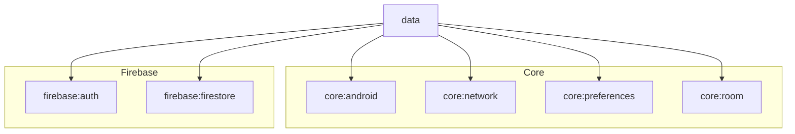

# Module :data

**Purpose:** Provides repository implementations that coordinate between local and remote data
sources, implementing the single source of truth pattern.

## Overview

The `data` module is the central data management layer that implements the **Repository Pattern**.
It coordinates between local (Room, DataStore) and remote (Network, Firebase) data sources to
provide a unified, reactive API for the UI layer.

## Key Concepts

### 1. Repository Pattern

- **Single source of truth**: Local database is always the source of truth
- **Offline-first**: UI always reads from local database
- **Background sync**: Network data updates local database
- **Reactive**: Exposes data as Flow for automatic UI updates

### 2. Two-Layer Architecture

This template intentionally uses a **two-layer architecture** (UI + Data):

- **NO domain layer** by design
- ViewModels call repositories directly
- Reduces complexity and boilerplate
- Sufficient for most applications

### 3. Data Flow

```
Network/Firebase → Repository → Local Database → Flow → ViewModel → UI
                       ↓
                  Sync Logic
```

## When to Use This Module

**Use `data` module for:**

- Implementing repository interfaces
- Coordinating local and remote data sources
- Offline-first data management
- Data transformation (DTO ↔ Entity ↔ Domain Model)
- Caching strategies

**Don't use `data` module for:**

- UI logic (use feature modules)
- Direct database access (use repositories)
- Business logic without data access (consider if you need a domain layer)

## Common Patterns

### Repository Interface

```kotlin
interface UserRepository {
    // Observe data (reactive)
    fun observeUsers(): Flow<List<User>>
    fun observeUserById(id: String): Flow<User?>

    // One-shot operations
    suspend fun syncUsers(): Result<Unit>
    suspend fun createUser(user: User): Result<Unit>
    suspend fun updateUser(user: User): Result<Unit>
    suspend fun deleteUser(id: String): Result<Unit>
}
```

### Repository Implementation (Offline-First)

```kotlin
class UserRepositoryImpl @Inject constructor(
    private val localDataSource: UserLocalDataSource,
    private val networkDataSource: UserNetworkDataSource,
    @IoDispatcher private val ioDispatcher: CoroutineDispatcher
) : UserRepository {

    // UI observes local database (single source of truth)
    override fun observeUsers(): Flow<List<User>> =
        localDataSource.observeUsers()
            .map { entities -> entities.map { it.toDomain() } }

    override fun observeUserById(id: String): Flow<User?> =
        localDataSource.observeUserById(id)
            .map { it?.toDomain() }

    // Sync from network to local database
    override suspend fun syncUsers(): Result<Unit> = suspendRunCatching {
        val networkUsers = networkDataSource.getUsers()
        localDataSource.saveUsers(
            networkUsers.map { dto ->
                dto.toEntity().copy(lastSynced = System.currentTimeMillis())
            }
        )
    }

    // Create local, then sync
    override suspend fun createUser(user: User): Result<Unit> = suspendRunCatching {
        val entity = user.toEntity().copy(
            syncAction = SyncAction.CREATE,
            lastUpdated = System.currentTimeMillis()
        )
        localDataSource.saveUser(entity)
        // SyncWorker will push to server
    }

    override suspend fun updateUser(user: User): Result<Unit> = suspendRunCatching {
        val entity = user.toEntity().copy(
            syncAction = SyncAction.UPDATE,
            lastUpdated = System.currentTimeMillis()
        )
        localDataSource.saveUser(entity)
    }

    override suspend fun deleteUser(id: String): Result<Unit> = suspendRunCatching {
        localDataSource.markAsDeleted(id)
    }
}
```

### Using `networkBoundResource` Helper

```kotlin
class UserRepositoryImpl @Inject constructor(
    private val localDataSource: UserLocalDataSource,
    private val networkDataSource: UserNetworkDataSource
) : UserRepository {

    override fun observeUsers(): Flow<Resource<List<User>>> =
        networkBoundResource(
            query = {
                localDataSource.observeUsers()
                    .map { entities -> entities.map { it.toDomain() } }
            },
            fetch = {
                networkDataSource.getUsers()
            },
            saveFetchResult = { dtos ->
                localDataSource.saveUsers(dtos.map { it.toEntity() })
            },
            shouldFetch = { users ->
                // Fetch if data is stale
                users.isEmpty() || isDataStale()
            }
        )
}
```

### Data Transformation (Mappers)

```kotlin
// DTO (from network) → Entity (Room)
fun UserDto.toEntity(): UserEntity = UserEntity(
    id = id,
    name = name,
    email = email,
    lastUpdated = System.currentTimeMillis(),
    syncAction = SyncAction.NONE
)

// Entity → Domain Model
fun UserEntity.toDomain(): User = User(
    id = id,
    name = name,
    email = email
)

// Domain Model → Entity
fun User.toEntity(): UserEntity = UserEntity(
    id = id,
    name = name,
    email = email
)

// Domain Model → DTO
fun User.toDto(): UserDto = UserDto(
    id = id,
    name = name,
    email = email
)
```

## Dependencies Graph



## Hilt Module Setup

```kotlin
@Module
@InstallIn(SingletonComponent::class)
abstract class RepositoryModule {
    @Binds
    @Singleton
    abstract fun bindUserRepository(
        impl: UserRepositoryImpl
    ): UserRepository
}
```

## API Documentation

For detailed API documentation, see the [Dokka-generated API reference](../docs/api/).

## Related Documentation

- [Data Flow Guide](../docs/data-flow.md) - Comprehensive data flow patterns and examples
- [Adding a Feature Guide](../docs/guide.md) - Step-by-step guide with repository implementation example
- [Quick Reference Guide](../docs/quick-reference.md) - Repository patterns cheat sheet
- [Architecture Overview](../docs/architecture.md) - Two-layer architecture explained
- [Core Room Module](../core/room/README.md) - Local data source patterns
- [Core Network Module](../core/network/README.md) - Remote data source patterns

## Repository Patterns

### 1. Network-Only Repository

```kotlin
class RemoteOnlyRepositoryImpl @Inject constructor(
    private val networkDataSource: NetworkDataSource
) : RemoteOnlyRepository {
    override suspend fun getData(): Result<Data> = suspendRunCatching {
        networkDataSource.getData()
    }
}
```

### 2. Local-Only Repository

```kotlin
class LocalOnlyRepositoryImpl @Inject constructor(
    private val localDataSource: LocalDataSource
) : LocalOnlyRepository {
    override fun observeData(): Flow<List<Data>> =
        localDataSource.observeData()
            .map { entities -> entities.map { it.toDomain() } }
}
```

### 3. Offline-First with Manual Sync

```kotlin
class OfflineFirstRepositoryImpl @Inject constructor(
    private val localDataSource: LocalDataSource,
    private val networkDataSource: NetworkDataSource
) : OfflineFirstRepository {
    // Always observe local
    override fun observeData(): Flow<List<Data>> =
        localDataSource.observeData()
            .map { entities -> entities.map { it.toDomain() } }

    // Manual refresh
    override suspend fun refresh(): Result<Unit> = suspendRunCatching {
        val networkData = networkDataSource.getData()
        localDataSource.saveData(networkData.map { it.toEntity() })
    }
}
```

### 4. Offline-First with Automatic Sync (using `networkBoundResource`)

See example above using `networkBoundResource` helper.

## Error Handling

This template uses a **layered error handling approach** with `Result<T>` and centralized error management.

### Repository-Level Error Handling

All repository operations use `suspendRunCatching` to wrap errors in `Result<T>`:

```kotlin
override suspend fun createPost(post: Post): Result<Unit> {
    return suspendRunCatching {
        val userId = preferencesDataSource.getUserIdOrThrow()

        // This can throw exceptions
        localDataSource.upsertPost(
            post.toEntity().copy(
                userId = userId,
                lastUpdated = System.currentTimeMillis(),
                needsSync = true,
                syncAction = SyncAction.UPSERT
            )
        )

        // This can also throw
        syncManager.requestSync()
    }
}
```

> [!IMPORTANT]
> Always use `suspendRunCatching` in repositories. Never let exceptions bubble up to ViewModels.

### ViewModel-Level Error Handling

Use `updateStateWith` or `updateWith` for automatic error handling:

```kotlin
fun createPost(title: String, content: String) {
    val newPost = Post(title = title, content = content)

    // Errors are automatically caught and set in UiState.error
    _uiState.updateWith {
        postsRepository.createPost(newPost)
    }
}
```

The `updateStateWith` and `updateWith` functions automatically:
- Set `loading = true` before the operation
- Set `loading = false` after completion
- Capture exceptions and set `error` field in UiState
- Transform successful results into new state

### UI-Level Error Handling

`StatefulComposable` automatically displays errors via snackbar:

```kotlin
@Composable
fun PostsRoute(
    onShowSnackbar: suspend (String, SnackbarAction, Throwable?) -> Boolean,
    viewModel: PostsViewModel = hiltViewModel()
) {
    val uiState by viewModel.uiState.collectAsStateWithLifecycle()

    StatefulComposable(
        state = uiState,
        onShowSnackbar = onShowSnackbar // Errors are shown automatically
    ) { screenData ->
        PostsScreen(
            posts = screenData.posts,
            onCreatePost = viewModel::createPost
        )
    }
}
```

When an error occurs, `StatefulComposable`:
1. Displays a snackbar with the error message
2. Provides an optional "Retry" action
3. Logs the error for debugging
4. Maintains the current UI state (no crash)

### Network-Specific Error Handling

Handle specific network errors in repository:

```kotlin
override suspend fun syncPosts(): Result<Unit> {
    return suspendRunCatching {
        // Check network availability first
        networkUtils.getCurrentState().first().let { state ->
            if (state != NetworkState.CONNECTED) {
                throw IOException("No network connection available")
            }
        }

        // Proceed with sync
        val userId = preferencesDataSource.getUserIdOrThrow()

        // ... sync logic
    }.onFailure { error ->
        when (error) {
            is IOException -> {
                // Network error - data will sync later
                Timber.w(error, "Network error during sync, will retry later")
            }
            is HttpException -> {
                // Server error
                Timber.e(error, "Server error during sync: ${error.code()}")
            }
            else -> {
                // Unknown error
                Timber.e(error, "Unknown error during sync")
            }
        }
    }
}
```

### Common HTTP Error Codes

Network errors from Retrofit are converted to appropriate exceptions:

| Error Code | Exception Type | Meaning | Typical Action |
|------------|---------------|---------|----------------|
| 401/403 | `HttpException` | Authentication failure | Sign user out, refresh token |
| 404 | `HttpException` | Resource not found | Show "not found" message |
| 500 | `HttpException` | Server error | Retry with backoff |
| Network failure | `IOException` | No connectivity | Use cached data, retry later |

### Error Flow Diagram

```
Repository Operation
        ↓
suspendRunCatching { ... }
        ↓
    [Success or Failure]
        ↓
    Result<T>
        ↓
    ViewModel
        ↓
updateStateWith/updateWith
        ↓
    [Auto-handle Result]
        ↓
    UiState (data or error)
        ↓
StatefulComposable
        ↓
[Show content or error snackbar]
```

## Best Practices

1. **Always use `suspendRunCatching`** for error handling in repositories
2. **Return Flow for observable data**, Result<T> for one-shot operations
3. **Keep repositories focused** on data coordination (no business logic)
4. **Use injected dispatchers** from core:android
5. **Implement mapper functions** for clean data transformation
6. **Prefer local database as source of truth** for offline-first
7. **Update sync metadata** when modifying local data
8. **Return domain models** from repositories (hide DTOs and Entities)
9. **Never let exceptions escape repositories** - wrap all operations in `suspendRunCatching`
10. **Use specific error types** when possible (IOException for network, IllegalStateException for invalid states)

## Philosophy

### Why No Domain Layer?

This template follows a **pragmatic simplicity** approach:

**Two-layer architecture (UI + Data):**

- ViewModels call repositories directly
- Repositories return domain models (simple data classes)
- Reduces boilerplate and indirection
- Easier to understand and maintain

**When to add a domain layer:**

- Complex business logic that doesn't fit in repositories
- Multiple UI representations of the same data
- Shared business rules across features
- Heavy data transformation logic

For most applications, **two layers are sufficient**.

## Usage

This module is used by all feature modules that need data access:

```kotlin
dependencies {
    implementation(project(":data"))
}
```