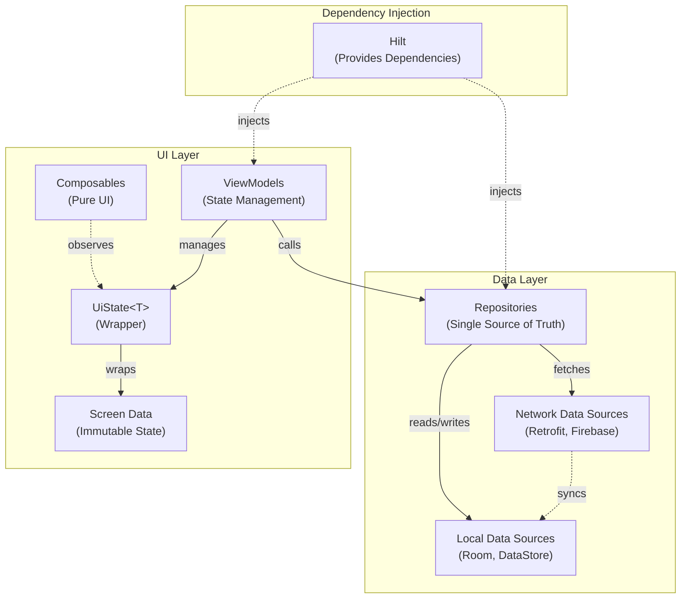
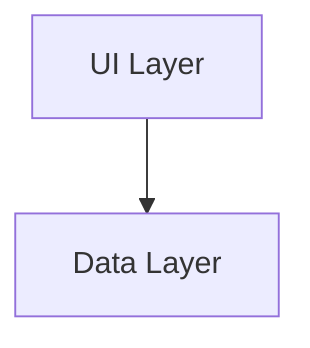
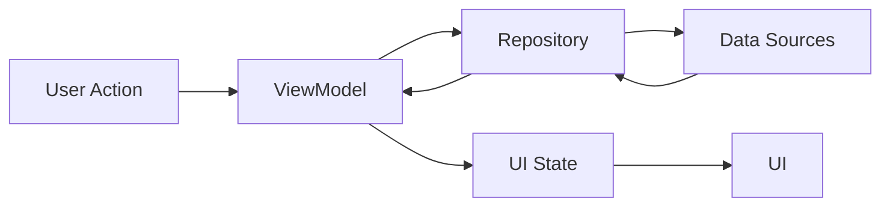
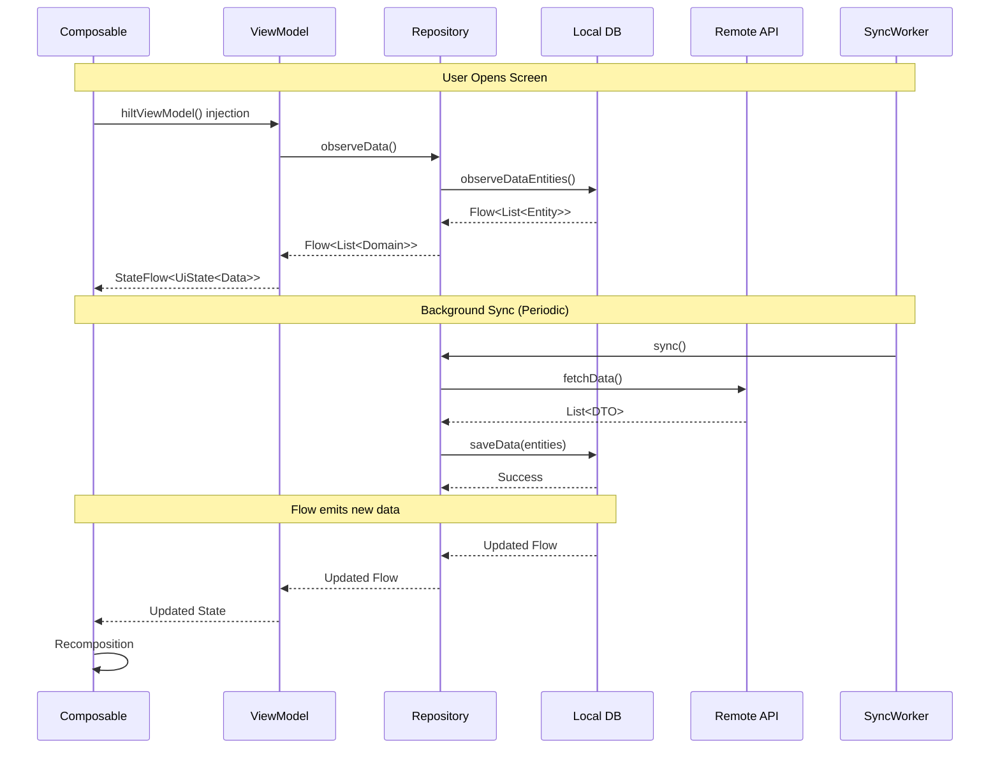

# Architecture Overview

This project follows the
official [Android Architecture Guidelines](https://developer.android.com/topic/architecture) with
some pragmatic adaptations to keep the codebase simple and maintainable.

## Architectural Principles

The architecture is built on several key principles:

1. **Separation of Concerns**: Each component has its own responsibility
2. **Single Source of Truth**: Data is managed in a single place
3. **Unidirectional Data Flow**: Data flows in one direction, events flow in the opposite
4. **State-Based UI**: UI is a reflection of the state
5. **Pragmatic Simplicity**: Complex patterns are only added when necessary

## Core Layers

The app uses a two-layer architecture:



**Simplified View**:



### UI Layer

The UI layer follows MVVM pattern and consists of:

1. **Composables**: Pure UI components built with Jetpack Compose
2. **ViewModels**: Manage UI state and business logic
3. **Screen Data**: Immutable data classes representing screen state

Example UI Layer structure:

```kotlin
data class HomeScreenData(
    val items: List<Item> = emptyList(),
    // other UI state properties
)

@HiltViewModel
class HomeViewModel @Inject constructor(
    private val repository: HomeRepository
) : ViewModel() {
    private val _uiState = MutableStateFlow(UiState(HomeScreenData()))
    val uiState = _uiState.asStateFlow()
}

@Composable
fun HomeScreen(
    screenData: HomeScreenData,
    onAction: (HomeAction) -> Unit
) {
}
```

### Data Layer

The data layer handles data operations and consists of:

1. **Repositories**: Single source of truth for data
2. **Data Sources**: Interface with external systems (API, database, etc.)
3. **Models**: Data representation classes

Example Data Layer structure:

```kotlin
class HomeRepositoryImpl @Inject constructor(
    private val localDataSource: LocalDataSource,
    private val networkDataSource: NetworkDataSource
) : HomeRepository {
    override fun getData(): Flow<List<Data>> =
        networkBoundResource(
            query = { localDataSource.getData() },
            fetch = { networkDataSource.getData() },
            saveFetchResult = { localDataSource.saveData(it) }
        )
}
```

> [!NOTE]
> Unlike the official guidelines, this project intentionally omits the domain layer to reduce
> complexity. You can add a domain layer if your app requires complex business logic or needs to
> share
> logic between multiple ViewModels.

## State Management

The project uses a consistent state management pattern:

1. **UiState Wrapper**:

    ```kotlin
    data class UiState<T : Any>(
        val data: T,
        val loading: Boolean = false,
        val error: OneTimeEvent<Throwable?> = OneTimeEvent(null)
    )
    ```

2. **State Updates**:

    ```kotlin
    // Regular state updates
    _uiState.updateState { copy(value = newValue) }

    // Async operations
    _uiState.updateStateWith {
        repository.someAsyncOperation()
    }
    ```

   > [!TIP]
   > **Kotlin Context Parameters**: The `updateStateWith` and `updateWith` functions use Kotlin's
   > context parameters feature (enabled via `-Xcontext-parameters` compiler flag) to automatically
   > access the ViewModel's scope. You don't need to pass `viewModelScope` explicitly - it's
   > injected via the `context(viewModel: ViewModel)` parameter.

3. **State Display**:

    ```kotlin
	@Composable
    fun StatefulScreen(
        state: UiState<ScreenData>,
        onShowSnackbar: suspend (String, SnackbarAction, Throwable?) -> Boolean
    ) {
        StatefulComposable(
            state = state,
            onShowSnackbar = onShowSnackbar
        ) { screenData ->
            // UI Content
        }
    }
    ```

## Dependency Injection

The project uses Hilt for dependency injection:

- **Modules**: Organized by feature and core functionality
- **Scoping**: Primarily uses singleton scope for repositories and data sources
- **Testing**: Enables easy dependency replacement for testing

## Data Flow

1. **User Interaction** → UI Events
2. **ViewModel** → Business Logic
3. **Repository** → Data Operations
4. **DataSource** → External Systems
5. **Back to UI** through StateFlow



## Adding a Domain Layer

If your app grows in complexity, you can add a domain layer:

```kotlin
class GetDataUseCase @Inject constructor(
    private val repository: Repository
) {
    suspend operator fun invoke(params: Params): Result<Data> =
        repository.getData(params)
}
```

> [!TIP]
> Consider adding a domain layer when:
> - Multiple ViewModels share business logic
> - Business rules become complex
> - You need to transform data between layers

## Testing Strategy

> [!NOTE]
> Testing infrastructure is planned but not yet implemented in this template.

The architecture enables different types of tests:

1. **UI Tests**: Test Composables in isolation
2. **ViewModel Tests**: Test state management and business logic
3. **Repository Tests**: Test data operations
4. **Integration Tests**: Test multiple layers together

## Best Practices

1. **Keep Screen Data Simple**: Only include what's needed for the UI
2. **Single Responsibility**: Each class should have one clear purpose
3. **Error Handling**: Use `Result` type for operations that can fail
4. **Coroutines**: Use structured concurrency with proper scoping
5. **Immutable Data**: Use data classes for state and models

---

## Integration Patterns

Understanding how different architectural components work together is crucial for building features
effectively. This section explains the key integration patterns in the template.

### Navigation + State Management Integration

Navigation and state management work together to create a seamless user experience with proper state
preservation.

**Pattern**: Type-safe navigation with state restoration

```kotlin
// 1. Define navigation route with parameters
@Serializable
data class ProfileRoute(val userId: String)

// 2. ViewModel manages state
@HiltViewModel
class ProfileViewModel @Inject constructor(
    savedStateHandle: SavedStateHandle,
    private val repository: UserRepository
) : ViewModel() {
    // Extract userId from navigation arguments
    private val userId: String = savedStateHandle.toRoute<ProfileRoute>().userId

    private val _uiState = MutableStateFlow(UiState(ProfileScreenData()))
    val uiState = _uiState.asStateFlow()

    init {
        loadProfile()
    }

    private fun loadProfile() {
        _uiState.updateStateWith {
            repository.getUserProfile(userId)
        }
    }
}

// 3. Navigation integration in NavGraph
fun NavGraphBuilder.profileScreen(
    onShowSnackbar: suspend (String, SnackbarAction, Throwable?) -> Boolean,
    onNavigateBack: () -> Unit
) {
    composable<ProfileRoute> { backStackEntry ->
        ProfileRoute(
            onShowSnackbar = onShowSnackbar,
            onNavigateBack = onNavigateBack
        )
    }
}
```

**Key Integration Points**:

- `SavedStateHandle` provides navigation arguments to ViewModel
- `toRoute<T>()` converts type-safe route to data class
- State survives configuration changes automatically
- Back stack preservation handled by Navigation Compose

> [!TIP]
> For detailed navigation patterns, see [Navigation Deep Dive](navigation.md). For state management
> patterns, see [State Management Guide](state-management.md).

### Firebase + Data Layer Integration

Firebase services integrate with the repository pattern to provide seamless authentication and cloud
data access.

**Pattern**: Firebase authentication flow with repository pattern

```kotlin
// 1. Firebase wrapper abstracts Firebase SDK
class FirebaseAuthWrapper @Inject constructor(
    private val auth: FirebaseAuth
) {
    fun currentUserFlow(): Flow<FirebaseUser?> = callbackFlow {
        val listener = FirebaseAuth.AuthStateListener { auth ->
            trySend(auth.currentUser)
        }
        auth.addAuthStateListener(listener)
        awaitClose { auth.removeAuthStateListener(listener) }
    }
}

// 2. Repository uses Firebase wrapper
class UserRepositoryImpl @Inject constructor(
    private val firebaseAuth: FirebaseAuthWrapper,
    private val firestore: FirestoreWrapper,
    private val localDataSource: UserLocalDataSource
) : UserRepository {
    // Observe authentication state
    override fun observeCurrentUser(): Flow<User?> =
        firebaseAuth.currentUserFlow()
            .map { firebaseUser ->
                firebaseUser?.let { getUserFromFirestore(it.uid) }
            }

    // Sync user data from Firestore to local database
    private suspend fun getUserFromFirestore(uid: String): User {
        val firestoreUser = firestore.getUser(uid)
        localDataSource.saveUser(firestoreUser.toEntity())
        return firestoreUser.toDomain()
    }
}

// 3. ViewModel observes repository
@HiltViewModel
class AuthViewModel @Inject constructor(
    private val userRepository: UserRepository
) : ViewModel() {
    val currentUser: StateFlow<User?> = userRepository.observeCurrentUser()
        .stateIn(
            scope = viewModelScope,
            started = SharingStarted.WhileSubscribed(5000),
            initialValue = null
        )
}
```

**Key Integration Points**:

- Firebase wrappers provide reactive Flow-based APIs
- Repositories coordinate between Firebase and local database
- ViewModels observe repositories using StateFlow
- Local database serves as cache for offline access

> [!TIP]
> For Firebase setup, see [Firebase Setup Guide](firebase.md). For repository patterns,
> see [Data Layer Guide](../data/README.md).

### Dependency Injection Integration

Hilt ties all architectural components together by providing dependencies throughout the app.

**Pattern**: Complete DI flow from data sources to UI

```kotlin
// 1. Provide data sources
@Module
@InstallIn(SingletonComponent::class)
object NetworkModule {
    @Provides
    @Singleton
    fun provideApiService(): ApiService = Retrofit.Builder()
        .baseUrl(BASE_URL)
        .build()
        .create(ApiService::class.java)
}

// 2. Bind repositories
@Module
@InstallIn(SingletonComponent::class)
abstract class RepositoryModule {
    @Binds
    @Singleton
    abstract fun bindUserRepository(
        impl: UserRepositoryImpl
    ): UserRepository
}

// 3. Inject into ViewModels
@HiltViewModel
class HomeViewModel @Inject constructor(
    private val userRepository: UserRepository,  // Injected by Hilt
    private val contentRepository: ContentRepository  // Injected by Hilt
) : ViewModel() {
    // ViewModel automatically receives dependencies
}

// 4. Inject into Composables
@Composable
fun HomeRoute(
    viewModel: HomeViewModel = hiltViewModel()  // Hilt provides ViewModel
) {
    val uiState by viewModel.uiState.collectAsStateWithLifecycle()
    // Use ViewModel
}
```

**Key Integration Points**:

- Data sources provided in Singleton scope
- Repositories use `@Binds` for interface-to-implementation mapping
- ViewModels annotated with `@HiltViewModel` for automatic injection
- `hiltViewModel()` retrieves ViewModels in Composables
- `@AndroidEntryPoint` enables injection in Activities/Fragments

> [!TIP]
> For complete DI patterns, see [Dependency Injection Guide](dependency-injection.md) (993 lines of
> comprehensive guidance).

### Sync + Repositories Integration

WorkManager-based sync integrates with repositories to keep local data synchronized with remote
sources.

**Pattern**: Background sync with repository coordination

```kotlin
// 1. Repository implements Syncable interface
class ContentRepositoryImpl @Inject constructor(
    private val localDataSource: ContentLocalDataSource,
    private val networkDataSource: ContentNetworkDataSource,
    @IoDispatcher private val ioDispatcher: CoroutineDispatcher
) : ContentRepository, Syncable {
    // UI observes local database (single source of truth)
    override fun observeContent(): Flow<List<Content>> =
        localDataSource.observeContent()
            .map { entities -> entities.map { it.toDomain() } }

    // Sync updates local database in background
    override suspend fun sync(): Boolean = withContext(ioDispatcher) {
        suspendRunCatching {
            val remoteContent = networkDataSource.getContent()
            localDataSource.saveContent(remoteContent.map { it.toEntity() })
        }.isSuccess
    }
}

// 2. SyncWorker coordinates repository sync with progress tracking
@HiltWorker
class SyncWorker @AssistedInject constructor(
    @Assisted private val context: Context,
    @Assisted workerParameters: WorkerParameters,
    @IoDispatcher private val ioDispatcher: CoroutineDispatcher,
    private val homeRepository: HomeRepository
) : CoroutineWorker(context, workerParameters) {
    override suspend fun doWork(): Result = withContext(ioDispatcher) {
        try {
            setForeground(getForegroundInfo())
            homeRepository.sync()
                .flowOn(ioDispatcher)
                .collect { progress ->
                    setForeground(getForegroundInfo(progress.total, progress.current))
                }
            Result.success()
        } catch (e: Exception) {
            if (runAttemptCount < TOTAL_SYNC_ATTEMPTS) Result.retry()
            else Result.failure()
        }
    }
}

// 3. Initialize sync in Application
class App : Application(), Configuration.Provider {
    override fun onCreate() {
        super.onCreate()
        Sync.initialize(context = this)  // Sets up periodic sync
    }
}
```

**Key Integration Points**:

- Repositories implement `sync()` method returning `Flow<SyncProgress>`
- `SyncWorker` receives repository via Hilt dependency injection
- `setForeground()` displays progress notification as sync runs
- `Sync.initialize()` sets up periodic WorkManager sync
- Local database updated in background
- UI automatically reflects changes via Flow observation
- Network constraints ensure sync only runs when connected
- Retry logic with exponential backoff (up to 3 attempts)

> [!TIP]
> For sync patterns and troubleshooting, see [Sync Module README](../sync/README.md).

### Complete Integration Flow Example

Here's how all systems work together when a user opens a feature screen:



**Flow Breakdown**:

1. **Screen Opens**:
    - Hilt injects ViewModel with Repository dependencies
    - ViewModel starts observing repository data
    - Repository returns Flow from local database (single source of truth)

2. **Initial Display**:
    - UI receives StateFlow with cached data
    - Screen displays immediately (offline-first)

3. **Background Sync**:
    - WorkManager triggers SyncWorker periodically
    - SyncWorker calls `sync()` on all repositories
    - Repository fetches from remote and updates local database

4. **Automatic Update**:
    - Local database change triggers Flow emission
    - ViewModel receives updated data
    - UI automatically recomposes with new data

**Key Benefits**:

- **Offline-first**: App works without network
- **Automatic updates**: No manual refresh needed
- **Type safety**: Compile-time navigation and DI
- **Separation of concerns**: Each layer has clear responsibility
- **Testability**: Dependencies easily mocked via Hilt

---

## Summary

This template uses a **two-layer architecture** (UI + Data) for simplicity:

- **UI Layer**: Composables + ViewModels with UiState wrapper
- **Data Layer**: Repositories + Data Sources (Network, Local, Firebase)
- **State Management**: Centralized with `updateState` and `updateStateWith` functions
- **Dependency Injection**: Hilt with feature-based modules
- **Unidirectional Data Flow**: User actions → ViewModel → Repository → Data Sources → UI

The architecture is intentionally simple but allows for growth when needed.

## Further Reading

### Concept Guides

- [Design Philosophy](philosophy.md) - Understand the design principles behind the architecture
- [State Management](state-management.md) - Deep dive into the UiState pattern
- [Adding Features](guide.md) - Step-by-step guide to implementing new features
- [Data Flow](data-flow.md) - Understand data flow patterns (offline-first, caching, sync)
- [Dependency Injection](dependency-injection.md) - Complete guide to Hilt setup and patterns

### Module Documentation

- [Core UI Module](../core/ui/README.md) - State management utilities and UI components
- [Data Layer Module](../data/README.md) - Repository patterns and implementations
- [App Module](../app/README.md) - Application architecture and MainActivity setup
