# Component Usage Guide

This guide covers the pre-built UI components available in the `core:ui` module, their usage
patterns, customization options, and best practices.

## Overview

The Jetpack Android Starter template provides a curated set of Material 3 components with consistent
styling and behavior patterns. These components are located in
`core/ui/src/main/kotlin/dev/atick/core/ui/components/`.

### Component Philosophy

1. **Material 3 Foundation**: All components wrap Material 3 components with opinionated defaults
2. **Consistent Theming**: Components automatically adapt to your app's theme
3. **Accessibility First**: Built-in content descriptions and semantic properties
4. **Minimal Configuration**: Sensible defaults reduce boilerplate
5. **Composable**: Flexible content slots for customization

### When to Use Pre-Built Components

**Use pre-built components when:**

- You need standard UI patterns (buttons, text fields, app bars)
- You want consistent styling across your app
- You need accessibility features out of the box
- You want to reduce boilerplate code

**Create custom components when:**

- You need highly specialized UI behavior
- Pre-built components don't match your design requirements
- You need fine-grained control over component internals

### Component Selection Guide

Use this flowchart to quickly find the right component for your needs:

```mermaid
graph TD
    Start[What do you need?] --> Input{User Input?}
    Input -->|Text| TextType{Input Type?}
    Input -->|Selection| SelectType{Selection Type?}
    Input -->|Action| ActionType{Action Type?}
    Input -->|Navigation| NavType{Navigation Type?}
    Input -->|Display| DisplayType{Display Type?}
    TextType -->|Regular Text| JetpackTextFiled
    TextType -->|Password| JetpackPasswordFiled
    SelectType -->|Multi - select Filter| JetpackFilterChip
    SelectType -->|Follow/Unfollow| JetpackTag
    SelectType -->|Toggle State| JetpackIconToggleButton
    SelectType -->|2 - 4 Options| JetpackToggleOptions
    SelectType -->|Tabs| JetpackTabRow
    ActionType -->|Primary| ButtonType{Need Emphasis?}
    ActionType -->|Icon Toggle| JetpackIconToggleButton
    ActionType -->|Primary FAB| FabType{Need Text?}
    ButtonType -->|High| JetpackButton
    ButtonType -->|Medium| JetpackOutlinedButton
    ButtonType -->|Low| JetpackTextButton
    FabType -->|Yes| JetpackExtendedFab
    FabType -->|No| MaterialFAB[Use Material3 FloatingActionButton]
    NavType -->|App - wide Adaptive| JetpackNavigationSuiteScaffold
    NavType -->|Bottom Bar Only| JetpackNavigationBar
    NavType -->|Side Rail Only| JetpackNavigationRail
    NavType -->|Top Bar| AppBarType{Need Action?}
    AppBarType -->|Back + Icon| JetpackTopAppBar1[JetpackTopAppBar]
    AppBarType -->|Icon Only| JetpackTopAppBar2[JetpackTopAppBar]
    AppBarType -->|Avatar| JetpackTopAppBarWithAvatar
    AppBarType -->|Text Action| JetpackActionBar
    DisplayType -->|Loading| LoadingType{Overlay?}
    DisplayType -->|Image| JetpackDynamicAsyncImage[DynamicAsyncImage]
    DisplayType -->|Divider| DividerWithText
    DisplayType -->|Background| BgType{Gradient?}
    LoadingType -->|Yes| JetpackOverlayLoadingWheel
    LoadingType -->|No| JetpackLoadingWheel
    BgType -->|Yes| AppGradientBackground
    BgType -->|No| AppBackground
    Start --> Gesture{Swipe Gesture?}
    Gesture -->|Swipe to Delete| SwipeToDismiss
```



## Component Reference

### Buttons

The template provides three button variants: filled, outlined, and text buttons. All support text
and icon content.

#### JetpackButton (Filled)

**Purpose**: Primary actions, high emphasis

**Basic Usage**:

```kotlin
JetpackButton(
    onClick = { /* action */ },
    text = { Text("Continue") }
)
```

**With Leading Icon**:

```kotlin
JetpackButton(
    onClick = { /* action */ },
    text = { Text("Sign In") },
    leadingIcon = {
        Icon(
            imageVector = Icons.Default.Login,
            contentDescription = null
        )
    }
)
```

**Custom Content**:

```kotlin
JetpackButton(
    onClick = { /* action */ },
    modifier = Modifier.fillMaxWidth()
) {
    Text("Custom Layout")
    Icon(Icons.Default.ArrowForward, contentDescription = null)
}
```

**Parameters**:

- `onClick`: Callback when button is clicked
- `text`: Text label composable (in overload)
- `leadingIcon`: Optional icon before text (in overload)
- `content`: Custom content slot (in base overload)
- `modifier`: Modifier to customize appearance
- `enabled`: Boolean to enable/disable button (default: `true`)
- `contentPadding`: Internal padding (default: `ButtonDefaults.ContentPadding`)

**Theming**: Uses `MaterialTheme.colorScheme.onBackground` for container color

#### JetpackOutlinedButton

**Purpose**: Secondary actions, medium emphasis

**Usage**: Same API as `JetpackButton`, but with outlined style

```kotlin
JetpackOutlinedButton(
    onClick = { /* action */ },
    text = { Text("Cancel") }
)
```

**Theming**:

- Uses `MaterialTheme.colorScheme.outline` for border
- Adapts border color when disabled (12% alpha)
- 1.dp border width

#### JetpackTextButton

**Purpose**: Tertiary actions, low emphasis

**Usage**: Same API as `JetpackButton`, but with no background

```kotlin
JetpackTextButton(
    onClick = { /* action */ },
    text = { Text("Skip") }
)
```

**Common Pattern - Button Row**:

```kotlin
Row(
    modifier = Modifier.fillMaxWidth(),
    horizontalArrangement = Arrangement.spacedBy(8.dp)
) {
    JetpackOutlinedButton(
        onClick = onCancel,
        text = { Text("Cancel") },
        modifier = Modifier.weight(1f)
    )
    JetpackButton(
        onClick = onConfirm,
        text = { Text("Confirm") },
        modifier = Modifier.weight(1f)
    )
}
```

### Text Fields

#### JetpackTextFiled

**Purpose**: Standard text input with validation support

**Basic Usage**:

```kotlin
var email by remember { mutableStateOf("") }

JetpackTextFiled(
    value = email,
    onValueChange = { email = it },
    label = { Text("Email") },
    leadingIcon = {
        Icon(
            imageVector = Icons.Default.Email,
            contentDescription = null
        )
    }
)
```

**With Validation**:

```kotlin
val emailData by viewModel.emailData.collectAsStateWithLifecycle()

JetpackTextFiled(
    value = emailData.value,
    onValueChange = viewModel::updateEmail,
    label = { Text("Email") },
    leadingIcon = {
        Icon(Icons.Default.Email, contentDescription = null)
    },
    errorMessage = emailData.errorMessage,
    keyboardOptions = KeyboardOptions(
        keyboardType = KeyboardType.Email
    )
)
```

**Parameters**:

- `value`: Current text value
- `onValueChange`: Callback when text changes
- `label`: Label composable
- `leadingIcon`: Icon before text input
- `trailingIcon`: Icon after text input (optional)
- `errorMessage`: Error text to display (null for no error)
- `keyboardOptions`: Keyboard configuration (default: `KeyboardOptions.Default`)
- `modifier`: Modifier to customize appearance

**Validation Pattern**:
The recommended pattern uses `TextFiledData` from `core:ui`:

```kotlin
// In ViewModel
private val _uiState = MutableStateFlow(UiState(ScreenData()))

fun updateEmail(email: String) {
    _uiState.updateState {
        copy(
            email = TextFiledData(
                value = email,
                errorMessage = if (email.isEmailValid()) null else "Invalid email"
            )
        )
    }
}

// Data class
data class ScreenData(
    val email: TextFiledData = TextFiledData("")
)
```

**Styling**:

- 50% rounded corners
- Red border/color when error is present
- Animated error message appearance

#### JetpackPasswordFiled

**Purpose**: Password input with visibility toggle

**Usage**:

```kotlin
var password by remember { mutableStateOf("") }

JetpackPasswordFiled(
    value = password,
    onValueChange = { password = it },
    label = { Text("Password") },
    leadingIcon = {
        Icon(
            imageVector = Icons.Default.Lock,
            contentDescription = null
        )
    },
    errorMessage = if (password.length < 8) "Too short" else null
)
```

**Features**:

- Automatic visibility toggle button
- Password masking by default
- Uses `PasswordVisualTransformation`
- Saves visibility state across configuration changes

**Common Pattern - Login Form**:

```kotlin
Column(
    modifier = Modifier
        .fillMaxWidth()
        .padding(16.dp),
    verticalArrangement = Arrangement.spacedBy(16.dp)
) {
    JetpackTextFiled(
        value = email,
        onValueChange = viewModel::updateEmail,
        label = { Text("Email") },
        leadingIcon = { Icon(Icons.Default.Email, null) },
        errorMessage = emailData.errorMessage
    )

    JetpackPasswordFiled(
        value = password,
        onValueChange = viewModel::updatePassword,
        label = { Text("Password") },
        leadingIcon = { Icon(Icons.Default.Lock, null) },
        errorMessage = passwordData.errorMessage
    )

    JetpackButton(
        onClick = viewModel::signIn,
        text = { Text("Sign In") },
        modifier = Modifier.fillMaxWidth(),
        enabled = emailData.isValid && passwordData.isValid
    )
}
```

### Top App Bars

#### JetpackTopAppBar (Navigation + Action)

**Purpose**: Screen title with navigation and action icons

**Usage**:

```kotlin
JetpackTopAppBar(
    titleRes = R.string.screen_title,
    navigationIcon = Icons.AutoMirrored.Filled.ArrowBack,
    navigationIconContentDescription = "Navigate back",
    actionIcon = Icons.Default.Settings,
    actionIconContentDescription = "Open settings",
    onNavigationClick = { navController.navigateUp() },
    onActionClick = { /* open settings */ }
)
```

**Parameters**:

- `titleRes`: String resource for title
- `navigationIcon`: Leading icon (typically back arrow)
- `navigationIconContentDescription`: Accessibility label for navigation
- `actionIcon`: Trailing action icon
- `actionIconContentDescription`: Accessibility label for action
- `onNavigationClick`: Navigation callback
- `onActionClick`: Action callback
- `colors`: TopAppBar colors (default: Material 3 defaults)
- `modifier`: Modifier to customize appearance

#### JetpackTopAppBar (Action Only)

**Purpose**: Screen title with action icon only

**Usage**:

```kotlin
JetpackTopAppBar(
    titleRes = R.string.home,
    actionIcon = Icons.Default.Settings,
    actionIconContentDescription = "Settings",
    onActionClick = { /* open settings */ }
)
```

#### JetpackTopAppBarWithAvatar

**Purpose**: Screen title with user avatar

**Usage**:

```kotlin
JetpackTopAppBarWithAvatar(
    titleRes = R.string.home,
    avatarUri = userProfilePictureUri,
    avatarContentDescription = "Profile picture",
    onAvatarClick = { navController.navigateToProfile() }
)
```

**Features**:

- Loads avatar with Coil's `AsyncImage`
- Fallback to default avatar drawable
- Circular clip automatically applied

#### JetpackActionBar

**Purpose**: Screen with back navigation and text action button

**Usage**:

```kotlin
JetpackActionBar(
    titleRes = R.string.edit_profile,
    actionRes = R.string.save,
    onNavigateBackClick = { navController.navigateUp() },
    onActionClick = viewModel::saveProfile
)
```

**Unique Feature**: Uses `JetpackButton` instead of icon for the action

**Common Pattern - Scaffold with Top App Bar**:

```kotlin
Scaffold(
    topBar = {
        JetpackTopAppBar(
            titleRes = R.string.screen_title,
            navigationIcon = Icons.AutoMirrored.Filled.ArrowBack,
            navigationIconContentDescription = "Back",
            actionIcon = Icons.Default.MoreVert,
            actionIconContentDescription = "More options",
            onNavigationClick = { navController.navigateUp() },
            onActionClick = { /* show menu */ }
        )
    }
) { paddingValues ->
    // Screen content
    Content(modifier = Modifier.padding(paddingValues))
}
```

### Loading Indicators

#### JetpackLoadingWheel

**Purpose**: Animated loading indicator

**Usage**:

```kotlin
JetpackLoadingWheel(
    contentDesc = "Loading data",
    modifier = Modifier.size(48.dp)
)
```

**Features**:

- Custom animated wheel design
- 12 rotating lines with color transitions
- Automatic rotation animation
- Material 3 color scheme integration

**Parameters**:

- `contentDesc`: Accessibility content description
- `modifier`: Modifier (default includes 48.dp size)

#### JetpackOverlayLoadingWheel

**Purpose**: Loading indicator with semi-transparent background

**Usage**:

```kotlin
Box(modifier = Modifier.fillMaxSize()) {
    // Your content
    Content()

    // Show loading overlay
    if (isLoading) {
        JetpackOverlayLoadingWheel(
            contentDesc = "Loading",
            modifier = Modifier.align(Alignment.Center)
        )
    }
}
```

**Features**:

- Rounded corners (60.dp)
- Elevated surface (8.dp shadow)
- 83% opacity background
- Fixed 60.dp size

**Common Pattern - Loading State**:

```kotlin
Box(modifier = Modifier.fillMaxSize()) {
    when {
        uiState.loading -> {
            JetpackOverlayLoadingWheel(
                contentDesc = "Loading content",
                modifier = Modifier.align(Alignment.Center)
            )
        }
        uiState.data.isEmpty() -> {
            EmptyState(modifier = Modifier.align(Alignment.Center))
        }
        else -> {
            ContentList(items = uiState.data)
        }
    }
}
```

### Filter Chips

#### JetpackFilterChip

**Purpose**: Multi-select filtering with visual checkmarks

**Usage**:

```kotlin
var selectedCategories by remember { mutableStateOf(setOf<String>()) }
val categories = listOf("Active", "Completed", "Archived")

LazyRow(horizontalArrangement = Arrangement.spacedBy(8.dp)) {
    items(categories) { category ->
        JetpackFilterChip(
            selected = category in selectedCategories,
            onSelectedChange = { selected ->
                selectedCategories = if (selected) {
                    selectedCategories + category
                } else {
                    selectedCategories - category
                }
            },
            label = { Text(category) }
        )
    }
}
```

**Features**:

- Automatic checkmark icon when selected
- Circular pill shape
- Custom border and color styling
- Disabled state support

**When to use**:

- Filtering lists or content (e.g., "Active", "Completed", "All")
- Multi-select scenarios where users can pick multiple options
- Category or tag selection

**Parameters**:

- `selected`: Whether the chip is currently checked
- `onSelectedChange`: Callback when chip is toggled
- `label`: Text label content
- `enabled`: Enable/disable chip (default: `true`)
- `modifier`: Modifier to customize appearance

**See also**: `JetpackTag` for non-toggleable tags with different visual style

### Tags

#### JetpackTag

**Purpose**: Follow/unfollow topics or interests

**Usage**:

```kotlin
var followedTopics by remember { mutableStateOf(setOf<String>()) }
val availableTopics = listOf("Android", "Kotlin", "Compose", "Testing")

FlowRow(
    horizontalArrangement = Arrangement.spacedBy(8.dp),
    verticalArrangement = Arrangement.spacedBy(8.dp)
) {
    availableTopics.forEach { topic ->
        JetpackTag(
            followed = topic in followedTopics,
            onClick = {
                followedTopics = if (topic in followedTopics) {
                    followedTopics - topic
                } else {
                    followedTopics + topic
                }
            },
            text = { Text(topic) }
        )
    }
}
```

**Features**:

- Visual distinction between followed (solid) and unfollowed (translucent) states
- Rounded button shape with small text
- Theme-aware colors
- Disabled state support

**When to use**:

- Interest or topic selection (e.g., "Follow topics you're interested in")
- Category management
- Tag-based filtering with persistent selection

**Parameters**:

- `followed`: Whether this tag is followed
- `onClick`: Callback when tag is clicked
- `text`: Text label content
- `enabled`: Enable/disable tag (default: `true`)
- `modifier`: Modifier to customize appearance

**See also**: `JetpackFilterChip` for temporary filtering (non-persistent selection)

### Icon Toggle Buttons

#### JetpackIconToggleButton

**Purpose**: Binary toggle actions (favorite/unfavorite, bookmark/unbookmark)

**Usage**:

```kotlin
var isFavorite by remember { mutableStateOf(false) }

JetpackIconToggleButton(
    checked = isFavorite,
    onCheckedChange = { isFavorite = it },
    icon = {
        Icon(
            imageVector = Icons.Default.FavoriteBorder,
            contentDescription = "Add to favorites"
        )
    },
    checkedIcon = {
        Icon(
            imageVector = Icons.Default.Favorite,
            contentDescription = "Remove from favorites"
        )
    }
)
```

**Features**:

- Automatic icon switching between checked/unchecked states
- Filled background with rounded shape
- Primary container color when checked, transparent when unchecked
- Disabled state support

**When to use**:

- Binary toggle actions (favorite/unfavorite, bookmark/unbookmark)
- Visibility toggles (show/hide password, expand/collapse)
- State indicators that can be toggled

**Parameters**:

- `checked`: Whether the toggle button is currently checked
- `onCheckedChange`: Callback when toggle button is clicked
- `icon`: Icon content when unchecked
- `checkedIcon`: Icon content when checked (defaults to `icon` if not provided)
- `enabled`: Enable/disable button (default: `true`)
- `modifier`: Modifier to customize appearance

### Toggle Options

#### JetpackToggleOptions

**Purpose**: Segmented button selector for mutually exclusive choices

**Usage**:

```kotlin
val themeOptions = listOf(
    ToggleOption(text = R.string.light, icon = Icons.Default.LightMode),
    ToggleOption(text = R.string.dark, icon = Icons.Default.DarkMode),
    ToggleOption(text = R.string.system, icon = Icons.Default.SettingsBrightness)
)
var selectedTheme by remember { mutableIntStateOf(2) } // System

JetpackToggleOptions(
    options = themeOptions,
    selectedIndex = selectedTheme,
    onSelectionChange = { selectedTheme = it }
)
```

**Features**:

- Segmented button-style selector
- Animated transitions between states
- Icon and text for each option
- Fixed 56dp height with rounded corners

**When to use**:

- Mutually exclusive choices (Light/Dark/System theme)
- View modes (List/Grid)
- Any set of 2-4 options requiring visual selection

**Parameters**:

- `options`: List of `ToggleOption` (recommended 2-4 options)
- `selectedIndex`: Zero-based index of selected option
- `onSelectionChange`: Callback when selection changes
- `modifier`: Modifier to customize appearance

### Floating Action Buttons

#### JetpackExtendedFab

**Purpose**: Primary actions with text label for clarity

**Usage**:

```kotlin
Scaffold(
    floatingActionButton = {
        JetpackExtendedFab(
            icon = Icons.Default.Add,
            text = R.string.create_item,
            onClick = { navController.navigate(CreateItem) }
        )
    }
) { padding ->
    ItemList(Modifier.padding(padding))
}
```

**Features**:

- Combined icon and text for clarity
- Material 3 theming and colors
- Standard FAB elevation and behavior
- Uses the same resource for icon description and button text

**When to use**:

- Primary actions that need text label for clarity (e.g., "Create", "Compose")
- When users need extra context beyond just an icon
- First-time user experiences where action should be obvious

**Parameters**:

- `icon`: Icon to display
- `text`: String resource for both text label and icon content description
- `onClick`: Callback when FAB is clicked
- `modifier`: Modifier to customize appearance

> [!NOTE]
> For icon-only FABs, use Material 3's `FloatingActionButton` directly.

### Navigation Components

The template provides adaptive navigation components that automatically adjust based on screen size.

#### JetpackNavigationSuiteScaffold

**Purpose**: Adaptive navigation (bottom bar on phones, rail on tablets, drawer on large screens)

**Usage**:

```kotlin
JetpackNavigationSuiteScaffold(
    navigationSuiteItems = {
        destinations.forEach { destination ->
            val selected = destination == currentDestination
            item(
                selected = selected,
                onClick = { onNavigateToDestination(destination) },
                icon = { Icon(destination.unselectedIcon, contentDescription = null) },
                selectedIcon = { Icon(destination.selectedIcon, contentDescription = null) },
                label = { Text(stringResource(destination.labelRes)) }
            )
        }
    }
) {
    NavHost(navController = navController, startDestination = startDestination) {
        // Navigation graph
    }
}
```

**Features**:

- Automatic adaptation based on window size:
    - **Compact** screens: Bottom navigation bar
    - **Medium** screens: Navigation rail
    - **Expanded** screens: Navigation drawer
- Consistent theming across all layouts
- Icon switching between selected/unselected states

**When to use**:

- App-wide navigation
- Multi-destination apps
- Responsive layouts across devices

#### JetpackNavigationBar

**Purpose**: Bottom navigation bar for compact screens

**Usage**:

```kotlin
JetpackNavigationBar {
    destinations.forEach { destination ->
        JetpackNavigationBarItem(
            selected = currentDestination == destination,
            onClick = { onNavigateToDestination(destination) },
            icon = { Icon(destination.icon, contentDescription = null) },
            label = { Text(stringResource(destination.label)) }
        )
    }
}
```

**When to use**:

- Fixed bottom navigation on phones
- 3-5 top-level destinations

#### JetpackNavigationRail

**Purpose**: Side navigation for tablets and larger screens

**Usage**:

```kotlin
JetpackNavigationRail(
    header = {
        JetpackExtendedFab(
            icon = Icons.Default.Add,
            text = R.string.create,
            onClick = { /* ... */ }
        )
    }
) {
    destinations.forEach { destination ->
        JetpackNavigationRailItem(
            selected = currentDestination == destination,
            onClick = { onNavigateToDestination(destination) },
            icon = { Icon(destination.icon, contentDescription = null) },
            label = { Text(stringResource(destination.label)) }
        )
    }
}
```

**When to use**:

- Tablet and large screen layouts
- Apps with many destinations (5+)

**See also**: [Navigation Deep Dive](navigation.md) for type-safe navigation patterns

### Tabs

#### JetpackTab & JetpackTabRow

**Purpose**: Tabbed content switching within a screen

**Usage**:

```kotlin
var selectedTab by remember { mutableIntStateOf(0) }
val tabs = listOf("Feed", "Explore", "Profile")

Column {
    JetpackTabRow(selectedTabIndex = selectedTab) {
        tabs.forEachIndexed { index, title ->
            JetpackTab(
                selected = selectedTab == index,
                onClick = { selectedTab = index },
                text = { Text(title) }
            )
        }
    }

    // Content for selected tab
    when (selectedTab) {
        0 -> FeedScreen()
        1 -> ExploreScreen()
        2 -> ProfileScreen()
    }
}
```

**Features**:

- Transparent container background
- Secondary indicator (2dp height) that animates between tabs
- Equal spacing for all tabs
- Custom top padding for visual alignment

**When to use**:

- Content switching within a single screen
- Viewing different aspects of the same data
- Alternative views of content

**Parameters (JetpackTab)**:

- `selected`: Whether tab is selected
- `onClick`: Callback when tab is clicked
- `text`: Text label content
- `enabled`: Enable/disable tab (default: `true`)
- `modifier`: Modifier to customize appearance

**Parameters (JetpackTabRow)**:

- `selectedTabIndex`: Index of currently selected tab
- `tabs`: Tab composables (typically multiple `JetpackTab`s)
- `modifier`: Modifier to customize appearance

### Dividers

#### DividerWithText

**Purpose**: Horizontal divider with centered text (e.g., "OR" between sign-in methods)

**Usage**:

```kotlin
Column {
    // Email sign-in form
    JetpackTextFiled(...)
    JetpackPasswordFiled(...)
    JetpackButton(onClick = { ... }) { Text("Sign In") }

    DividerWithText(text = R.string.or)

    // Social sign-in buttons
    GoogleSignInButton(onClick = { ... })
    FacebookSignInButton(onClick = { ... })
}
```

**Features**:

- Centered text label with equal dividers on both sides
- Material 3 HorizontalDivider styling
- Small typography for subtle visual separation
- 16dp horizontal padding around text

**When to use**:

- Separating alternative sign-in methods ("OR")
- Breaking up long forms into logical sections
- Showing "More options" between primary and secondary actions

**Parameters**:

- `text`: String resource for text to display
- `modifier`: Modifier to customize appearance

### Swipe to Dismiss

#### SwipeToDismiss

**Purpose**: Swipe-to-delete gesture for list items

**Usage**:

```kotlin
LazyColumn {
    items(items, key = { it.id }) { item ->
        SwipeToDismiss(
            onDelete = { viewModel.deleteItem(item.id) }
        ) {
            ItemCard(item = item)
        }
    }
}
```

**Features**:

- End-to-start swipe only (prevents accidental dismissal)
- Visual feedback: delete icon with error container background
- Animated background color based on swipe progress
- Confirmation: `onDelete` only called when swipe completes threshold

**When to use**:

- Dismissing items in a LazyColumn list
- Removing notifications
- Deleting messages or emails

**Parameters**:

- `onDelete`: Callback when item is swiped to dismiss
- `content`: Content to display (the item being dismissed)
- `modifier`: Modifier to customize appearance

> [!TIP]
> Always use `key` parameter in `items()` for proper animation and recomposition when using
> SwipeToDismiss.

### Image Loading

#### DynamicAsyncImage

**Purpose**: Async image loading with Coil integration

**Usage**:

```kotlin
DynamicAsyncImage(
    imageUrl = "https://example.com/avatar.jpg",
    contentDescription = "User avatar",
    placeholder = painterResource(R.drawable.ic_placeholder),
    modifier = Modifier
        .size(80.dp)
        .clip(CircleShape)
)
```

**Features**:

- **Loading state**: Displays `JetpackLoadingWheel` while loading
- **Error handling**: Falls back to placeholder on failure
- **Theme integration**: Applies tint from `LocalTintTheme` when appropriate
- **Preview mode**: Shows placeholder in Android Studio preview
- **Coil integration**: Automatic memory and disk caching

**When to use**:

- Loading remote images (avatars, thumbnails, photos)
- Any image that needs async loading
- Images requiring loading states and error handling

**Parameters**:

- `imageUrl`: URL of image to load
- `contentDescription`: Accessibility description
- `placeholder`: Painter to display while loading or on error (default: `ic_placeholder`)
- `modifier`: Modifier to customize appearance

**See also**: [Performance Guide](performance.md#image-loading-optimization) for image optimization
patterns

### Background Components

#### AppBackground

**Purpose**: Main app background with theme support

**Usage**:

```kotlin
@Composable
fun MyApp() {
    AppBackground {
        Scaffold(
            topBar = { JetpackTopAppBar(...) },
            content = { padding ->
                MainContent(Modifier.padding(padding))
            }
        )
    }
}
```

**Features**:

- Automatic color from `LocalBackgroundTheme`
- Tonal elevation support for depth
- Resets absolute tonal elevation for nested surfaces
- Fills max size by default

**When to use**:

- App-level background wrapper
- Consistent theming across screens

#### AppGradientBackground

**Purpose**: Decorative gradient background for special screens

**Usage**:

```kotlin
@Composable
fun OnboardingScreen() {
    AppGradientBackground(
        gradientColors = GradientColors(
            top = Color(0xFF4CAF50),
            bottom = Color(0xFF2196F3),
            container = MaterialTheme.colorScheme.surface
        )
    ) {
        Column(
            modifier = Modifier.fillMaxSize(),
            verticalArrangement = Arrangement.Center
        ) {
            Text("Welcome!", style = MaterialTheme.typography.displayLarge)
            Text("Get started with our app")
        }
    }
}
```

**Features**:

- Dual gradient (top fades out at 72.4%, bottom fades in at 25.5%)
- Angled at 11.06 degrees for visual interest
- Theme-aware gradient colors from `LocalGradientColors`
- Container background with gradient overlay

**When to use**:

- Onboarding or welcome screens
- Feature announcements or promotions
- Hero sections with visual emphasis
- Special event or seasonal theming

**Parameters**:

- `gradientColors`: Gradient colors to render (default: `LocalGradientColors.current`)
- `content`: Background content
- `modifier`: Modifier to customize appearance

**See also**: `AppBackground` for standard solid backgrounds

## Theming Components

### Color Scheme

All components use Material 3's `MaterialTheme.colorScheme`. The default color scheme is defined in
`core/ui/src/main/kotlin/dev/atick/core/ui/theme/Color.kt`.

**Component Color Usage**:

- **JetpackButton**: `colorScheme.onBackground` (container)
- **JetpackOutlinedButton**: `colorScheme.outline` (border)
- **Loading Indicators**: `colorScheme.onBackground` and `colorScheme.inversePrimary`
- **Text Fields**: `colorScheme.error` (when error is present)

### Customizing Colors

**Option 1: Modify theme colors** (affects all components):

```kotlin
// In core/ui/theme/Color.kt
val LightColorScheme = lightColorScheme(
    primary = Color(0xFF6200EE),
    onBackground = Color(0xFF1C1B1F),
    // ... other colors
)
```

**Option 2: Override colors for specific component instances**:

```kotlin
JetpackButton(
    onClick = { },
    colors = ButtonDefaults.buttonColors(
        containerColor = Color.Red // Override default
    ),
    content = { Text("Delete") }
)
```

### Typography

Components use Material 3 typography defined in
`core/ui/src/main/kotlin/dev/atick/core/ui/theme/Type.kt`.

**Customizing Typography**:

```kotlin
// In core/ui/theme/Type.kt
val Typography = Typography(
    bodyLarge = TextStyle(
        fontFamily = FontFamily.Default,
        fontWeight = FontWeight.Normal,
        fontSize = 16.sp
    ),
    // ... other text styles
)
```

### Dynamic Color

The app supports Material You dynamic colors. Enable in `SettingsScreen`:

```kotlin
// In feature/settings module
settingsViewModel.updateDynamicColorPreference(true)
```

Dynamic colors automatically adapt to the user's wallpaper (Android 12+).

## Accessibility Best Practices

### Content Descriptions

**Always provide content descriptions for icons**:

```kotlin
Icon(
    imageVector = Icons.Default.Home,
    contentDescription = "Navigate to home" // ✅ Good
)

Icon(
    imageVector = Icons.Default.Home,
    contentDescription = null // ✅ Only for decorative icons
)
```

**Use semantic properties**:

```kotlin
JetpackLoadingWheel(
    contentDesc = "Loading your data" // ✅ Describes what's loading
)
```

### Touch Targets

Ensure interactive elements meet minimum size requirements (48.dp):

```kotlin
IconButton(
    onClick = { },
    modifier = Modifier.size(48.dp) // ✅ Meets minimum
) {
    Icon(Icons.Default.Close, contentDescription = "Close")
}
```

### Contrast

Components automatically use theme colors with sufficient contrast. Verify custom colors meet WCAG
AA standards:

- Normal text: 4.5:1 contrast ratio
- Large text: 3:1 contrast ratio

## Custom Component Creation

When pre-built components don't meet your needs, create custom components following these patterns:

### 1. Create Component File

Create in `core/ui/src/main/kotlin/dev/atick/core/ui/components/YourComponent.kt`:

```kotlin
/*
 * Copyright 2025 Your Name
 *
 * Licensed under the Apache License, Version 2.0 (the "License");
 * ...
 */

package dev.atick.core.ui.components

import androidx.compose.runtime.Composable
import androidx.compose.ui.Modifier

/**
 * Custom component description.
 *
 * @param param1 Parameter description
 * @param modifier Modifier to customize appearance
 */
@Composable
fun CustomComponent(
    param1: String,
    modifier: Modifier = Modifier
) {
    // Implementation
}
```

### 2. Follow Material 3 Patterns

Use Material 3 components as building blocks:

```kotlin
@Composable
fun CustomCard(
    title: String,
    content: @Composable () -> Unit,
    modifier: Modifier = Modifier
) {
    Card(
        modifier = modifier,
        colors = CardDefaults.cardColors(
            containerColor = MaterialTheme.colorScheme.surface
        )
    ) {
        Column(modifier = Modifier.padding(16.dp)) {
            Text(
                text = title,
                style = MaterialTheme.typography.titleMedium
            )
            Spacer(modifier = Modifier.height(8.dp))
            content()
        }
    }
}
```

### 3. Support Theming

Always use `MaterialTheme` properties instead of hardcoded values:

```kotlin
// ❌ Bad
Text(text = "Title", color = Color(0xFF000000))

// ✅ Good
Text(
    text = "Title",
    color = MaterialTheme.colorScheme.onSurface
)
```

### 4. Add Previews

Use `@Preview` annotations for design iteration:

```kotlin
@PreviewDevices
@PreviewThemes
@Composable
private fun CustomComponentPreview() {
    JetpackTheme {
        CustomComponent(param1 = "Preview")
    }
}
```

**Preview Annotations**:

- `@PreviewDevices`: Shows component on multiple device sizes
- `@PreviewThemes`: Shows component in light and dark themes

### 5. Document with KDoc

Provide comprehensive KDoc for all public components:

```kotlin
/**
 * A custom card component for displaying user information.
 *
 * Example usage:
 * ```

* UserCard(
*     name = "John Doe",
*     email = "john@example.com"
* )
* ```
*
* @param name The user's display name
* @param email The user's email address
* @param modifier Modifier to be applied to the card
  */
  @Composable
  fun UserCard(/* ... */) { /* ... */ }

```

## Component Organization

### File Structure

```

core/ui/src/main/kotlin/dev/atick/core/ui/
├── components/
│ ├── Button.kt # All button variants
│ ├── TextField.kt # All text field variants
│ ├── TopAppBar.kt # All app bar variants
│ ├── LoadingWheel.kt # Loading indicators
│ └── ...
├── theme/
│ ├── Color.kt # Color definitions
│ ├── Type.kt # Typography
│ └── Theme.kt # Theme setup
└── utils/
└── ... # UI utilities

```

### Naming Conventions

- **Component files**: PascalCase, describe component type (e.g., `Button.kt`)
- **Component functions**: Prefixed with `Jetpack` (e.g., `JetpackButton`)
- **Variants**: Use descriptive suffixes (e.g., `JetpackOutlinedButton`)
- **Private helpers**: Standard Kotlin naming (e.g., `JetpackButtonContent`)

### When to Split Files

Create a new file when:
- Component has multiple complex variants (3+ functions)
- File exceeds ~300 lines
- Component is unrelated to others in the file

Keep in one file when:
- Variants are closely related (e.g., filled/outlined/text buttons)
- Total complexity is low
- Components share private helpers

## Performance Considerations

### Composition Optimization

**Use `remember` for expensive computations**:

```kotlin
@Composable
fun ExpensiveComponent(data: List<Item>) {
    val processedData = remember(data) {
        data.map { /* expensive transformation */ }
    }
    // Use processedData
}
```

**Avoid creating new lambdas in composition**:

```kotlin
// ❌ Bad - Creates new lambda on each recomposition
JetpackButton(
    onClick = { viewModel.doSomething(item) },
    text = { Text("Action") }
)

// ✅ Good - Stable reference
val onClick = remember(item) {
    { viewModel.doSomething(item) }
}
JetpackButton(
    onClick = onClick,
    text = { Text("Action") }
)
```

### LazyList Optimization

When using components in lists:

```kotlin
LazyColumn {
    items(
        items = itemList,
        key = { it.id } // ✅ Stable key for better performance
    ) { item ->
        ItemCard(item = item)
    }
}
```

### Image Loading

Use `DynamicAsyncImage` for efficient image loading:

```kotlin
DynamicAsyncImage(
    imageUrl = item.imageUrl,
    contentDescription = item.title,
    modifier = Modifier.size(100.dp)
)
```

Features:

- Automatic memory and disk caching (Coil)
- Crossfade animations
- Placeholder and error handling

## Migration from XML Views

If migrating from XML to Compose, use these mappings:

| XML View        | Jetpack Component     |
|-----------------|-----------------------|
| `<Button>`      | `JetpackButton`       |
| `<EditText>`    | `JetpackTextFiled`    |
| `<Toolbar>`     | `JetpackTopAppBar`    |
| `<ProgressBar>` | `JetpackLoadingWheel` |
| `<ImageView>`   | `DynamicAsyncImage`   |

**Example Migration**:

```xml
<!-- Before (XML) -->
<Button android:id="@+id/submitButton" android:layout_width="match_parent"
        android:layout_height="wrap_content" android:text="@string/submit"
        android:onClick="onSubmitClick" />
```

```kotlin
// After (Compose)
JetpackButton(
    onClick = viewModel::onSubmitClick,
    text = { Text(stringResource(R.string.submit)) },
    modifier = Modifier.fillMaxWidth()
)
```

---

## Summary

The component library provides:

- **Consistent UI** across your app with minimal effort
- **Accessibility** features built-in
- **Material 3** theming and dynamic colors
- **Flexibility** through content slots and modifiers
- **Performance** optimizations for common patterns

Follow the patterns in this guide to build beautiful, accessible, and performant UIs with minimal
boilerplate.

## Further Reading

### Concept Guides

- [Architecture Overview](architecture.md) - Understand where components fit in the architecture
- [State Management](state-management.md) - Learn how to manage component state
- [Adding Features](guide.md) - Step-by-step guide to building features with components
- [Quick Reference](quick-reference.md) - Cheat sheet for common component patterns

### Module Documentation

- [Core UI Module](../core/ui/README.md) - Component architecture and state management utilities
- [Feature Auth Module](../feature/auth/README.md) - Example of form components and authentication
  UI
- [Feature Home Module](../feature/home/README.md) - Example of list components and data display

### External Resources

- [Material 3 Guidelines](https://m3.material.io/) - Official Material Design 3 documentation
