# Data Flow Guide

This guide explains how data flows through the application layers, covering different architectural
patterns for network-only, local-only, and offline-first (network + local) data sources.

---

## Table of Contents

1. [Architecture Overview](#architecture-overview)
2. [Data Flow Patterns](#data-flow-patterns)
3. [Network-Only Pattern](#network-only-pattern)
4. [Local-Only Pattern](#local-only-pattern)
5. [Offline-First Pattern (Network + Local)](#offline-first-pattern-network--local)
6. [Real-Time Data Updates](#real-time-data-updates)
7. [Caching Strategies](#caching-strategies)
8. [Error Handling](#error-handling)

---

## Architecture Overview

### Two-Layer Architecture

This template intentionally uses a simplified **two-layer architecture** (UI + Data) instead of the
traditional three-layer approach. There is **no domain layer** by design to reduce complexity.

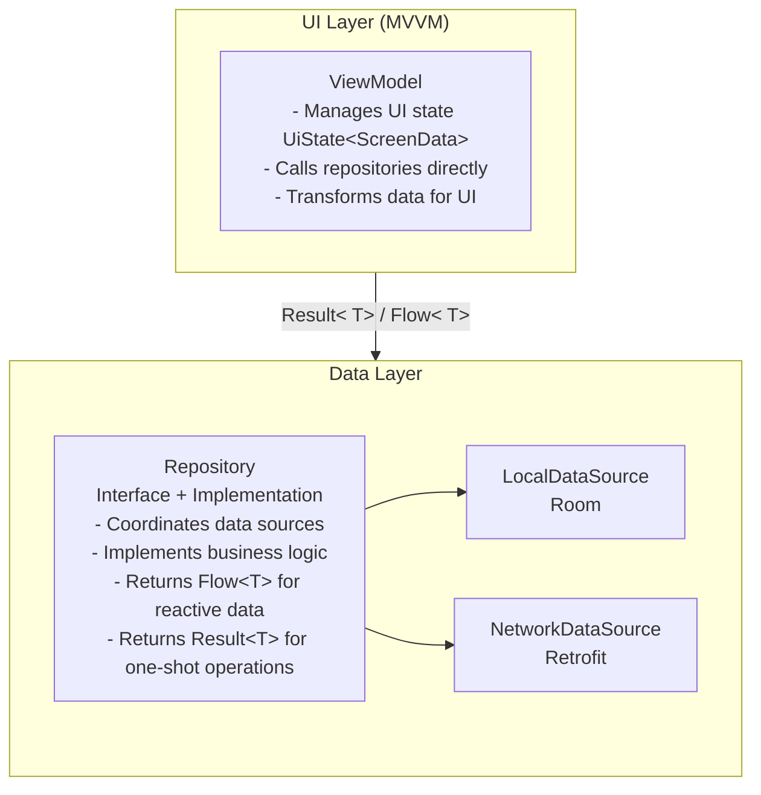

### Unidirectional Data Flow

Data flows in **one direction** through the layers:

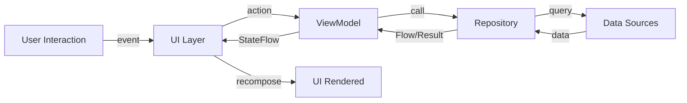

**Flow Steps:**

1. **User Interaction** → UI Layer
2. **ViewModel** → Calls Repository
3. **Repository** → Coordinates Data Sources (Room/Retrofit/Firebase/DataStore)
4. **Data Sources** → External Systems (Database/Network/Storage)
5. **Data** flows back → Repository → ViewModel → UI

### Key Principles

- **Single Source of Truth**: Local database (Room) is the source of truth for observable data
- **Repositories Expose Flow**: Observable data uses `Flow<T>`, one-shot operations use `Result<T>`
- **ViewModels Call Repositories Directly**: No domain layer, repositories contain business logic
- **Offline-First**: Local data is displayed immediately, network updates happen in background
- **Error Handling**: Use `Result<T>` for error propagation, `suspendRunCatching` for repository
  operations

---

## Data Flow Patterns

The template supports three main data flow patterns. Choose based on your feature requirements:

| Pattern           | Use Case                         | Data Source              | Example                      |
|-------------------|----------------------------------|--------------------------|------------------------------|
| **Network-Only**  | Non-cacheable data, always fresh | Retrofit API             | Weather data, stock prices   |
| **Local-Only**    | User preferences, settings       | Room or DataStore        | Theme preference, auth token |
| **Offline-First** | Core app data, sync required     | Room + Retrofit/Firebase | User posts, profile data     |

---

## Network-Only Pattern

### When to Use

- Data must always be fresh (e.g., live sports scores, stock prices)
- Caching would provide stale or incorrect information
- Data is not critical for offline access

### Architecture

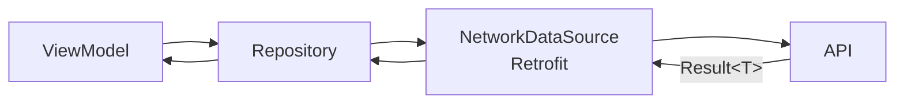

### Data Flow Diagram

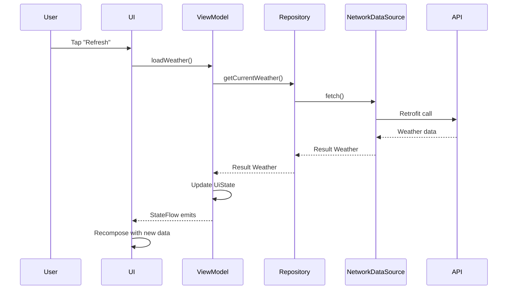

### Key Characteristics

- **No local caching** - Data fetched directly from network
- **Always fresh** - Every request goes to the server
- **No offline support** - Requires active network connection
- **Returns Result<T>** - One-shot operations for network calls

> [!NOTE]
> For complete repository implementation examples including interface definitions, data sources, and
> mapper functions, see the [Data Module README](../data/README.md#repository-patterns).

---

## Local-Only Pattern

### When to Use

- User preferences and settings
- Authentication tokens and session data
- Data that doesn't require network sync
- Small, simple key-value data

### Architecture

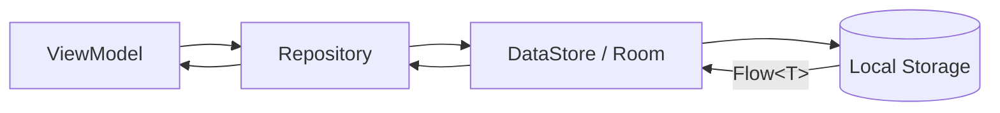

### Data Flow Diagram

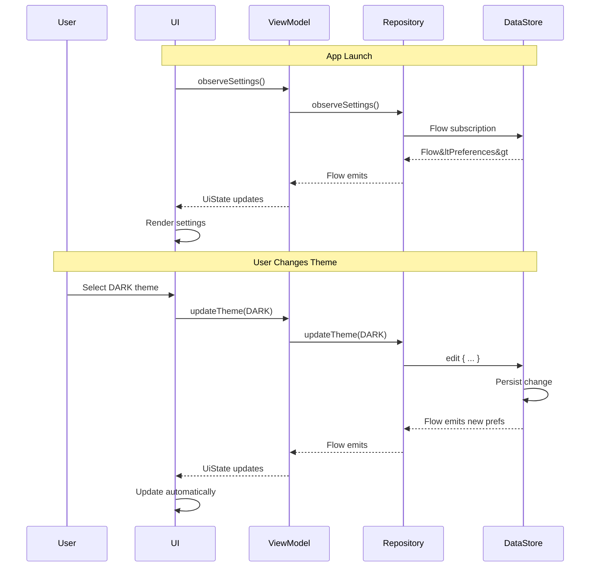

### Key Characteristics

- **Fully offline** - No network dependency
- **Reactive with Flow** - UI automatically updates when data changes
- **Immediate persistence** - Changes saved to local storage instantly
- **DataStore for preferences** - Type-safe, reactive preferences storage
- **Room for complex data** - Use Room if data structure is complex

> [!TIP]
> Use DataStore for simple key-value preferences and Room for structured local data with
> relationships.

---

## Offline-First Pattern (Network + Local)

### When to Use

- Core application data (posts, messages, user profiles)
- Data needed offline
- Data that syncs with a server
- Multi-device synchronization required

### Architecture

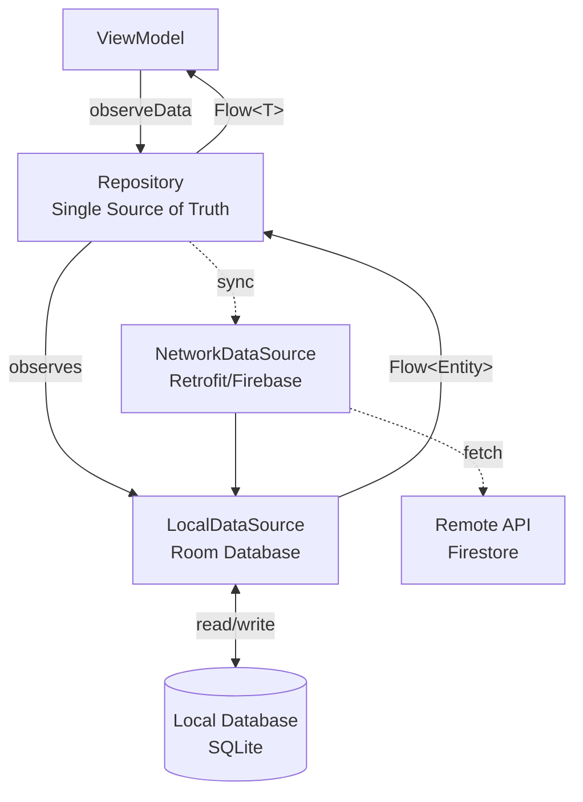

### Key Concepts

1. **Room is the Single Source of Truth**: UI always observes local database
2. **Network Updates Background**: Fetch from network, update local database
3. **Sync Metadata**: Track sync state (lastUpdated, lastSynced, needsSync)
4. **Soft Deletes**: Mark as deleted locally, sync deletion, then remove

### Data Flow Diagram

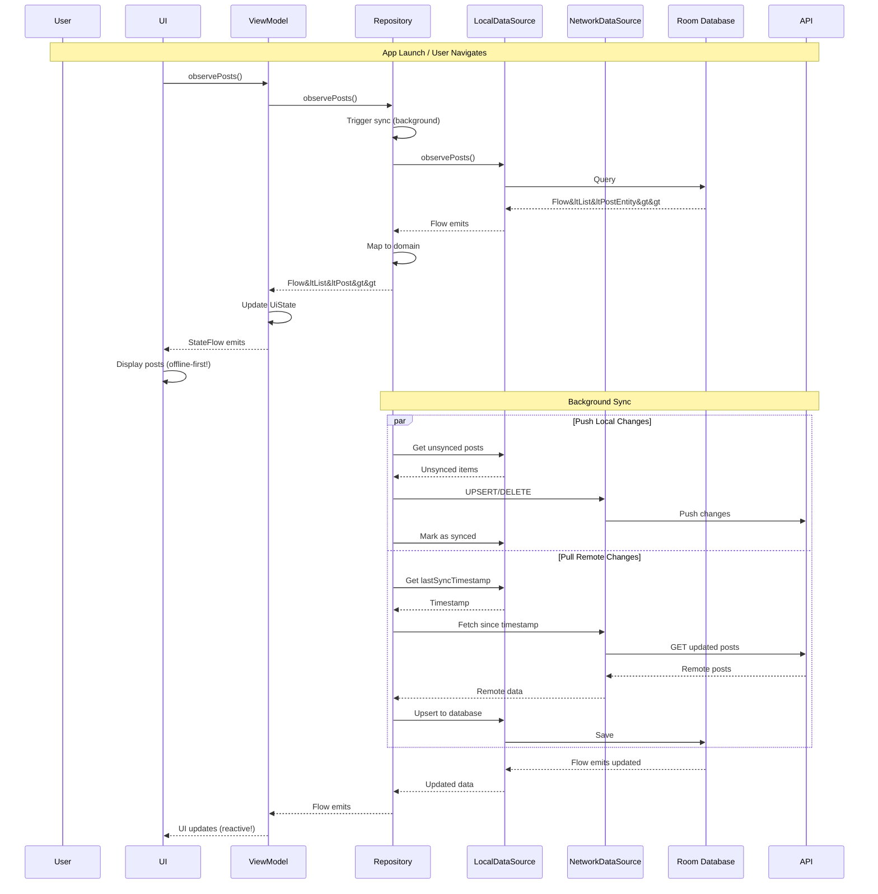

### Key Characteristics

- **Room as Single Source of Truth** - UI always observes local database
- **Immediate UI updates** - Local changes reflected instantly
- **Background synchronization** - Network sync happens asynchronously
- **Conflict resolution** - Last-write-wins (server timestamp based)
- **Bidirectional sync** - Push local changes, pull remote changes
- **Incremental sync** - Only fetch data modified since last sync

> [!IMPORTANT]
> The offline-first pattern requires careful sync metadata tracking. Always include `lastUpdated`,
`lastSynced`, `needsSync`, and `syncAction` fields in your Room entities.

For detailed offline-first repository implementation with sync metadata, see
the [Data Module README](../data/README.md#repository-patterns).

---

## Real-Time Data Updates

For real-time updates (e.g., Firebase Firestore snapshots, WebSocket), use Firebase's snapshot
listeners or similar mechanisms.

### Firebase Firestore Real-Time Flow

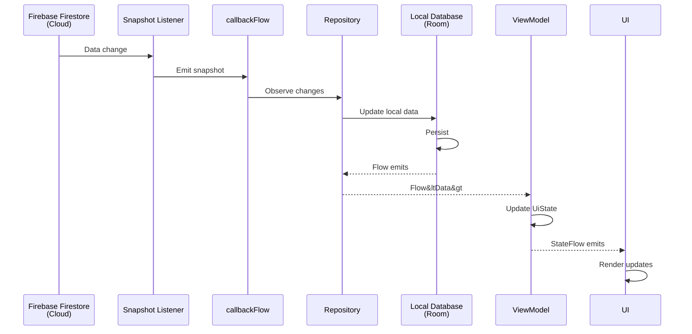

### Key Pattern: Firestore → Room → UI

Even with real-time updates, maintain **Room as the single source of truth**:

1. **Firestore snapshot listener** emits changes
2. **Repository** updates local Room database
3. **UI observes Room Flow** (not Firestore directly)
4. **Result**: Consistent data access pattern across app

This approach ensures:

- Offline access to last known data
- Consistent data access APIs
- Easy testing (mock Room, not Firestore)
- Works even if Firebase connection fails

> [!NOTE]
> For Firebase Firestore integration examples, see
> the [Firebase Module README](../firebase/firestore/README.md).

---

## Caching Strategies

### 1. Time-Based Cache Invalidation

Fetch fresh data from network if cache is older than a threshold.

**Flow:**

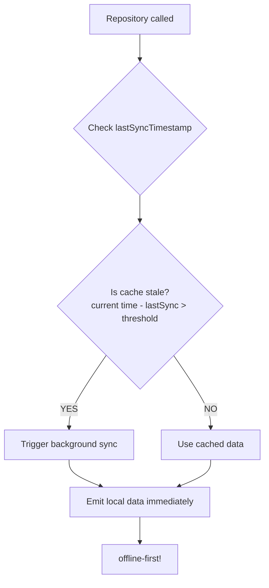

**Use When:**

- Data changes infrequently
- Staleness tolerance is acceptable (e.g., 5 minutes)
- Want to reduce network calls

### 2. Manual Refresh (Pull-to-Refresh)

Allow user to manually trigger sync.

**Flow:**

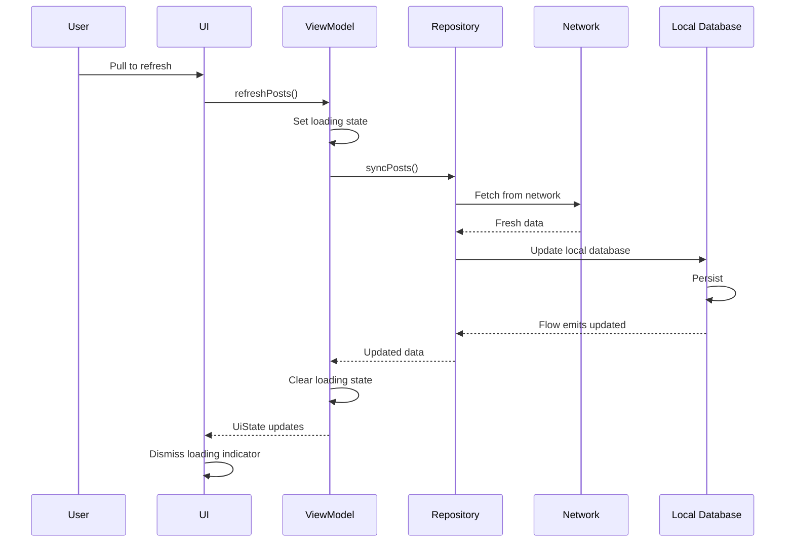

**Use When:**

- User wants to ensure fresh data
- Complementary to time-based caching
- Provides user control

### 3. Network-Bound Resource Pattern

Utility for coordinating network + local data with automatic caching.

**Flow:**

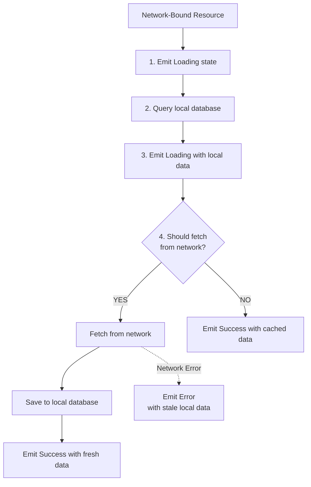

**Use When:**

- Want automatic cache-then-network pattern
- Need loading states with cached data
- Want to show stale data on network errors

> [!NOTE]
> For `networkBoundResource` implementation and usage examples, see
> the [Data Module README](../data/README.md).

---

## Error Handling

All data layer operations use a **layered error handling approach** with `Result<T>` for error
propagation:

- **Repository Layer**: Uses `suspendRunCatching` to wrap all operations
- **ViewModel Layer**: Uses `updateStateWith`/`updateWith` for automatic error capture
- **UI Layer**: Uses `StatefulComposable` for automatic error display via snackbar

### Error Flow Diagram

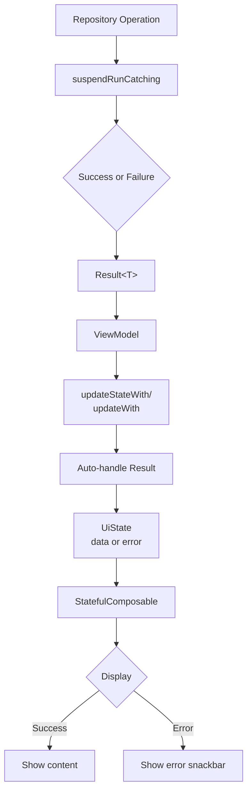

For comprehensive error handling patterns including network-specific errors, HTTP error codes, and
detailed examples, see:

> [!NOTE]
> Complete error handling documentation is available in
> the [Data Module README](../data/README.md#error-handling).

---

## Summary

This guide covered three main data flow patterns:

- **Network-Only**: For real-time data that doesn't need offline access (weather, stock prices)
- **Local-Only**: For preferences and settings using DataStore (theme, notifications)
- **Offline-First**: For user-generated content with Room as single source of truth (posts,
  profiles)

**Key Takeaways:**

1. **Choose the Right Pattern** based on feature requirements
2. **Room is the Single Source of Truth** for offline-first - UI observes local database, network
   updates happen in background
3. **Use Proper Threading** - Inject `@IoDispatcher` and use `withContext(ioDispatcher)` for
   blocking calls
4. **Error Handling is Centralized** - Repository uses `suspendRunCatching`, ViewModel uses
   `updateStateWith`/`updateWith`, UI uses `StatefulComposable`
5. **Flow for Reactive Data** - Observe local database with Flow, UI updates automatically
6. **Result for Operations** - One-shot operations return Result<T> for error handling

All patterns use **Repositories** as the interface to ViewModels, **Data Sources** for external
system interaction, **Result** type for error handling, and **Flow** for reactive data streams.

## Further Reading

- [Data Module README](../data/README.md) - Repository patterns, implementations, and error handling
  reference
- [State Management](state-management.md) - Learn about ViewModel state patterns
- [Architecture Overview](architecture.md) - Understand the two-layer architecture
- [Adding Features](guide.md) - Step-by-step implementation guide
- [Quick Reference](quick-reference.md) - Common data flow patterns cheat sheet
