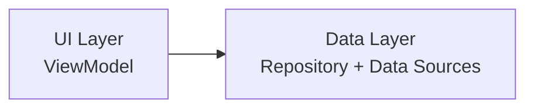
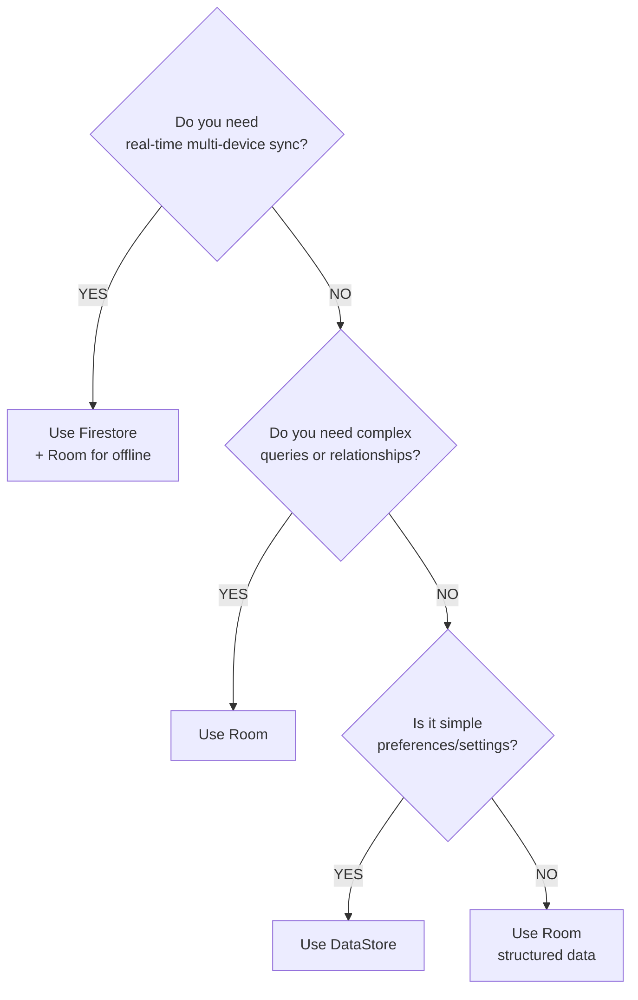
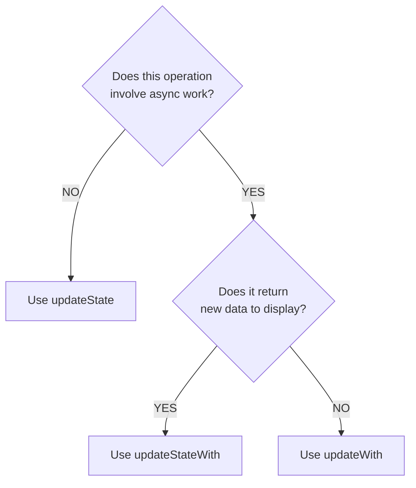

# Frequently Asked Questions (FAQ)

This FAQ answers common questions about using and extending this Android starter template. Questions
are organized by category for easy reference.

---

## Table of Contents

1. [Architecture Questions](#architecture-questions)
2. [Component Questions](#component-questions)
3. [Data Layer Questions](#data-layer-questions)
4. [State Management Questions](#state-management-questions)
5. [Deployment Questions](#deployment-questions)
6. [Performance Questions](#performance-questions)
7. [Firebase Questions](#firebase-questions)

---

## Architecture Questions

### Why no domain layer?

**TL;DR:** To keep the template simple and avoid over-engineering.

The template intentionally uses a **two-layer architecture** (UI + Data) instead of the traditional
three-layer approach:



**Reasons:**

- **Reduces complexity**: Fewer layers means less boilerplate and easier navigation
- **Faster development**: No need to create use cases for simple CRUD operations
- **Easier to understand**: New developers can grasp the architecture quickly
- **Pragmatic**: Most apps don't need the extra layer

**When to add a domain layer:**

- Multiple ViewModels share complex business logic
- Business rules become too complex for repositories
- You need to transform data between multiple repositories
- Your team prefers strict layering

See [architecture.md](./architecture.md) for more details.

---

### When should I add a domain layer?

Add a domain layer when you encounter any of these scenarios:

#### 1. **Shared Business Logic Across ViewModels**

```kotlin
// Without domain layer (code duplication)
class PostsViewModel : ViewModel() {
    fun loadPosts() {
        val posts = repository.getPosts()
            .filter { it.isPublished }
            .sortedByDescending { it.createdAt }
        // Use posts
    }
}

class FeedViewModel : ViewModel() {
    fun loadFeed() {
        val posts = repository.getPosts()
            .filter { it.isPublished }  // ❌ Duplicate logic
            .sortedByDescending { it.createdAt }  // ❌ Duplicate logic
        // Use posts
    }
}

// With domain layer (shared logic)
class GetPublishedPostsUseCase @Inject constructor(
    private val repository: PostsRepository
) {
    suspend operator fun invoke(): Result<List<Post>> {
        return repository.getPosts().map { posts ->
            posts.filter { it.isPublished }
                .sortedByDescending { it.createdAt }
        }
    }
}

// Now both ViewModels use the same logic
class PostsViewModel @Inject constructor(
    private val getPublishedPosts: GetPublishedPostsUseCase
) : ViewModel() {
    fun loadPosts() {
        _uiState.updateStateWith {
            getPublishedPosts()
        }
    }
}
```

#### 2. **Complex Data Transformations**

When you need to combine data from multiple repositories with complex transformation logic, use
cases keep this logic testable and reusable.

```kotlin
class GetUserDashboardUseCase @Inject constructor(
    private val userRepository: UserRepository,
    private val postsRepository: PostsRepository,
    private val statsRepository: StatsRepository
) {
    suspend operator fun invoke(userId: String): Result<Dashboard> {
        return suspendRunCatching {
            // Complex orchestration of multiple repositories
            val user = userRepository.getUser(userId).getOrThrow()
            val posts = postsRepository.getUserPosts(userId).getOrThrow()
            val stats = statsRepository.getUserStats(userId).getOrThrow()

            Dashboard(
                user = user,
                recentPosts = posts.take(5),
                totalViews = stats.views,
                totalLikes = stats.likes,
                engagement = calculateEngagement(posts, stats)
            )
        }
    }

    private fun calculateEngagement(posts: List<Post>, stats: Stats): Double {
        // Complex business logic
    }
}
```

#### 3. **Business Rules Enforcement**

Use cases are perfect for enforcing business rules:

```kotlin
class PublishPostUseCase @Inject constructor(
    private val postsRepository: PostsRepository,
    private val userRepository: UserRepository
) {
    suspend operator fun invoke(post: Post): Result<Unit> {
        return suspendRunCatching {
            // Enforce business rules
            val user = userRepository.getCurrentUser().getOrThrow()

            require(user.canPublish) {
                "User doesn't have permission to publish"
            }

            require(post.title.isNotBlank()) {
                "Post title cannot be empty"
            }

            require(post.content.length >= 100) {
                "Post content must be at least 100 characters"
            }

            // Publish the post
            postsRepository.publishPost(post).getOrThrow()
        }
    }
}
```

**How to add:**

1. Create `domain` module: `mkdir -p domain/src/main/kotlin/dev/atick/domain/usecase`
2. Create use case classes with `operator fun invoke()`
3. Inject into ViewModels instead of repositories
4. Keep repositories for data operations only

---

### Why two-layer architecture?

The two-layer architecture prioritizes:

1. **Pragmatic Simplicity**: Most apps don't need complex layering
2. **Reduced Boilerplate**: Fewer interfaces and classes to maintain
3. **Faster Onboarding**: New developers understand the flow quickly
4. **Direct Communication**: ViewModels can directly call repositories

This is a **conscious trade-off**:

- ✅ Simpler codebase
- ✅ Faster development
- ✅ Less abstraction overhead
- ❌ Some business logic lives in repositories
- ❌ May need refactoring if complexity grows

See [philosophy.md](./philosophy.md) for the full rationale.

---

## Component Questions

### How do I customize component appearance?

**Option 1: Modify theme colors** (affects all components globally):

```kotlin
// core/ui/src/main/kotlin/.../theme/Color.kt
val LightDefaultColorScheme = lightColorScheme(
    primary = Color(0xFF6200EE),           // Your brand color
    onBackground = Color(0xFF1C1B1F),
    outline = Color(0xFF79747E),
    // ... other colors
)
```

**Option 2: Override individual component** (for specific instances):

```kotlin
JetpackButton(
    onClick = { },
    colors = ButtonDefaults.buttonColors(
        containerColor = Color.Red,  // Custom color for this button
        contentColor = Color.White
    ),
    content = { Text("Delete") }
)
```

**Option 3: Create themed variant**:

```kotlin
@Composable
fun DangerButton(
    onClick: () -> Unit,
    text: @Composable () -> Unit,
    modifier: Modifier = Modifier
) {
    JetpackButton(
        onClick = onClick,
        colors = ButtonDefaults.buttonColors(
            containerColor = MaterialTheme.colorScheme.error,
            contentColor = MaterialTheme.colorScheme.onError
        ),
        modifier = modifier,
        text = text
    )
}
```

See [components.md](./components.md#theming-components) for more customization patterns.

---

### How do I create a new custom component?

Follow this pattern:

#### 1. Create Component File

```kotlin
// core/ui/src/main/kotlin/dev/atick/core/ui/components/CustomCard.kt
package dev.atick.core.ui.components

import androidx.compose.material3.*
import androidx.compose.runtime.Composable
import androidx.compose.ui.Modifier

/**
 * A custom card component for displaying featured content.
 *
 * Example:
 * ```

* CustomCard(
*     title = "Featured Post",
*     subtitle = "Read more about..."
* ) {
*     Text("Card content")
* }
* ```
*
* @param title Card title
* @param subtitle Card subtitle
* @param modifier Modifier to customize appearance
* @param content Card body content
  */
  @Composable
  fun CustomCard(
  title: String,
  subtitle: String,
  modifier: Modifier = Modifier,
  content: @Composable () -> Unit
  ) {
  Card(
  modifier = modifier,
  colors = CardDefaults.cardColors(
  containerColor = MaterialTheme.colorScheme.surfaceVariant
  )
  ) {
  Column(modifier = Modifier.padding(16.dp)) {
  Text(
  text = title,
  style = MaterialTheme.typography.titleLarge,
  color = MaterialTheme.colorScheme.onSurface
  )
  Text(
  text = subtitle,
  style = MaterialTheme.typography.bodyMedium,
  color = MaterialTheme.colorScheme.onSurfaceVariant
  )
  Spacer(modifier = Modifier.height(8.dp))
  content()
  }
  }
  }

```

#### 2. Add Previews

```kotlin
@PreviewDevices
@PreviewThemes
@Composable
private fun CustomCardPreview() {
    JetpackTheme {
        CustomCard(
            title = "Sample Title",
            subtitle = "Sample Subtitle"
        ) {
            Text("Card content here")
        }
    }
}
```

See [components.md](./components.md#custom-component-creation) for complete guide.

---

### When should I use which component?

| Component                    | Use Case                | Example                    |
|------------------------------|-------------------------|----------------------------|
| `JetpackButton`              | Primary action          | Save, Submit, Continue     |
| `JetpackOutlinedButton`      | Secondary action        | Cancel, Skip               |
| `JetpackTextButton`          | Tertiary / low-emphasis | Learn More, View Details   |
| `JetpackTextFiled`           | Standard text input     | Name, Email, Address       |
| `JetpackPasswordFiled`       | Password input          | Password, PIN              |
| `JetpackTopAppBar`           | Screen title + actions  | Most screens               |
| `JetpackActionBar`           | Screen with text action | Edit Profile (Save button) |
| `JetpackLoadingWheel`        | Content loading         | Inside LazyColumn          |
| `JetpackOverlayLoadingWheel` | Full-screen loading     | Initial data load          |

**General Rules:**

- Use **filled button** for the most important action
- Use **outlined button** for secondary actions alongside primary
- Use **text button** for low-emphasis actions or inline links
- Use **loading wheel** for in-context loading
- Use **overlay loading** for blocking operations

---

## Data Layer Questions

### How do I add a new data source?

Follow these steps based on the data source type:

#### Network Data Source (Retrofit)

```kotlin
// 1. Define API interface
// core/network/src/main/kotlin/.../api/UsersApi.kt
interface UsersApi {
    @GET("users/{id}")
    suspend fun getUser(@Path("id") String userId): UserResponse
}

// 2. Provide API instance in module
@Module
@InstallIn(SingletonComponent::class)
object UsersApiModule {
    @Singleton
    @Provides
    fun provideUsersApi(retrofit: Retrofit): UsersApi {
        return retrofit.create(UsersApi::class.java)
    }
}

// 3. Create data source interface
interface UsersNetworkDataSource {
    suspend fun getUser(userId: String): Result<UserResponse>
}

// 4. Implement data source
internal class UsersNetworkDataSourceImpl @Inject constructor(
    private val usersApi: UsersApi,
    @IoDispatcher private val ioDispatcher: CoroutineDispatcher
) : UsersNetworkDataSource {
    override suspend fun getUser(userId: String): Result<UserResponse> {
        return withContext(ioDispatcher) {
            suspendRunCatching {
                usersApi.getUser(userId)
            }
        }
    }
}

// 5. Bind in Hilt module
@Module
@InstallIn(SingletonComponent::class)
abstract class UsersDataSourceModule {
    @Binds
    @Singleton
    internal abstract fun bindUsersNetworkDataSource(
        impl: UsersNetworkDataSourceImpl
    ): UsersNetworkDataSource
}
```

#### Local Data Source (Room)

```kotlin
// 1. Define entity
@Entity(tableName = "users")
data class UserEntity(
    @PrimaryKey val id: String,
    val name: String,
    val email: String
)

// 2. Create DAO
@Dao
interface UserDao {
    @Query("SELECT * FROM users WHERE id = :id")
    fun observeUser(id: String): Flow<UserEntity>

    @Upsert
    suspend fun upsert(user: UserEntity)
}

// 3. Add DAO to database
@Database(
    entities = [UserEntity::class, /* other entities */],
    version = 1
)
abstract class JetpackDatabase : RoomDatabase() {
    abstract fun getUserDao(): UserDao
}

// 4. Provide DAO in module
@Module(includes = [DatabaseModule::class])
@InstallIn(SingletonComponent::class)
object DaoModule {
    @Singleton
    @Provides
    fun provideUserDao(database: JetpackDatabase): UserDao {
        return database.getUserDao()
    }
}

// 5. Create data source
internal class LocalDataSourceImpl @Inject constructor(
    private val userDao: UserDao,
    @IoDispatcher private val ioDispatcher: CoroutineDispatcher
) : LocalDataSource {
    override fun observeUser(id: String): Flow<UserEntity> {
        return userDao.observeUser(id)
    }

    override suspend fun upsertUser(user: UserEntity) {
        withContext(ioDispatcher) {
            userDao.upsert(user)
        }
    }
}
```

See [data-flow.md](./data-flow.md) for complete patterns.

---

### How do I choose between Room, DataStore, and Firestore?

| Data Source   | Use Case                                  | Pros                                | Cons                                |
|---------------|-------------------------------------------|-------------------------------------|-------------------------------------|
| **Room**      | Structured relational data, offline-first | Fast, SQL queries, type-safe        | More setup, migration complexity    |
| **DataStore** | Simple key-value preferences              | Easy setup, type-safe, Flow support | Not for large datasets              |
| **Firestore** | Real-time sync, multi-device              | Real-time, serverless, scalable     | Requires network, query limitations |

**Decision Tree:**



**Examples:**

- **Room**: User posts, messages, cached data, offline-first content
- **DataStore**: Theme preference, auth token, user settings, language
- **Firestore**: Chat messages, collaborative documents, social feeds

**Combining Multiple Sources:**

```kotlin
// Offline-first pattern: Room + Firestore
class PostsRepositoryImpl @Inject constructor(
    private val localDataSource: LocalDataSource,    // Room
    private val firebaseDataSource: FirebaseDataSource,  // Firestore
    private val preferencesDataSource: UserPreferencesDataSource  // DataStore
) : PostsRepository {

    override fun observePosts(): Flow<List<Post>> {
        return flow {
            // Get user ID from preferences
            val userId = preferencesDataSource.getUserIdOrThrow()

            // Listen to Firestore real-time updates
            viewModelScope.launch {
                firebaseDataSource.observePosts(userId)
                    .collect { firestorePosts ->
                        localDataSource.savePosts(firestorePosts)
                    }
            }

            // Emit from Room (single source of truth)
            emitAll(
                localDataSource.observePosts(userId)
                    .map { it.map { entity -> entity.toDomain() } }
            )
        }
    }
}
```

See [data/README.md](../data/README.md) and [data-flow.md](./data-flow.md) for patterns.

---

### How do I handle offline scenarios?

The template supports offline-first by design. Follow this pattern:

#### 1. Use Room as Single Source of Truth

```kotlin
// UI always observes Room, not network
override fun observePosts(): Flow<List<Post>> {
    return localDataSource.observePosts()  // Room
        .map { entities -> entities.map { it.toDomain() } }
}
```

#### 2. Sync in Background

```kotlin
override fun observePosts(): Flow<List<Post>> {
    return flow {
        // Trigger background sync
        syncManager.requestSync()

        // Emit local data immediately (works offline!)
        emitAll(
            localDataSource.observePosts()
                .map { entities -> entities.map { it.toDomain() } }
        )
    }
}
```

#### 3. Track Sync Metadata

```kotlin
@Entity
data class PostEntity(
    @PrimaryKey val id: String,
    val title: String,
    val content: String,

    // Sync metadata
    val lastUpdated: Long = 0,      // Local modification time
    val lastSynced: Long = 0,       // Last successful sync
    val needsSync: Boolean = false, // Has pending changes
    val syncAction: SyncAction = SyncAction.NONE
)

enum class SyncAction {
    NONE,    // Already synced
    UPSERT,  // Create or update on server
    DELETE   // Delete on server
}
```

#### 4. Push Changes When Online

```kotlin
override suspend fun syncPosts(): Result<Unit> {
    return suspendRunCatching {
        // Get unsynced local changes
        val unsyncedPosts = localDataSource.getUnsyncedPosts()

        // Push to server when online
        unsyncedPosts.forEach { post ->
            when (post.syncAction) {
                SyncAction.UPSERT -> networkDataSource.upsertPost(post)
                SyncAction.DELETE -> networkDataSource.deletePost(post.id)
                SyncAction.NONE -> { /* skip */
                }
            }
            localDataSource.markAsSynced(post.id)
        }

        // Pull remote changes
        val remotePosts = networkDataSource.getPosts()
        localDataSource.savePosts(remotePosts)
    }
}
```

#### 5. Use WorkManager for Background Sync

The template includes `sync` module with WorkManager:

```kotlin
// Initialize in Application.onCreate()
Sync.initialize(context)  // Sets up periodic sync

// Request immediate sync
syncManager.requestSync()

// Observe sync state
syncManager.isSyncing.collect { isSyncing ->
    // Show sync indicator in UI
}
```

See [data-flow.md](./data-flow.md#offline-first-pattern-network--local) for complete offline-first
pattern.

---

## State Management Questions

### When should I use `updateState` vs `updateStateWith`?

**Quick Decision Tree:**



#### Use `updateState` for synchronous state changes

```kotlin
// Form input
fun onNameChanged(name: String) {
    _uiState.updateState {
        copy(name = name)
    }
}

// Toggle boolean
fun toggleSelection(item: Item) {
    _uiState.updateState {
        copy(
            items = items.map {
                if (it.id == item.id) it.copy(selected = !it.selected)
                else it
            }
        )
    }
}

// Filter list
fun applyFilter(filter: FilterType) {
    _uiState.updateState {
        copy(selectedFilter = filter)
    }
}
```

#### Use `updateStateWith` for async operations that return new data

```kotlin
// Load data from repository
fun loadPosts() {
    _uiState.updateStateWith {
        postsRepository.getPosts().map { posts ->
            copy(posts = posts)
        }
    }
}

// Search with results
fun search(query: String) {
    _uiState.updateStateWith {
        searchRepository.search(query).map { results ->
            copy(searchResults = results, searchQuery = query)
        }
    }
}
```

#### Use `updateWith` for async operations without new data (side effects)

```kotlin
// Save to database
fun savePost(post: Post) {
    _uiState.updateWith {
        postsRepository.savePost(post)
    }
}

// Delete
fun deletePost(postId: String) {
    _uiState.updateWith {
        postsRepository.deletePost(postId)
    }
}

// Update preferences
fun enableNotifications() {
    _uiState.updateWith {
        settingsRepository.updateNotifications(true)
    }
}
```

See [state-management.md](./state-management.md#update-functions-explained) for detailed examples.

---

### How do I handle multiple loading states?

**Option 1: Use separate boolean flags** (recommended for distinct sections):

```kotlin
data class DashboardScreenData(
    val user: User? = null,
    val posts: List<Post> = emptyList(),
    val stats: Stats? = null,

    // Separate loading states
    val isLoadingUser: Boolean = false,
    val isLoadingPosts: Boolean = false,
    val isLoadingStats: Boolean = false
)

class DashboardViewModel : ViewModel() {
    private val _uiState = MutableStateFlow(UiState(DashboardScreenData()))
    val uiState = _uiState.asStateFlow()

    fun loadUser() {
        viewModelScope.launch {
            _uiState.update { it.copy(data = it.data.copy(isLoadingUser = true)) }

            userRepository.getUser().onSuccess { user ->
                _uiState.updateState {
                    copy(user = user, isLoadingUser = false)
                }
            }.onFailure { error ->
                _uiState.update {
                    it.copy(
                        data = it.data.copy(isLoadingUser = false),
                        error = OneTimeEvent(error)
                    )
                }
            }
        }
    }

    fun loadPosts() {
        viewModelScope.launch {
            _uiState.update { it.copy(data = it.data.copy(isLoadingPosts = true)) }

            postsRepository.getPosts().onSuccess { posts ->
                _uiState.updateState {
                    copy(posts = posts, isLoadingPosts = false)
                }
            }.onFailure { error ->
                _uiState.update {
                    it.copy(
                        data = it.data.copy(isLoadingPosts = false),
                        error = OneTimeEvent(error)
                    )
                }
            }
        }
    }
}

// In UI
@Composable
fun DashboardScreen(screenData: DashboardScreenData) {
    Column {
        if (screenData.isLoadingUser) {
            CircularProgressIndicator()
        } else {
            UserCard(user = screenData.user)
        }

        if (screenData.isLoadingPosts) {
            CircularProgressIndicator()
        } else {
            PostsList(posts = screenData.posts)
        }
    }
}
```

**Option 2: Use global loading state** (for simple cases):

```kotlin
// The default UiState.loading applies to the whole screen
fun loadAllData() {
    _uiState.updateStateWith {
        val user = userRepository.getUser().getOrThrow()
        val posts = postsRepository.getPosts().getOrThrow()

        Result.success(
            copy(user = user, posts = posts)
        )
    }
}
```

See [state-management.md](./state-management.md#pattern-2-partial-loading-states) for more patterns.

---

### How do I reset state?

**Reset to initial state:**

```kotlin
data class FormScreenData(
    val name: String = "",
    val email: String = "",
    val isSubmitted: Boolean = false
)

class FormViewModel : ViewModel() {
    private val _uiState = MutableStateFlow(UiState(FormScreenData()))
    val uiState = _uiState.asStateFlow()

    fun resetForm() {
        _uiState.updateState {
            FormScreenData()  // Reset to initial state
        }
    }

    // Or reset specific fields
    fun clearForm() {
        _uiState.updateState {
            copy(name = "", email = "", isSubmitted = false)
        }
    }
}
```

**Reset after navigation:**

```kotlin
// In Route composable
@Composable
fun FormRoute(
    onNavigateBack: () -> Unit,
    viewModel: FormViewModel = hiltViewModel()
) {
    val uiState by viewModel.uiState.collectAsStateWithLifecycle()

    // Reset when leaving screen
    DisposableEffect(Unit) {
        onDispose {
            viewModel.resetForm()
        }
    }

    StatefulComposable(state = uiState) { screenData ->
        FormScreen(
            screenData = screenData,
            onSubmit = {
                viewModel.submitForm()
                onNavigateBack()
            }
        )
    }
}
```

---

## Deployment Questions

### How do I prepare for release?

#### 1. Set Up Signing

Create `keystore.properties` in the root directory:

```properties
storeFile=/path/to/your/keystore.jks
storePassword=your-store-password
keyAlias=your-key-alias
keyPassword=your-key-password
```

**Generate keystore** (if you don't have one):

```bash
keytool -genkey -v -keystore my-release-key.jks -keyalg RSA -keysize 2048 -validity 10000 -alias my-key-alias
```

#### 2. Update Version

Edit `app/build.gradle.kts`:

```kotlin
val majorUpdateVersion = 1
val minorUpdateVersion = 2  // Increment for features
val patchVersion = 3       // Increment for fixes

// versionCode automatically calculated
// versionName: "1.2.3"
```

#### 3. Run Code Quality Checks

```bash
# Format code
./gradlew spotlessApply --init-script gradle/init.gradle.kts --no-configuration-cache

# Check formatting
./gradlew spotlessCheck --init-script gradle/init.gradle.kts --no-configuration-cache

# Build release
./gradlew assembleRelease
```

#### 4. Test Release Build

```bash
# Install on device
./gradlew installRelease

# Or locate APK
# app/Jetpack-Android-Starter_release_v1.2.3_YYYY_MM_DD_HH_MM_AM.apk
```

#### 5. Configure ProGuard (Optional)

Edit `app/proguard-rules.pro` if needed. Current rules:

```proguard
# Keep @Serializable classes for Navigation
-keep @kotlinx.serialization.Serializable class * { *; }

# Crashlytics
-keepattributes SourceFile,LineNumberTable
-keep public class * extends java.lang.Exception
```

#### 6. Set Up Firebase (Production)

1. Create production Firebase project
2. Download `google-services.json`
3. Place in `app/google-services.json`
4. Update SHA-1 fingerprint for production keystore:

```bash
keytool -list -v -keystore my-release-key.jks -alias my-key-alias
# Copy SHA-1 fingerprint to Firebase Console
```

See [github.md](./github.md) for CI/CD setup.

---

### How do I set up signing?

The template automatically handles signing configuration in `app/build.gradle.kts`:

**Signing Configuration (Already Implemented):**

```kotlin
signingConfigs {
    create("release") {
        if (keystorePropertiesFile.exists()) {
            val keystoreProperties = Properties()
            keystoreProperties.load(FileInputStream(keystorePropertiesFile))
            keyAlias = keystoreProperties["keyAlias"] as String
            keyPassword = keystoreProperties["keyPassword"] as String
            storeFile = file(keystoreProperties["storeFile"] as String)
            storePassword = keystoreProperties["storePassword"] as String
        }
    }
}

buildTypes {
    release {
        signingConfig = if (keystorePropertiesFile.exists()) {
            signingConfigs.getByName("release")
        } else {
            println("keystore.properties not found. Using debug key.")
            signingConfigs.getByName("debug")
        }
        isMinifyEnabled = true
        proguardFiles(
            getDefaultProguardFile("proguard-android-optimize.txt"),
            "proguard-rules.pro"
        )
    }
}
```

**You only need to:**

1. Create `keystore.properties` in root directory
2. Generate keystore (if needed)
3. Build release: `./gradlew assembleRelease`

**Without keystore**, release builds automatically fall back to debug signing (for testing).

---

### How do I configure CI/CD?

The template includes GitHub Actions workflow (`.github/workflows/ci.yml`):

**Current CI Pipeline:**

```yaml
1. Lint Job:
  - Validates Gradle wrapper
  - Runs spotlessCheck (code formatting)

2. Build Job (only if lint passes):
  - Clean project
  - Build debug APK
```

**To extend for release builds:**

```yaml
release:
  name: 🚀 Build Release APK
  needs: build
  runs-on: ubuntu-latest
  if: github.ref == 'refs/heads/main'
  steps:
    - name: ⬇️ Checkout Repository
      uses: actions/checkout@v5

    - name: 🏗️ Set up JDK 21
      uses: actions/setup-java@v5
      with:
        java-version: 21
        distribution: 'temurin'

    - name: 🔐 Decode Keystore
      env:
        ENCODED_STRING: ${{ secrets.KEYSTORE_BASE64 }}
      run: |
        echo $ENCODED_STRING | base64 -di > app/keystore.jks

    - name: 📦 Build Release APK
      env:
        KEY_ALIAS: ${{ secrets.KEY_ALIAS }}
        KEY_PASSWORD: ${{ secrets.KEY_PASSWORD }}
        STORE_PASSWORD: ${{ secrets.STORE_PASSWORD }}
      run: |
        echo "storeFile=app/keystore.jks" > keystore.properties
        echo "keyAlias=$KEY_ALIAS" >> keystore.properties
        echo "keyPassword=$KEY_PASSWORD" >> keystore.properties
        echo "storePassword=$STORE_PASSWORD" >> keystore.properties
        ./gradlew assembleRelease

    - name: 📤 Upload Release APK
      uses: actions/upload-artifact@v4
      with:
        name: release-apk
        path: app/build/outputs/apk/release/*.apk
```

**Add GitHub Secrets:**

1. Go to repository Settings → Secrets
2. Add:
    - `KEYSTORE_BASE64`: Base64-encoded keystore
    - `KEY_ALIAS`: Keystore alias
    - `KEY_PASSWORD`: Key password
    - `STORE_PASSWORD`: Store password

---

## Performance Questions

### How do I optimize Compose performance?

Follow these patterns:

#### 1. Use `remember` for Expensive Computations

```kotlin
@Composable
fun ExpensiveList(items: List<Item>) {
    val processedItems = remember(items) {
        items.map { /* expensive transformation */ }
    }

    LazyColumn {
        items(processedItems) { item ->
            ItemCard(item = item)
        }
    }
}
```

#### 2. Use Stable Keys in `LazyColumn`

```kotlin
LazyColumn {
    items(
        items = postsList,
        key = { post -> post.id }  // ✅ Stable key
    ) { post ->
        PostCard(post = post)
    }
}
```

#### 3. Avoid Creating Lambdas in Composition

```kotlin
// ❌ Bad - Creates new lambda on each recomposition
@Composable
fun PostCard(post: Post, onDelete: (Post) -> Unit) {
    JetpackButton(
        onClick = { onDelete(post) },  // New lambda each time
        text = { Text("Delete") }
    )
}

// ✅ Good - Stable reference
@Composable
fun PostCard(post: Post, onDelete: (Post) -> Unit) {
    val onClick = remember(post) {
        { onDelete(post) }
    }

    JetpackButton(
        onClick = onClick,
        text = { Text("Delete") }
    )
}
```

#### 4. Use `derivedStateOf` for Computed Values

```kotlin
@Composable
fun SearchScreen(posts: List<Post>, query: String) {
    val filteredPosts = remember(posts, query) {
        derivedStateOf {
            posts.filter { it.title.contains(query, ignoreCase = true) }
        }
    }.value

    LazyColumn {
        items(filteredPosts) { post ->
            PostCard(post = post)
        }
    }
}
```

See [performance.md](./performance.md) for more optimization techniques.

---

### How do I reduce app size?

#### 1. Enable R8/ProGuard

Already enabled in `app/build.gradle.kts`:

```kotlin
buildTypes {
    release {
        isMinifyEnabled = true  // ✅ Enabled
        proguardFiles(
            getDefaultProguardFile("proguard-android-optimize.txt"),
            "proguard-rules.pro"
        )
    }
}
```

#### 2. Enable Resource Shrinking

```kotlin
buildTypes {
    release {
        isMinifyEnabled = true
        isShrinkResources = true  // Add this
        proguardFiles(/*...*/)
    }
}
```

#### 3. Use App Bundles

```bash
# Instead of APK, build App Bundle
./gradlew bundleRelease

# Output: app/build/outputs/bundle/release/app-release.aab
```

#### 4. Analyze APK Size

```bash
./gradlew assembleRelease

# Analyze
./gradlew :app:analyzeReleaseBundle
```

---

## Firebase Questions

### How do I set up Firebase for this project?

Firebase is already configured in the template. You just need to add your project:

#### 1. Create Firebase Project

1. Go to [Firebase Console](https://console.firebase.google.com/)
2. Click "Add project"
3. Follow the wizard

#### 2. Download `google-services.json`

1. In Firebase Console, go to Project Settings
2. Under "Your apps", click "Add app" → Android
3. Register app with package name: `dev.atick.compose`
4. Download `google-services.json`
5. Place in `app/google-services.json`

#### 3. Add SHA-1 Fingerprint (for Google Sign-In)

```bash
# Get debug SHA-1
./gradlew signingReport

# Copy SHA-1 from debug config
# Add to Firebase Console → Project Settings → Your apps
```

#### 4. Enable Authentication Methods

1. Go to Firebase Console → Authentication
2. Click "Get Started"
3. Enable sign-in methods you need:
    - Email/Password
    - Google

That's it! The template already includes:

- ✅ Firebase Crashlytics (`firebase:analytics`)
- ✅ Firebase Auth (`firebase:auth`)
- ✅ Firebase Firestore (`firebase:firestore`)
- ✅ Convention plugin for Firebase setup

See [firebase/auth/README.md](../firebase/auth/README.md) for detailed authentication setup.

---

### Why is Google Sign-In not working?

**Common causes:**

#### 1. Missing SHA-1 Fingerprint

```bash
# Get SHA-1
./gradlew signingReport

# Add to Firebase Console:
# Project Settings → Your apps → SHA certificate fingerprints
```

#### 2. Wrong Package Name

Package name in Firebase Console must match `app/build.gradle.kts`:

```kotlin
defaultConfig {
    applicationId = "dev.atick.compose"  // Must match Firebase
}
```

#### 3. Credential Manager Not Available (Android < 14)

Google Sign-In uses Credential Manager (Android 14+). On older devices, it falls back to standard
Google Sign-In flow.

**Check implementation:**

```kotlin
// firebase/auth/src/main/kotlin/.../AuthDataSource.kt
override suspend fun signInWithGoogle(activity: Activity): Result<AuthUser> {
    return suspendRunCatching {
        try {
            // Try Credential Manager first (Android 14+)
            val credential = credentialManager.getCredential(...)
            // ...
        } catch (e: Exception) {
            // Fallback for older devices
            // Implement traditional Google Sign-In
        }
    }
}
```

See [troubleshooting.md](./troubleshooting.md#firebase-issues) for more solutions.

---

## Additional Resources

### Documentation Guides

- **Architecture**: [architecture.md](./architecture.md)
- **State Management**: [state-management.md](./state-management.md)
- **Components**: [components.md](./components.md)
- **Data Flow**: [data-flow.md](./data-flow.md)
- **Navigation**: [navigation.md](./navigation.md)
- **Dependency Injection**: [dependency-injection.md](./dependency-injection.md)
- **Troubleshooting**: [troubleshooting.md](./troubleshooting.md)
- **Quick Reference**: [quick-reference.md](./quick-reference.md)

### Module Documentation

- **Core UI**: [core/ui/README.md](../core/ui/README.md) - UI components and state management
  utilities
- **Data Layer**: [data/README.md](../data/README.md) - Repository patterns and data sources
- **Firebase Auth**: [firebase/auth/README.md](../firebase/auth/README.md) - Firebase Authentication
  integration
- **Firebase Firestore**: [firebase/firestore/README.md](../firebase/firestore/README.md) - Cloud
  Firestore integration
- **Sync**: [sync/README.md](../sync/README.md) - Background data synchronization
- **App Module**: [app/README.md](../app/README.md) - Main application architecture

> [!NOTE]
> **API Documentation** is available after running `./gradlew dokkaGeneratePublicationHtml`. The
> generated docs will be at `build/dokka/html/index.html`.

---

## Still Have Questions?

If your question isn't answered here:

1. Check the [Troubleshooting Guide](./troubleshooting.md)
2. Search existing [GitHub Issues](https://github.com/atick-faisal/Jetpack-Android-Starter/issues)
3. Create a new issue with:
    - Clear description of the problem
    - Steps to reproduce
    - Expected vs actual behavior
    - Relevant code snippets
    - Android Studio version and device info
