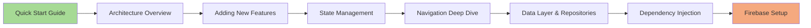
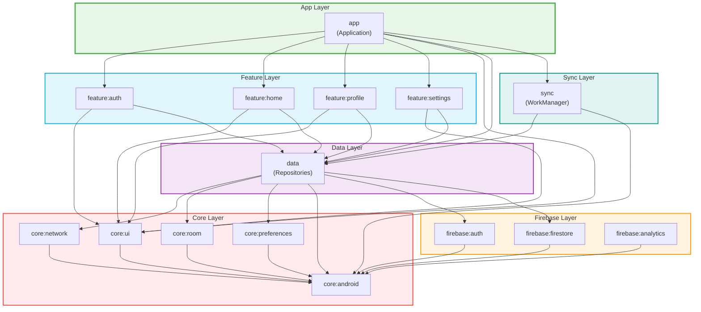

    
    
    
    

# 🚀 Jetpack Android Starter

A robust, production-ready template for modern Android development that takes the pain out of
setting up a new project. Built on the foundation
of [Now In Android](https://github.com/android/nowinandroid)'s architecture, this template provides
a comprehensive starting point for both new and experienced Android developers.

  
<i>"Android Development is Easy until You Rotate the Device"</i>

## 📱 Apps Built With This Template

Check out apps built with this
template [here](https://github.com/atick-faisal?tab=repositories&q=&type=source&language=kotlin&sort=).

## ☃️ Why This Template?

- **Production-Ready Authentication**: Firebase authentication with Google Sign-In and
  email/password
- **Clean Architecture**: Clear separation of concerns with a modular, scalable architecture
- **Modern Tech Stack**: Latest Android development tools including Jetpack Compose
- **Type-Safe Navigation**: Fully typed navigation using Kotlin serialization
- **Robust Data Management**: Repository pattern with Room and DataStore
- **Firebase Integration**: Auth, Firestore, Analytics, and Crashlytics
- **Background Sync**: Data synchronization using WorkManager
- **Multilingual Support**: Runtime localization update with support for RTL languages
- **CI/CD**: Automated build, release, and deployment with GitHub Actions

## 📂 Technical Stack

### 💾 Core Libraries

- **UI
  **: [Jetpack Compose](https://developer.android.com/compose), [Material3](https://m3.material.io/)
- **DI**: [Dagger Hilt](https://dagger.dev/hilt/)
- **Async
  **: [Kotlin Coroutines](https://kotlinlang.org/coroutines-overview.html) & [Flow](https://kotlinlang.org/docs/flow.html)
- **Network
  **: [Retrofit](https://square.github.io/retrofit/), [OkHttp](https://square.github.io/okhttp/)
- **Storage
  **: [Room DB](https://developer.android.com/training/data-storage/room), [DataStore](https://developer.android.com/topic/libraries/architecture/datastore)
- **Firebase
  **: [Auth](https://firebase.google.com/auth/android/start), [Firestore](https://firebase.google.com/docs/firestore/quickstart), [Analytics](https://firebase.google.com/docs/analytics), [Performance](https://firebase.google.com/docs/perf-mon)
- **Others
  **: [WorkManager](https://developer.android.com/topic/libraries/architecture/workmanager), [Coil](https://coil-kt.github.io/coil/), [Timber](https://github.com/JakeWharton/timber), [Lottie](https://airbnb.io/lottie/)

### 🏗️ Build & Tools

- [Kotlin 2.0](https://kotlinlang.org/)
- [Gradle 8.11.1](https://docs.gradle.org/current/userguide/userguide.html)
  with [Version Catalogs](https://docs.gradle.org/current/userguide/version_catalogs.html)
- [Java 21](https://openjdk.java.net/projects/jdk/21/)
- Custom [Gradle Convention Plugins](https://docs.gradle.org/current/userguide/custom_plugins.html)
- [Dokka](https://kotlinlang.org/dokka-introduction.html)
  and [MkDocs Material](https://squidfunk.github.io/mkdocs-material/) for documentation
- [ktlint](https://github.com/pinterest/ktlint) and [Spotless](https://github.com/diffplug/spotless)
  for code formatting

## 📖 Documentation

### [📚 Full Documentation](https://atick.dev/Jetpack-Android-Starter)

### 🎯 Getting Started

- [Quick Start Guide](getting-started.md)
- [Firebase Setup](firebase.md)
- [Dependency Management](dependency.md)

### 🏛️ Architecture & Design

- [Architecture Overview](architecture.md)
- [Design Philosophy](philosophy.md)
- [Adding New Features](guide.md)

### 🚧 Development Tools

- [Convention Plugins](plugins.md)
- [Code Style with Spotless](spotless.md)
- [Performance Optimization](performance.md)
- [Useful Tips & Tricks](tips.md)

### ⚡ Deployment

- [GitHub CI/CD Setup](github.md)
- [Fastlane Configuration](fastlane.md)

### [📚 API Reference](https://atick.dev/Jetpack-Android-Starter/api/)

## 🗺️ Documentation Map

This section provides a complete navigation guide for all documentation in this project. Use this
map to find the right documentation for your needs.

### 📍 Documentation Structure

This project has a **dual-documentation system**:

#### 1. Guide Documentation (MkDocs Site)

- **Location**: `/docs/*.md` files
- **Purpose**: Concepts, patterns, tutorials, and how-to guides
- **Deployed to**: [GitHub Pages](https://atick.dev/Jetpack-Android-Starter)
- **Coverage**: Architecture, state management, navigation, Firebase, performance, etc.

#### 2. API Reference (Dokka)

- **Location**: Module `README.md` files + KDoc comments in source code
- **Purpose**: Module architecture, API documentation, code reference
- **Generate with**: `./gradlew dokkaGeneratePublicationHtml`
- **Output**: `build/dokka/html/index.html`
- **Coverage**: All modules (`:core:ui`, `:data`, `:feature:*`, etc.)

### 🎯 Getting Started Path

**New to this template?** Follow this suggested reading order:

1. **[Quick Start Guide](getting-started.md)** - Set up your project and understand the basics
2. **[Architecture Overview](architecture.md)** - Learn the two-layer architecture and design
   decisions
3. **[Adding New Features](guide.md)** - Step-by-step tutorial for creating your first feature
4. **[State Management](state-management.md)** - Master the `UiState<T>` pattern and ViewModel
   patterns
5. **[Navigation Deep Dive](navigation.md)** - Understand type-safe navigation with Kotlin
   serialization
6. **[Data Layer & Repositories](data-flow.md)** - Learn offline-first data patterns and repository
   implementations
7. **[Dependency Injection](dependency-injection.md)** - Comprehensive Hilt setup and DI patterns (
   993 lines!)
8. **[Firebase Setup](firebase.md)** - Configure Firebase Auth, Firestore, and Crashlytics

### 🔍 Quick Reference

Need to look something up quickly? Start here:

| Topic               | Documentation                               | What You'll Find                                                                    |
|---------------------|---------------------------------------------|-------------------------------------------------------------------------------------|
| **Common Patterns** | [Quick Reference](quick-reference.md)       | Cheat sheet for common patterns (ViewModel, Repository, Navigation, etc.)           |
| **Component Usage** | [Component Guide](components.md)            | All UI components with examples (buttons, text fields, app bars, etc.)              |
| **Troubleshooting** | [Troubleshooting Guide](troubleshooting.md) | Solutions for common issues (build errors, runtime errors, Firebase, Compose, etc.) |
| **FAQ**             | [Frequently Asked Questions](faq.md)        | 20+ questions covering architecture, deployment, performance, Firebase              |
| **Tips & Tricks**   | [Tips & Best Practices](tips.md)            | IDE productivity, debugging techniques, development workflow                        |

### 📚 Deep Dive Guides

Want to understand concepts in depth? Explore these comprehensive guides:

#### Core Concepts

- **[Architecture Deep Dive](architecture.md)** - Two-layer architecture, module structure,
  dependency flow
- **[State Management](state-management.md)** - `UiState<T>` wrapper, update functions, context
  parameters, advanced patterns
- **[Navigation Patterns](navigation.md)** - Type-safe routes, nested navigation, deep links, bottom
  navigation
- **[Data Flow](data-flow.md)** - Flow patterns (network-only, local-only, offline-first), caching
  strategies

#### Implementation Guides

- **[Adding Features](guide.md)** - Complete tutorial: data models → repositories → UI →
  navigation → DI
- **[Component Development](components.md)** - Using components, theming, accessibility, creating
  custom components
- **[Dependency Injection](dependency-injection.md)** - Hilt modules, qualifiers, scopes, best
  practices (993 lines)
- **[Firebase Integration](firebase.md)** - Auth setup, Firestore integration, Crashlytics, security
  rules

#### Advanced Topics

- **[Performance Optimization](performance.md)** - LazyList optimization, image loading, memory leak
  prevention, startup optimization
- **[Data Layer Implementation](../data/README.md)** - Repository patterns, error handling,
  offline-first sync, mappers
- **[Sync Architecture](../sync/README.md)** - WorkManager setup, sync strategies, conflict
  resolution, troubleshooting

### 🛠️ Tool & Process Documentation

Learn about the tools and processes used in this project:

#### Development Tools

- **[Convention Plugins](plugins.md)** - Gradle convention plugins for standardized builds
- **[Code Style with Spotless](spotless.md)** - Automated code formatting with ktlint
- **[Dependency Management](dependency.md)** - Gradle version catalogs and dependency updates
- **[Design Philosophy](philosophy.md)** - Architectural decisions and design principles

#### Deployment & CI/CD

- **[GitHub CI/CD Setup](github.md)** - Automated build, test, and deployment workflows
- **[Fastlane Configuration](fastlane.md)** - Release automation with Fastlane

### 📦 Module Documentation

Each module has a `README.md` file documenting its architecture and usage:

#### Core Modules

- **[Core UI](../core/ui/README.md)** - UI components, `UiState` wrapper, theme system
- **[Core Android](../core/android/README.md)** - Android utilities, DI qualifiers, extensions
- **[Core Network](../core/network/README.md)** - Retrofit, OkHttp, network data sources
- **[Core Room](../core/room/README.md)** - Room database, DAOs, entities
- **[Core Preferences](../core/preferences/README.md)** - DataStore, user preferences

#### Data & Sync

- **[Data Module](../data/README.md)** - Repository implementations, error handling, offline-first
  patterns
- **[Sync Module](../sync/README.md)** - WorkManager background sync, conflict resolution

#### Firebase Modules

- **[Firebase Auth](../firebase/auth/README.md)** - Firebase Authentication wrapper, Google Sign-In
- **[Firebase Firestore](../firebase/firestore/README.md)** - Cloud Firestore wrapper, reactive
  access
- **[Firebase Analytics](../firebase/analytics/README.md)** - Firebase Crashlytics (crash reporting)

#### Feature Modules

- **[App Module](../app/README.md)** - Main application module, MainActivity responsibilities
- **[Feature: Auth](../feature/auth/README.md)** - Authentication screens (sign in, sign up)
- **[Feature: Home](../feature/home/README.md)** - Home screen implementation
- **[Feature: Profile](../feature/profile/README.md)** - User profile screen
- **[Feature: Settings](../feature/settings/README.md)** - App settings screen

### 📦 Module Dependency Graph

This diagram shows how all modules in the project depend on each other:

**Key Dependency Rules:**

- **Feature modules** → Never depend on other feature modules (isolated)
- **Feature modules** → Always depend on `:core:ui` and `:data`
- **Data module** → Depends on all core modules and Firebase modules
- **Core modules** → Never depend on feature, data, or firebase modules (reusable)
- **Firebase modules** → Only depend on `:core:android` (lightweight wrappers)
- **Sync module** → Only depends on `:data` and `:core:android` (background operations)

### 🔗 Cross-References & Integration

Understanding how systems work together:

- **Navigation + State Management**: See [Navigation Deep Dive](navigation.md) for how navigation
  integrates with `UiState<T>`
- **Firebase + Data Layer**: See [Firebase Setup](firebase.md) and [Data Layer](../data/README.md)
  for how Firebase data flows through repositories
- **DI + Everything**: See [Dependency Injection](dependency-injection.md) for how Hilt ties all
  layers together
- **Sync + Repositories**: See [Sync Module](../sync/README.md) for how WorkManager integrates with
  repository sync operations

### 📊 Documentation Statistics

- **Total Documentation Files**: 38 (15 module READMEs + 23 guide docs)
- **Total Lines of Documentation**: 15,000+ lines
- **KDoc Coverage**: 87% of Kotlin files (1,022 KDoc blocks)
- **Module Coverage**: 100% (all modules have READMEs)
- **Best-in-Class Guides**:
    - Dependency Injection Guide: 993 lines
    - State Management Guide: 928 lines
    - Troubleshooting Guide: ~1,570 lines
    - Component Guide: 1,428 lines
    - FAQ: 1,353 lines (20+ questions)

> [!TIP]
> **First time here?** Start with the [Quick Start Guide](getting-started.md) and follow the *
*Getting Started Path** above. The path takes you from setup to mastery in a logical progression.

> [!NOTE]
> **Looking for API docs?** Run `./gradlew dokkaGeneratePublicationHtml` to generate API
> documentation from KDoc comments. The output will be at `build/dokka/html/index.html`.

<a href="https://sites.google.com/view/mchowdhury" target="_blank">Qatar University Machine Learning Group</a>

