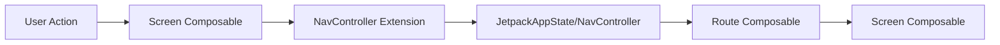
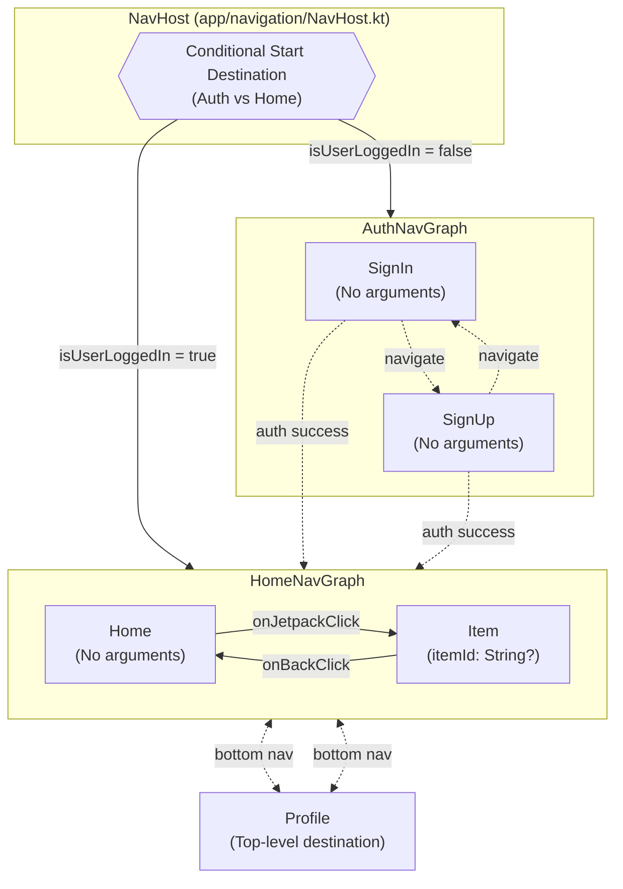

# Navigation Deep Dive

This guide provides a comprehensive overview of navigation in this Android template, which uses
Jetpack Navigation Compose with type-safe navigation powered by Kotlin Serialization.

## Table of Contents

- [Overview](#overview)
- [Type-Safe Navigation](#type-safe-navigation)
- [Simple Navigation](#simple-navigation)
- [Navigation with Arguments](#navigation-with-arguments)
- [Nested Navigation Graphs](#nested-navigation-graphs)
- [Adaptive Navigation (Bottom Bar / Navigation Rail / Drawer)](#adaptive-navigation-bottom-bar--navigation-rail--drawer)
- [Back Stack Management](#back-stack-management)
- [Navigation Testing](#navigation-testing)
- [Common Patterns](#common-patterns)
- [Best Practices](#best-practices)
- [Troubleshooting](#troubleshooting)

---

## Overview

### Navigation Architecture

This template uses **Jetpack Navigation Compose** with **type-safe navigation** via Kotlin
Serialization. This approach provides:

- **Compile-time safety**: Routes are defined as Kotlin objects/data classes
- **Type-safe arguments**: Arguments are passed as typed parameters
- **IDE support**: Auto-completion and refactoring support
- **Reduced errors**: No string-based routes to mess up

### Key Components

The Navigation Layer consists of:

- **Route Definitions** - `@Serializable` objects/data classes
- **Navigation Extensions** - `NavController.navigateToX()`
- **Graph Builders** - `NavGraphBuilder.xScreen()`
- **Top-Level Destinations** - `TopLevelDestination` enum
- **App State** - `JetpackAppState`
- **NavHost Setup** - `JetpackNavHost`

### Navigation Flow



### Complete Navigation Graph

This diagram shows the complete navigation graph structure used in this template:



**Legend:**

- **Solid arrows** (→): Direct navigation within a graph
- **Dotted arrows** (-.->): Navigation between graphs or conditional navigation
- **Orange box**: Conditional routing logic
- **Red box**: Authentication graph (not logged in)
- **Green boxes**: Main app destinations (logged in)

---

## Type-Safe Navigation

### Defining Routes

Routes are defined as `@Serializable` objects or data classes in each feature module's `navigation/`
directory:

```kotlin
// feature/home/navigation/HomeNavigation.kt
package dev.atick.feature.home.navigation

import kotlinx.serialization.Serializable

// Simple route without arguments
@Serializable
data object Home

// Route with required argument
@Serializable
data class Item(val itemId: String?)

// Navigation graph
@Serializable
data object HomeNavGraph
```

**Why use @Serializable?**

- Kotlin Serialization automatically handles serialization/deserialization
- Type-safe argument passing with compile-time checking
- No manual string parsing or type conversion
- Supports complex types (enums, lists, custom classes)

### Route Organization Pattern (Used in This Template)

Each feature module has a `navigation/` directory with a single file defining all routes:

- `feature/auth/navigation/` - Contains `AuthNavigation.kt` defining `AuthNavGraph`, `SignIn`,
  `SignUp`
- `feature/home/navigation/` - Contains `HomeNavigation.kt` defining `HomeNavGraph`, `Home`, `Item`
- `feature/profile/navigation/` - Contains `ProfileNavigation.kt` defining `Profile`

**Example from this template:**

```kotlin
// feature/auth/navigation/AuthNavigation.kt
package dev.atick.feature.auth.navigation

import kotlinx.serialization.Serializable

@Serializable
data object AuthNavGraph

@Serializable
data object SignIn

@Serializable
data object SignUp
```

---

## Simple Navigation

### NavController Extension

Create extension functions for type-safe navigation in the same file as route definitions:

```kotlin
// feature/profile/navigation/ProfileNavigation.kt
fun NavController.navigateToProfileScreen(navOptions: NavOptions? = null) {
    navigate(Profile, navOptions)
}
```

**Example from this template:**

```kotlin
// feature/auth/navigation/AuthNavigation.kt
fun NavController.navigateToSignInScreen(navOptions: NavOptions? = null) {
    navigate(SignIn, navOptions)
}

fun NavController.navigateToSignUpScreen(navOptions: NavOptions? = null) {
    navigate(SignUp, navOptions)
}
```

**Benefits:**

- Centralized navigation logic
- Consistent API across features
- Easy to find all navigation entry points
- Supports NavOptions for advanced behavior

### Graph Builder Extension

Create extension functions to register screens:

```kotlin
// feature/profile/navigation/ProfileNavigation.kt
fun NavGraphBuilder.profileScreen(
    onShowSnackbar: suspend (String, SnackbarAction, Throwable?) -> Boolean
) {
    composable<Profile> {
        ProfileScreen(
            onShowSnackbar = onShowSnackbar
        )
    }
}
```

**Example from this template:**

```kotlin
// feature/auth/navigation/AuthNavigation.kt
fun NavGraphBuilder.signInScreen(
    onSignUpClick: () -> Unit,
    onShowSnackbar: suspend (String, SnackbarAction, Throwable?) -> Boolean,
) {
    composable<SignIn> {
        SignInScreen(
            onSignUpClick = onSignUpClick,
            onShowSnackbar = onShowSnackbar,
        )
    }
}
```

### NavHost Setup (Template Pattern)

This template uses a centralized `JetpackNavHost` composable:

```kotlin
// app/src/main/kotlin/dev/atick/compose/navigation/NavHost.kt
@Composable
fun JetpackNavHost(
    appState: JetpackAppState,
    onShowSnackbar: suspend (String, SnackbarAction, Throwable?) -> Boolean,
    modifier: Modifier = Modifier,
) {
    val navController = appState.navController
    val startDestination =
        if (appState.isUserLoggedIn) HomeNavGraph::class else AuthNavGraph::class

    NavHost(
        navController = navController,
        startDestination = startDestination,
        modifier = modifier,
    ) {
        authNavGraph(
            nestedNavGraphs = {
                signInScreen(
                    onSignUpClick = navController::navigateToSignUpScreen,
                    onShowSnackbar = onShowSnackbar,
                )
                signUpScreen(
                    onSignInClick = navController::navigateToSignInScreen,
                    onShowSnackbar = onShowSnackbar,
                )
            },
        )
        homeNavGraph(
            nestedNavGraphs = {
                homeScreen(
                    onJetpackClick = navController::navigateToItemScreen,
                    onShowSnackbar = onShowSnackbar,
                )
                itemScreen(
                    onBackClick = navController::popBackStack,
                    onShowSnackbar = onShowSnackbar,
                )
            },
        )
        profileScreen(
            onShowSnackbar = onShowSnackbar,
        )
    }
}
```

**Key Pattern:** Conditional start destination based on authentication state.

---

## Navigation with Arguments

### Required Arguments

Pass required data via constructor parameters:

```kotlin
// Define route with required argument
@Serializable
data class Item(val itemId: String?)

// Navigation extension
fun NavController.navigateToItemScreen(itemId: String?) {
    navigate(Item(itemId)) { launchSingleTop = true }
}

// Screen registration - arguments are extracted automatically
fun NavGraphBuilder.itemScreen(
    onBackClick: () -> Unit,
    onShowSnackbar: suspend (String, SnackbarAction, Throwable?) -> Boolean,
) {
    composable<Item> {
        ItemScreen(
            onBackClick = onBackClick,
            onShowSnackbar = onShowSnackbar,
        )
    }
}
```

**In the Route/Screen composable**, access arguments via the ViewModel:

```kotlin
// feature/home/ui/item/ItemScreen.kt
@Composable
fun ItemScreen(
    onBackClick: () -> Unit,
    onShowSnackbar: suspend (String, SnackbarAction, Throwable?) -> Boolean,
    viewModel: ItemViewModel = hiltViewModel()
) {
    // ViewModel automatically receives itemId via SavedStateHandle
    val uiState by viewModel.uiState.collectAsStateWithLifecycle()

    StatefulComposable(
        state = uiState,
        onShowSnackbar = onShowSnackbar
    ) { screenData ->
        // UI implementation
    }
}
```

**In the ViewModel**, access arguments via SavedStateHandle:

```kotlin
@HiltViewModel
class ItemViewModel @Inject constructor(
    savedStateHandle: SavedStateHandle,
    private val repository: JetpackRepository
) : ViewModel() {
    // Navigation arguments are automatically available in SavedStateHandle
    private val itemId: String? = savedStateHandle.toRoute<Item>().itemId

    // Use itemId to load data
    init {
        loadItem(itemId)
    }
}
```

### Optional Arguments

Use default parameter values for optional arguments:

```kotlin
@Serializable
data class ArticleDetail(
    val articleId: String,
    val scrollToComments: Boolean = false,
    val highlightCommentId: String? = null
)

// Navigation with optional arguments
fun NavController.navigateToArticleDetail(
    articleId: String,
    scrollToComments: Boolean = false,
    highlightCommentId: String? = null,
    navOptions: NavOptions? = null
) {
    navigate(
        ArticleDetail(
            articleId = articleId,
            scrollToComments = scrollToComments,
            highlightCommentId = highlightCommentId
        ),
        navOptions
    )
}

// Usage
navController.navigateToArticleDetail("article-123") // Use defaults
navController.navigateToArticleDetail(
    articleId = "article-123",
    scrollToComments = true,
    highlightCommentId = "comment-456"
)
```

### Complex Types

Kotlin Serialization supports complex argument types:

```kotlin
// Enum arguments
enum class FilterType {
    ALL, FAVORITES, ARCHIVED
}

@Serializable
data class ArticleList(
    val filter: FilterType = FilterType.ALL
)

// List arguments (use @Serializable-compatible types)
@Serializable
data class MultiSelect(
    val selectedIds: List<String> = emptyList()
)

// Custom serializable types
@Serializable
data class DateRange(
    val startDate: String, // Use ISO 8601 format
    val endDate: String
)

@Serializable
data class Reports(
    val dateRange: DateRange
)
```

---

## Nested Navigation Graphs

### Template Pattern for Nested Graphs

This template uses a specific pattern for nested navigation graphs:

```kotlin
// feature/auth/navigation/AuthNavigation.kt
fun NavGraphBuilder.authNavGraph(
    nestedNavGraphs: NavGraphBuilder.() -> Unit,
) {
    navigation<AuthNavGraph>(startDestination = SignIn) {
        nestedNavGraphs()
    }
}
```

**Key Pattern:**

- The graph builder accepts a lambda (`nestedNavGraphs`) that defines child screens
- This allows the NavHost to control which screens are included in the graph

### Using Nested Graphs

Include nested graphs in the main NavHost:

```kotlin
// app/src/main/kotlin/dev/atick/compose/navigation/NavHost.kt
NavHost(
    navController = navController,
    startDestination = startDestination,
    modifier = modifier,
) {
    authNavGraph(
        nestedNavGraphs = {
            signInScreen(
                onSignUpClick = navController::navigateToSignUpScreen,
                onShowSnackbar = onShowSnackbar,
            )
            signUpScreen(
                onSignInClick = navController::navigateToSignInScreen,
                onShowSnackbar = onShowSnackbar,
            )
        },
    )
    homeNavGraph(
        nestedNavGraphs = {
            homeScreen(/* ... */)
            itemScreen(/* ... */)
        },
    )
    profileScreen(/* ... */)
}
```

### Navigating to Nested Graphs

Navigate to the root of a nested graph:

```kotlin
// Navigate to HomeNavGraph extension
fun NavController.navigateToHomeNavGraph(navOptions: NavOptions? = null) {
    navigate(HomeNavGraph, navOptions)
}

// Navigate directly to a specific screen in the graph
navController.navigateToItemScreen("item-123")
```

### Conditional Start Destination

This template demonstrates conditional navigation based on authentication:

```kotlin
val startDestination =
    if (appState.isUserLoggedIn) HomeNavGraph::class else AuthNavGraph::class

NavHost(
    navController = navController,
    startDestination = startDestination,
    modifier = modifier,
) {
    // ...
}
```

---

## Adaptive Navigation (Bottom Bar / Navigation Rail / Drawer)

### NavigationSuiteScaffold Pattern

This template uses **NavigationSuiteScaffold** for adaptive navigation that automatically switches
between:

- **Bottom navigation bar** (compact screens)
- **Navigation rail** (medium screens)
- **Navigation drawer** (expanded screens)

### Top-Level Destinations

Define top-level destinations in an enum:

```kotlin
// app/src/main/kotlin/dev/atick/compose/navigation/TopLevelDestination.kt
enum class TopLevelDestination(
    val selectedIcon: ImageVector,
    val unselectedIcon: ImageVector,
    @StringRes val iconTextId: Int,
    @StringRes val titleTextId: Int,
    val route: KClass<*>,
) {
    HOME(
        selectedIcon = Icons.Filled.Home,
        unselectedIcon = Icons.Outlined.Home,
        iconTextId = R.string.home,
        titleTextId = R.string.home,
        route = Home::class,
    ),
    PROFILE(
        selectedIcon = Icons.Filled.Person,
        unselectedIcon = Icons.Outlined.Person,
        iconTextId = R.string.profile,
        titleTextId = R.string.profile,
        route = Profile::class,
    ),
}
```

### JetpackAppState Pattern

Centralize navigation logic in an app state holder:

```kotlin
// app/src/main/kotlin/dev/atick/compose/ui/JetpackAppState.kt
@Stable
class JetpackAppState(
    val isUserLoggedIn: Boolean,
    val navController: NavHostController,
    // ...
) {
    val currentDestination: NavDestination?
        @Composable get() = /* ... */

    val currentTopLevelDestination: TopLevelDestination?
        @Composable get() = TopLevelDestination.entries.firstOrNull { topLevelDestination ->
            currentDestination?.hasRoute(route = topLevelDestination.route) == true
        }

    val topLevelDestinations: List<TopLevelDestination> = TopLevelDestination.entries

    fun navigateToTopLevelDestination(topLevelDestination: TopLevelDestination) {
        val topLevelNavOptions = navOptions {
            popUpTo(navController.graph.findStartDestination().id) {
                saveState = true
            }
            launchSingleTop = true
            restoreState = true
        }

        when (topLevelDestination) {
            TopLevelDestination.HOME -> navController.navigateToHomeNavGraph(topLevelNavOptions)
            TopLevelDestination.PROFILE -> navController.navigateToProfileScreen(topLevelNavOptions)
        }
    }
}
```

### NavigationSuiteScaffold Setup

```kotlin
// app/src/main/kotlin/dev/atick/compose/ui/JetpackApp.kt
JetpackNavigationSuiteScaffold(
    navigationSuiteItems = {
        appState.topLevelDestinations.forEach { destination ->
            val selected = currentDestination.isTopLevelDestinationInHierarchy(destination)

            item(
                selected = selected,
                onClick = { appState.navigateToTopLevelDestination(destination) },
                icon = {
                    Icon(
                        imageVector = destination.unselectedIcon,
                        contentDescription = null,
                    )
                },
                selectedIcon = {
                    Icon(
                        imageVector = destination.selectedIcon,
                        contentDescription = null,
                    )
                },
                label = { Text(stringResource(destination.iconTextId)) }
            )
        }
    },
    windowAdaptiveInfo = windowAdaptiveInfo,
) {
    JetpackScaffold(
        appState = appState,
        snackbarHostState = snackbarHostState,
        onTopAppBarActionClick = onTopAppBarActionClick,
        modifier = modifier,
    )
}
```

**Benefits:**

- Automatically adapts to different screen sizes
- Consistent navigation UX across device types
- Single source of truth for navigation items
- Built-in state preservation

### Conditional Navigation UI

Show navigation only for top-level destinations:

```kotlin
if (appState.currentTopLevelDestination == null) {
    // No navigation UI (e.g., auth screens, detail screens)
    JetpackScaffold(/* ... */)
    return
}

// Show NavigationSuiteScaffold for top-level destinations
JetpackNavigationSuiteScaffold(/* ... */)
```

---

## Back Stack Management

### Understanding the Back Stack

The back stack is a LIFO (Last In, First Out) stack of destinations:

```
[Home] → [Profile] → [Item] → [Detail]  ← Current
```

### Navigating Up

Go back one step in the back stack:

```kotlin
// In your composable
onBackClick = { navController.popBackStack() }

// Or use navigateUp() for proper up navigation
onBackClick = { navController.navigateUp() }
```

**Example from this template:**

```kotlin
// feature/home/navigation/HomeNavigation.kt
itemScreen(
    onBackClick = navController::popBackStack,
    onShowSnackbar = onShowSnackbar,
)
```

### Pop to Destination

Remove destinations until reaching a specific one:

```kotlin
// Pop back to Home, removing all intermediate screens
navController.navigate(Home) {
    popUpTo(Home) {
        inclusive = true // Include Home itself in the pop
    }
}
```

### Top-Level Navigation Pattern

This template uses a consistent pattern for top-level navigation:

```kotlin
fun navigateToTopLevelDestination(topLevelDestination: TopLevelDestination) {
    val topLevelNavOptions = navOptions {
        // Pop up to the start destination to avoid stack buildup
        popUpTo(navController.graph.findStartDestination().id) {
            saveState = true
        }
        // Avoid multiple copies of the same destination
        launchSingleTop = true
        // Restore state when re-selecting a previously selected item
        restoreState = true
    }

    when (topLevelDestination) {
        TopLevelDestination.HOME -> navController.navigateToHomeNavGraph(topLevelNavOptions)
        TopLevelDestination.PROFILE -> navController.navigateToProfileScreen(topLevelNavOptions)
    }
}
```

**Key aspects:**

- `saveState = true`: Preserves screen state when navigating away
- `launchSingleTop = true`: Prevents duplicate destinations
- `restoreState = true`: Restores saved state when returning

### Single Top Launch Mode

Avoid duplicate destinations in the stack:

```kotlin
navController.navigate(Profile) {
    launchSingleTop = true // Don't add if already on top
}
```

**Example from this template:**

```kotlin
fun NavController.navigateToItemScreen(itemId: String?) {
    navigate(Item(itemId)) { launchSingleTop = true }
}
```

### Back Press Handling

Handle back press with `BackHandler`:

```kotlin
@Composable
fun UnsavedChangesScreen(
    onNavigateBack: () -> Unit,
    viewModel: EditViewModel = hiltViewModel()
) {
    val hasUnsavedChanges by viewModel.hasUnsavedChanges.collectAsState()
    var showDialog by remember { mutableStateOf(false) }

    BackHandler(enabled = hasUnsavedChanges) {
        showDialog = true
    }

    if (showDialog) {
        AlertDialog(
            onDismissRequest = { showDialog = false },
            title = { Text("Unsaved Changes") },
            text = { Text("You have unsaved changes. Are you sure you want to leave?") },
            confirmButton = {
                TextButton(
                    onClick = {
                        showDialog = false
                        onNavigateBack()
                    }
                ) {
                    Text("Leave")
                }
            },
            dismissButton = {
                TextButton(onClick = { showDialog = false }) {
                    Text("Stay")
                }
            }
        )
    }

    // Screen content...
}
```

---

## Navigation Testing

### Testing Navigation Actions

Test that navigation happens correctly:

```kotlin
@OptIn(ExperimentalTestApi::class)
class HomeNavigationTest {

    @get:Rule
    val composeTestRule = createAndroidComposeRule<ComponentActivity>()

    private lateinit var navController: TestNavHostController

    @Before
    fun setup() {
        composeTestRule.setContent {
            navController = TestNavHostController(LocalContext.current).apply {
                navigatorProvider.addNavigator(ComposeNavigator())
            }

            NavHost(navController = navController, startDestination = Home) {
                homeScreen(
                    onJetpackClick = { itemId ->
                        navController.navigateToItemScreen(itemId)
                    },
                    onShowSnackbar = { _, _, _ -> true }
                )

                itemScreen(
                    onBackClick = { navController.popBackStack() },
                    onShowSnackbar = { _, _, _ -> true }
                )
            }
        }
    }

    @Test
    fun navigateToItem_updatesCurrentDestination() {
        // Navigate to item
        composeTestRule.runOnUiThread {
            navController.navigateToItemScreen("item-123")
        }

        // Verify current destination
        composeTestRule.runOnUiThread {
            val currentRoute = navController.currentBackStackEntry?.toRoute<Item>()
            assertEquals("item-123", currentRoute?.itemId)
        }
    }

    @Test
    fun clickBackButton_navigatesUp() {
        // Navigate to item
        composeTestRule.runOnUiThread {
            navController.navigateToItemScreen("item-123")
        }

        // Click back button
        composeTestRule.onNodeWithContentDescription("Back").performClick()

        // Verify navigation
        composeTestRule.runOnUiThread {
            val currentRoute = navController.currentBackStackEntry?.destination?.hasRoute<Home>()
            assertTrue(currentRoute == true)
        }
    }
}
```

### Testing Back Stack

Test back stack behavior:

```kotlin
@Test
fun backStack_preservesState() {
    val navController = TestNavHostController(
        ApplicationProvider.getApplicationContext()
    ).apply {
        navigatorProvider.addNavigator(ComposeNavigator())
    }

    // Navigate through several screens
    navController.navigate(Home)
    navController.navigate(Profile)
    navController.navigate(Settings)

    // Verify back stack size
    assertEquals(3, navController.backQueue.size)

    // Pop back
    navController.popBackStack()

    // Verify current destination
    val currentRoute = navController.currentBackStackEntry?.destination?.hasRoute<Profile>()
    assertTrue(currentRoute == true)
}
```

---

## Common Patterns

### Conditional Navigation

Navigate based on state:

```kotlin
@Composable
fun HomeRoute(
    onShowSnackbar: suspend (String, SnackbarAction, Throwable?) -> Boolean,
    onNavigateToAuth: () -> Unit,
    viewModel: HomeViewModel = hiltViewModel()
) {
    val isAuthenticated by viewModel.isAuthenticated.collectAsStateWithLifecycle()

    LaunchedEffect(isAuthenticated) {
        if (!isAuthenticated) {
            onNavigateToAuth()
        }
    }

    // Rest of the screen...
}
```

### Navigation After Async Operation

Navigate after an async operation completes:

```kotlin
@Composable
fun CreateArticleRoute(
    onShowSnackbar: suspend (String, SnackbarAction, Throwable?) -> Boolean,
    onNavigateToDetail: (String) -> Unit,
    viewModel: CreateArticleViewModel = hiltViewModel()
) {
    val uiState by viewModel.uiState.collectAsStateWithLifecycle()

    // Navigate when article is created
    LaunchedEffect(uiState.data.createdArticleId) {
        uiState.data.createdArticleId?.let { articleId ->
            onNavigateToDetail(articleId)
        }
    }

    StatefulComposable(
        state = uiState,
        onShowSnackbar = onShowSnackbar
    ) { screenData ->
        CreateArticleScreen(
            screenData = screenData,
            onSubmit = viewModel::createArticle
        )
    }
}
```

### Accessing Navigation Arguments in ViewModel

Use `SavedStateHandle.toRoute<T>()` to access navigation arguments:

```kotlin
@HiltViewModel
class ItemViewModel @Inject constructor(
    savedStateHandle: SavedStateHandle,
    private val repository: JetpackRepository
) : ViewModel() {
    // Extract navigation arguments
    private val itemId: String? = savedStateHandle.toRoute<Item>().itemId

    private val _uiState = MutableStateFlow(UiState(ItemScreenData()))
    val uiState = _uiState.asStateFlow()

    init {
        loadItem(itemId)
    }

    private fun loadItem(itemId: String?) {
        _uiState.updateStateWith {
            repository.getItem(itemId)
        }
    }
}
```

---

## Best Practices

### Do's

**Use type-safe navigation**

```kotlin
// Good: Type-safe
navController.navigate(Item(itemId = "123"))

// Avoid: String-based routes
navController.navigate("item/123")
```

**Create navigation extensions**

```kotlin
// Centralize navigation logic
fun NavController.navigateToItem(itemId: String?) {
    navigate(Item(itemId = itemId)) { launchSingleTop = true }
}
```

**Separate Route and Screen composables**

```kotlin
// Route: Handles ViewModel and navigation callbacks
@Composable
fun ItemScreen(
    onBackClick: () -> Unit,
    onShowSnackbar: suspend (String, SnackbarAction, Throwable?) -> Boolean,
    viewModel: ItemViewModel = hiltViewModel()
) {
    val uiState by viewModel.uiState.collectAsStateWithLifecycle()

    StatefulComposable(uiState, onShowSnackbar) { screenData ->
        ItemScreenContent(screenData, onBackClick)
    }
}

// Screen content: Pure UI, no navigation knowledge
@Composable
private fun ItemScreenContent(
    screenData: ItemScreenData,
    onBackClick: () -> Unit
) {
    // UI only
}
```

**Use JetpackAppState pattern for top-level navigation**

```kotlin
// Centralize navigation state and logic
class JetpackAppState(
    val navController: NavHostController,
    // ...
) {
    fun navigateToTopLevelDestination(destination: TopLevelDestination) {
        // Consistent navigation logic
    }
}
```

**Use NavOptions for complex navigation**

```kotlin
navController.navigate(Home) {
    popUpTo(Login) { inclusive = true }
    launchSingleTop = true
}
```

**Pass callbacks, not NavController**

```kotlin
// Good: Pass specific callbacks
fun NavGraphBuilder.itemScreen(
    onBackClick: () -> Unit,
    onShowSnackbar: suspend (String, SnackbarAction, Throwable?) -> Boolean
) {
    composable<Item> {
        ItemScreen(onBackClick, onShowSnackbar)
    }
}

// Avoid: Passing NavController
fun NavGraphBuilder.itemScreen(navController: NavController) {}
```

### Don'ts

**Don't pass NavController to Screen composables**

```kotlin
// Bad: Screen shouldn't know about NavController
@Composable
fun ItemScreen(navController: NavController) {
}

// Good: Use callbacks
@Composable
fun ItemScreen(onBackClick: () -> Unit) {
}
```

**Don't use string-based routes**

```kotlin
// Avoid
composable("item/{itemId}") { }

// Use type-safe routes instead
composable<Item> { }
```

**Don't navigate in ViewModels**

```kotlin
// Bad: ViewModel shouldn't know about navigation
class ItemViewModel(private val navController: NavController) : ViewModel() {
    fun onBackClick() {
        navController.navigateUp()
    }
}

// Good: Use events or rely on callbacks from composables
class ItemViewModel : ViewModel() {
    // ViewModel focuses on business logic only
    // Navigation is handled by composables via callbacks
}
```

**Don't forget state preservation for top-level navigation**

```kotlin
// Avoid: Loses state when switching tabs
navController.navigate(Profile)

// Use: Preserves state
navController.navigate(Profile) {
    popUpTo(navController.graph.findStartDestination().id) {
        saveState = true
    }
    launchSingleTop = true
    restoreState = true
}
```

---

## Troubleshooting

### Common Issues

#### Issue: Arguments not accessible in ViewModel

**Problem:** Navigation arguments are null in ViewModel.

**Solution:**

```kotlin
// Use SavedStateHandle.toRoute<T>() to extract arguments
@HiltViewModel
class ItemViewModel @Inject constructor(
    savedStateHandle: SavedStateHandle,
    private val repository: JetpackRepository
) : ViewModel() {
    // Extract route arguments
    private val itemId: String? = savedStateHandle.toRoute<Item>().itemId
}
```

#### Issue: Back stack not clearing

**Problem:** Back button doesn't behave as expected.

**Solution:**

```kotlin
// Clear specific destinations
navController.navigate(Home) {
    popUpTo(Login) {
        inclusive = true
    }
}

// Clear entire back stack
navController.navigate(Home) {
    popUpTo(navController.graph.id) {
        inclusive = true
    }
}
```

#### Issue: Nested graph not found

**Problem:** Can't navigate to screens within nested graph.

**Solution:**

```kotlin
// Ensure nested graph is registered in NavHost
NavHost(navController = navController, startDestination = startDestination) {
    authNavGraph(
        nestedNavGraphs = {
            signInScreen(/* ... */)
            signUpScreen(/* ... */)
        }
    )
    homeNavGraph(
        nestedNavGraphs = {
            homeScreen(/* ... */)
            itemScreen(/* ... */)
        }
    )
}
```

#### Issue: State not preserved in bottom navigation

**Problem:** Screen state is lost when switching tabs.

**Solution:**

```kotlin
// Enable state saving in NavOptions
navController.navigate(destination) {
    popUpTo(navController.graph.findStartDestination().id) {
        saveState = true
    }
    restoreState = true
    launchSingleTop = true
}
```

#### Issue: Navigation UI showing on non-top-level screens

**Problem:** Bottom bar or navigation rail visible on detail screens.

**Solution:**

```kotlin
// Check currentTopLevelDestination in JetpackApp
if (appState.currentTopLevelDestination == null) {
    // No navigation UI for auth screens, detail screens, etc.
    JetpackScaffold(/* ... */)
    return
}

// Show NavigationSuiteScaffold only for top-level destinations
JetpackNavigationSuiteScaffold(/* ... */)
```

---

## Summary

This guide covered:

- Type-safe navigation with Kotlin Serialization
- Navigation patterns used in this template
- Simple and complex navigation with arguments
- Nested navigation graphs (template pattern)
- Adaptive navigation with NavigationSuiteScaffold
- JetpackAppState pattern for centralized navigation
- Back stack management
- Navigation testing strategies
- Common navigation patterns
- Best practices specific to this template
- Troubleshooting common issues

**Key Takeaways:**

1. Always use type-safe navigation with `@Serializable` routes
2. Follow the template's nested graph pattern with `nestedNavGraphs` lambda
3. Use JetpackAppState for centralized top-level navigation logic
4. Use NavigationSuiteScaffold for adaptive navigation UI
5. Access navigation arguments in ViewModel via `SavedStateHandle.toRoute<T>()`
6. Pass callbacks to composables, never NavController
7. Use conditional start destination for auth flows
8. Preserve state with saveState/restoreState for top-level navigation

## Further Reading

### Concept Guides

- [Architecture Overview](architecture.md) - Understand where navigation fits in the architecture
- [State Management](state-management.md) - Learn how to pass state through navigation
- [Adding Features](guide.md) - Step-by-step guide including navigation setup
- [Quick Reference](quick-reference.md#navigation) - Navigation patterns cheat sheet

### Module Documentation

- [App Module](../app/README.md) - Main app navigation setup and JetpackAppState
- [Feature Auth Module](../feature/auth/README.md) - Example of authentication navigation flow
- [Feature Home Module](../feature/home/README.md) - Example of nested navigation graph
