# State Management Deep Dive

This guide provides a comprehensive understanding of the state management pattern used in this
Android starter template. The pattern centers around **predictable, centralized state management**
using the `UiState` wrapper combined with specialized update functions.

---

## Table of Contents

1. [Core Concepts](#core-concepts)
2. [The UiState Wrapper](#the-uistate-wrapper)
3. [Update Functions Explained](#update-functions-explained)
4. [Kotlin Context Parameters](#kotlin-context-parameters)
5. [Complete Examples](#complete-examples)
6. [Advanced Patterns](#advanced-patterns)
7. [Anti-Patterns to Avoid](#anti-patterns-to-avoid)
8. [Migration Guide](#migration-guide)

---

## Core Concepts

### Philosophy

The state management pattern in this template follows these principles:

1. **Single Source of Truth**: Each screen has exactly one `UiState<ScreenData>` that represents all
   UI state
2. **Unidirectional Data Flow**: Data flows from Repository → ViewModel → UI in one direction
3. **Automatic Loading & Error Handling**: Loading states and errors are handled automatically by
   `UiState`
4. **Predictable Updates**: State updates follow consistent patterns using `updateState`,
   `updateStateWith`, and `updateWith`
5. **Type Safety**: Compile-time guarantees through Kotlin's type system

### Architecture Layers

```mermaid
graph TB
    subgraph UI["UI Layer (Compose)"]
        SC[StatefulComposable<br/>- Shows LoadingIndicator<br/>- Shows ErrorSnackbar<br/>- Renders Screen]
    end

subgraph VM["ViewModel Layer (MVVM)"]
VML[ViewModel<br/>- _uiState: MutableStateFlow<br/>- uiState: StateFlow<br/>- updateState&#40;&#41;<br/>- updateStateWith&#40;&#41;<br/>- updateWith&#40;&#41;]
end

subgraph Data["Data Layer (Repository)"]
Repo[Repository<br/>- suspendRunCatching &#123; &#125;<br/>- Flow&lt;Data&gt;]
end

UI -->|UiState&lt ;ScreenData&gt ;|VM
VM -->|Result&lt ;T&gt ;|Data

style UI fill:#e1f5ff, stroke: #01579b, stroke-width: 2px
style VM fill: #fff3e0, stroke: #e65100,stroke-width: 2px
style Data fill: #f3e5f5,stroke: #4a148c, stroke-width: 2px
```



---

## The UiState Wrapper

### Definition

```kotlin
data class UiState<T : Any>(
    val data: T,
    val loading: Boolean = false,
    val error: OneTimeEvent<Throwable?> = OneTimeEvent(null)
)
```

### Purpose

`UiState<T>` wraps your screen data (`T`) and adds:

- **`data: T`**: The actual screen data (always available, even during loading/error)
- **`loading: Boolean`**: Indicates if an async operation is in progress
- **`error: OneTimeEvent<Throwable?>`**: One-time error events that won't re-trigger on
  recomposition

### Why Use UiState?

**Without UiState** (Anti-pattern):

```kotlin
// ❌ Multiple state flows - complex and error-prone
class BadViewModel : ViewModel() {
    private val _posts = MutableStateFlow<List<Post>>(emptyList())
    val posts = _posts.asStateFlow()

    private val _isLoading = MutableStateFlow(false)
    val isLoading = _isLoading.asStateFlow()

    private val _error = MutableStateFlow<String?>(null)
    val error = _error.asStateFlow()

    fun loadPosts() {
        viewModelScope.launch {
            _isLoading.value = true
            _error.value = null
            try {
                _posts.value = repository.getPosts()
            } catch (e: Exception) {
                _error.value = e.message
            } finally {
                _isLoading.value = false
            }
        }
    }
}
```

**With UiState** (Correct pattern):

```kotlin
// ✅ Single state flow - simple and predictable
data class PostsScreenData(
    val posts: List<Post> = emptyList()
)

class GoodViewModel @Inject constructor(
    private val repository: PostsRepository
) : ViewModel() {
    private val _uiState = MutableStateFlow(UiState(PostsScreenData()))
    val uiState = _uiState.asStateFlow()

    fun loadPosts() {
        _uiState.updateStateWith {
            repository.getPosts().map { posts ->
                copy(posts = posts)
            }
        }
    }
}
```

---

## Update Functions Explained

There are **three update functions**, each designed for a specific use case:

| Function          | Use Case                                         | Returns New Data? | Async? |
|-------------------|--------------------------------------------------|-------------------|--------|
| `updateState`     | Synchronous state changes                        | No                | No     |
| `updateStateWith` | Async operations that return new data            | Yes               | Yes    |
| `updateWith`      | Async operations without new data (side effects) | No                | Yes    |

### 1. updateState - Synchronous Updates

**Use when**: Updating state based on current data (no async operations)

```kotlin
/**
 * Synchronous state update function.
 * Use this when you need to update the screen data based on current state,
 * without performing any asynchronous operations.
 */
fun updateValue(newValue: String) {
    _uiState.updateState {
        copy(searchQuery = newValue)
    }
}
```

**Example - Form Input:**

```kotlin
data class FormScreenData(
    val name: String = "",
    val email: String = "",
    val isValid: Boolean = false
)

class FormViewModel : ViewModel() {
    private val _uiState = MutableStateFlow(UiState(FormScreenData()))
    val uiState = _uiState.asStateFlow()

    fun onNameChanged(name: String) {
        _uiState.updateState {
            copy(
                name = name,
                isValid = name.isNotBlank() && email.isNotBlank()
            )
        }
    }

    fun onEmailChanged(email: String) {
        _uiState.updateState {
            copy(
                email = email,
                isValid = name.isNotBlank() && email.isNotBlank()
            )
        }
    }
}
```

### 2. updateStateWith - Async with New Data

**Use when**: Fetching data from repository/network and updating state with the result

```kotlin
/**
 * Async state update function that returns new data.
 * Use this when you need to perform an async operation (like fetching from repository)
 * and update the screen data with the result.
 */
fun loadPosts() {
    _uiState.updateStateWith {
        repository.getPosts().map { posts ->
            copy(posts = posts)
        }
    }
}
```

**How it works:**

1. Sets `loading = true`
2. Executes your async block
3. If **success**: Updates `data` with result, sets `loading = false`
4. If **failure**: Sets `error` with exception, keeps existing `data`, sets `loading = false`

**Example - Loading User Profile:**

```kotlin
data class ProfileScreenData(
    val user: User? = null,
    val followers: List<User> = emptyList()
)

class ProfileViewModel @Inject constructor(
    private val userRepository: UserRepository
) : ViewModel() {
    private val _uiState = MutableStateFlow(UiState(ProfileScreenData()))
    val uiState = _uiState.asStateFlow()

    fun loadProfile(userId: String) {
        _uiState.updateStateWith {
            userRepository.getUser(userId).map { user ->
                copy(user = user)
            }
        }
    }

    fun loadFollowers(userId: String) {
        _uiState.updateStateWith {
            userRepository.getFollowers(userId).map { followers ->
                copy(followers = followers)
            }
        }
    }
}
```

### 3. updateWith - Async without New Data

**Use when**: Performing async operations that don't return data (side effects like save, delete,
update)

```kotlin
/**
 * Async operation without returning new data.
 * Use this when you need to perform a side effect (like saving to database)
 * that doesn't return new data to display.
 */
fun savePost(post: Post) {
    _uiState.updateWith {
        repository.savePost(post)
    }
}
```

**How it works:**

1. Sets `loading = true`
2. Executes your async block
3. If **success**: Sets `loading = false` (data unchanged)
4. If **failure**: Sets `error` with exception, sets `loading = false`

**Example - Saving Settings:**

```kotlin
data class SettingsScreenData(
    val darkMode: Boolean = false,
    val notifications: Boolean = true
)

class SettingsViewModel @Inject constructor(
    private val settingsRepository: SettingsRepository
) : ViewModel() {
    private val _uiState = MutableStateFlow(UiState(SettingsScreenData()))
    val uiState = _uiState.asStateFlow()

    fun toggleDarkMode() {
        _uiState.updateState {
            copy(darkMode = !darkMode)
        }
        _uiState.updateWith {
            settingsRepository.saveDarkMode(uiState.value.data.darkMode)
        }
    }

    fun deleteAccount() {
        _uiState.updateWith {
            settingsRepository.deleteAccount()
        }
    }
}
```

---

## Kotlin Context Parameters

### What Are Context Parameters?

Kotlin 2.0 introduces **context parameters** - a way to implicitly pass context to functions without
explicitly declaring parameters. This template uses context parameters in the update functions to
access `viewModelScope`.

### Traditional Approach (Before Context Parameters)

```kotlin
// ❌ Old way - must pass viewModelScope explicitly
fun <T : Any> MutableStateFlow<UiState<T>>.updateStateWith(
    viewModelScope: CoroutineScope,  // Explicit parameter
    transform: suspend T.() -> Result<T>
) {
    viewModelScope.launch {
        // ...
    }
}

// Usage - verbose
_uiState.updateStateWith(viewModelScope) {
    repository.getData()
}
```

### With Context Parameters (Current Implementation)

```kotlin
// ✅ New way - viewModelScope is implicit
context(ViewModel)  // Context parameter declaration
fun <T : Any> MutableStateFlow<UiState<T>>.updateStateWith(
    transform: suspend T.() -> Result<T>
) {
    viewModelScope.launch {  // Accessed from context
        // ...
    }
}

// Usage - clean and concise
_uiState.updateStateWith {
    repository.getData()
}
```

### How It Works

1. **Declaration**: `context(ViewModel)` declares that this function requires a `ViewModel` context
2. **Access**: Inside the function, you can access `viewModelScope` from the `ViewModel` context
3. **Invocation**: When calling from a `ViewModel` class, the context is automatically provided

### Benefits

- **Cleaner API**: No need to pass `viewModelScope` every time
- **Type Safety**: Compiler enforces that function is only called from `ViewModel`
- **Reduced Boilerplate**: Less repetitive code

### Compiler Flag

To use context parameters, the project enables the feature via compiler flag:

```kotlin
// In build-logic/convention/../KotlinLibraryConventionPlugin.kt
kotlinOptions {
    freeCompilerArgs = freeCompilerArgs + listOf(
        "-Xcontext-receivers",      // Old name
        "-Xcontext-parameters"      // New name in Kotlin 2.0+
    )
}
```

---

## Complete Examples

### Example 1: Posts List Screen

```kotlin
// 1. Define screen data
data class PostsScreenData(
    val posts: List<Post> = emptyList(),
    val searchQuery: String = "",
    val selectedFilter: FilterType = FilterType.ALL
)

// 2. Create ViewModel
@HiltViewModel
class PostsViewModel @Inject constructor(
    private val postsRepository: PostsRepository
) : ViewModel() {
    private val _uiState = MutableStateFlow(UiState(PostsScreenData()))
    val uiState = _uiState.asStateFlow()

    init {
        loadPosts()
    }

    // Load posts (async with new data)
    fun loadPosts() {
        _uiState.updateStateWith {
            postsRepository.observePosts().first().map { posts ->
                copy(posts = posts.filter(selectedFilter))
            }
        }
    }

    // Update search query (synchronous)
    fun onSearchQueryChanged(query: String) {
        _uiState.updateState {
            copy(searchQuery = query)
        }
    }

    // Change filter (synchronous + reload)
    fun onFilterChanged(filter: FilterType) {
        _uiState.updateState {
            copy(selectedFilter = filter)
        }
        loadPosts()
    }

    // Delete post (async without new data)
    fun deletePost(postId: String) {
        _uiState.updateWith {
            postsRepository.deletePost(postId)
        }
    }
}

// 3. Create UI
@Composable
fun PostsRoute(
    onShowSnackbar: suspend (String, SnackbarAction, Throwable?) -> Boolean,
    viewModel: PostsViewModel = hiltViewModel()
) {
    val uiState by viewModel.uiState.collectAsStateWithLifecycle()

    StatefulComposable(
        state = uiState,
        onShowSnackbar = onShowSnackbar
    ) { screenData ->
        PostsScreen(
            posts = screenData.posts,
            searchQuery = screenData.searchQuery,
            onSearchQueryChanged = viewModel::onSearchQueryChanged,
            onFilterChanged = viewModel::onFilterChanged,
            onDeletePost = viewModel::deletePost
        )
    }
}

@Composable
private fun PostsScreen(
    posts: List<Post>,
    searchQuery: String,
    onSearchQueryChanged: (String) -> Unit,
    onFilterChanged: (FilterType) -> Unit,
    onDeletePost: (String) -> Unit
) {
    Column {
        SearchBar(
            query = searchQuery,
            onQueryChange = onSearchQueryChanged
        )
        FilterChips(onFilterChanged = onFilterChanged)
        LazyColumn {
            items(posts) { post ->
                PostCard(
                    post = post,
                    onDelete = { onDeletePost(post.id) }
                )
            }
        }
    }
}
```

### Example 2: Form with Validation

```kotlin
// 1. Define screen data
data class SignUpScreenData(
    val email: String = "",
    val password: String = "",
    val confirmPassword: String = "",
    val emailError: String? = null,
    val passwordError: String? = null,
    val isFormValid: Boolean = false
)

// 2. Create ViewModel
@HiltViewModel
class SignUpViewModel @Inject constructor(
    private val authRepository: AuthRepository
) : ViewModel() {
    private val _uiState = MutableStateFlow(UiState(SignUpScreenData()))
    val uiState = _uiState.asStateFlow()

    fun onEmailChanged(email: String) {
        _uiState.updateState {
            copy(
                email = email,
                emailError = validateEmail(email),
                isFormValid = isValid(email, password, confirmPassword)
            )
        }
    }

    fun onPasswordChanged(password: String) {
        _uiState.updateState {
            copy(
                password = password,
                passwordError = validatePassword(password, confirmPassword),
                isFormValid = isValid(email, password, confirmPassword)
            )
        }
    }

    fun onConfirmPasswordChanged(confirmPassword: String) {
        _uiState.updateState {
            copy(
                confirmPassword = confirmPassword,
                passwordError = validatePassword(password, confirmPassword),
                isFormValid = isValid(email, password, confirmPassword)
            )
        }
    }

    fun signUp() {
        _uiState.updateWith {
            authRepository.signUp(email, password)
        }
    }

    private fun validateEmail(email: String): String? {
        return if (email.isBlank()) "Email is required"
        else if (!android.util.Patterns.EMAIL_ADDRESS.matcher(email).matches())
            "Invalid email format"
        else null
    }

    private fun validatePassword(password: String, confirmPassword: String): String? {
        return when {
            password.isBlank() -> "Password is required"
            password.length < 8 -> "Password must be at least 8 characters"
            password != confirmPassword -> "Passwords do not match"
            else -> null
        }
    }

    private fun SignUpScreenData.isValid(
        email: String,
        password: String,
        confirmPassword: String
    ): Boolean {
        return validateEmail(email) == null &&
                validatePassword(password, confirmPassword) == null
    }
}
```

---

## Advanced Patterns

### Pattern 1: Multiple Async Operations

**Sequential async operations:**

```kotlin
fun loadUserData(userId: String) {
    _uiState.updateStateWith {
        // Load user first
        userRepository.getUser(userId).flatMap { user ->
            // Then load their posts
            postsRepository.getUserPosts(userId).map { posts ->
                copy(user = user, posts = posts)
            }
        }
    }
}
```

**Parallel async operations:**

```kotlin
fun loadDashboard(userId: String) {
    _uiState.updateStateWith {
        // Load both in parallel
        val userDeferred = async { userRepository.getUser(userId) }
        val statsDeferred = async { statsRepository.getStats(userId) }

        // Wait for both
        val user = userDeferred.await().getOrThrow()
        val stats = statsDeferred.await().getOrThrow()

        Result.success(copy(user = user, stats = stats))
    }
}
```

### Pattern 2: Partial Loading States

**When you need fine-grained loading indicators:**

```kotlin
data class DashboardScreenData(
    val user: User? = null,
    val posts: List<Post> = emptyList(),
    val isLoadingPosts: Boolean = false,
    val isLoadingUser: Boolean = false
)

class DashboardViewModel : ViewModel() {
    private val _uiState = MutableStateFlow(UiState(DashboardScreenData()))
    val uiState = _uiState.asStateFlow()

    fun loadUser() {
        viewModelScope.launch {
            _uiState.update { it.copy(data = it.data.copy(isLoadingUser = true)) }

            userRepository.getUser().onSuccess { user ->
                _uiState.updateState {
                    copy(user = user, isLoadingUser = false)
                }
            }.onFailure { error ->
                _uiState.update {
                    it.copy(
                        data = it.data.copy(isLoadingUser = false),
                        error = OneTimeEvent(error)
                    )
                }
            }
        }
    }

    fun loadPosts() {
        viewModelScope.launch {
            _uiState.update { it.copy(data = it.data.copy(isLoadingPosts = true)) }

            postsRepository.getPosts().onSuccess { posts ->
                _uiState.updateState {
                    copy(posts = posts, isLoadingPosts = false)
                }
            }.onFailure { error ->
                _uiState.update {
                    it.copy(
                        data = it.data.copy(isLoadingPosts = false),
                        error = OneTimeEvent(error)
                    )
                }
            }
        }
    }
}
```

### Pattern 3: Optimistic Updates

**Update UI immediately, rollback on failure:**

```kotlin
fun likePost(post: Post) {
    // Optimistic update
    val originalLikeStatus = post.isLiked
    _uiState.updateState {
        copy(
            posts = posts.map {
                if (it.id == post.id) it.copy(isLiked = !it.isLiked)
                else it
            }
        )
    }

    // Try to save to server
    viewModelScope.launch {
        postsRepository.toggleLike(post.id).onFailure {
            // Rollback on failure
            _uiState.updateState {
                copy(
                    posts = posts.map {
                        if (it.id == post.id) it.copy(isLiked = originalLikeStatus)
                        else it
                    }
                )
            }
            _uiState.update {
                it.copy(error = OneTimeEvent(Exception("Failed to like post")))
            }
        }
    }
}
```

---

## Anti-Patterns to Avoid

### ❌ Anti-Pattern 1: Multiple StateFlows

```kotlin
// ❌ DON'T: Manage multiple state flows
class BadViewModel : ViewModel() {
    private val _posts = MutableStateFlow<List<Post>>(emptyList())
    val posts = _posts.asStateFlow()

    private val _loading = MutableStateFlow(false)
    val loading = _loading.asStateFlow()

    private val _error = MutableStateFlow<String?>(null)
    val error = _error.asStateFlow()
}

// ✅ DO: Use single UiState
class GoodViewModel : ViewModel() {
    private val _uiState = MutableStateFlow(UiState(PostsScreenData()))
    val uiState = _uiState.asStateFlow()
}
```

### ❌ Anti-Pattern 2: Manual Loading Management

```kotlin
// ❌ DON'T: Manually manage loading states
fun loadPosts() {
    viewModelScope.launch {
        _uiState.update { it.copy(loading = true) }
        try {
            val posts = repository.getPosts().getOrThrow()
            _uiState.update {
                it.copy(
                    data = it.data.copy(posts = posts),
                    loading = false
                )
            }
        } catch (e: Exception) {
            _uiState.update {
                it.copy(
                    loading = false,
                    error = OneTimeEvent(e)
                )
            }
        }
    }
}

// ✅ DO: Use updateStateWith - handles loading automatically
fun loadPosts() {
    _uiState.updateStateWith {
        repository.getPosts().map { posts ->
            copy(posts = posts)
        }
    }
}
```

### ❌ Anti-Pattern 3: Nullable Data

```kotlin
// ❌ DON'T: Use nullable data in UiState
data class BadScreenData(
    val user: User? = null  // Nullable - forces null checks everywhere
)

// ✅ DO: Provide sensible defaults
data class GoodScreenData(
    val user: User = User.EMPTY,  // Non-null with empty state
    val hasLoadedUser: Boolean = false  // Explicit flag if needed
)
```

### ❌ Anti-Pattern 4: Direct Repository Calls in UI

```kotlin
// ❌ DON'T: Call repository directly from composables
@Composable
fun BadScreen(repository: PostsRepository) {
    val posts = repository.observePosts()
        .collectAsStateWithLifecycle(emptyList())
    // UI rendering
}

// ✅ DO: Call through ViewModel
@Composable
fun GoodRoute(viewModel: PostsViewModel = hiltViewModel()) {
    val uiState by viewModel.uiState.collectAsStateWithLifecycle()

    StatefulComposable(state = uiState) { screenData ->
        GoodScreen(posts = screenData.posts)
    }
}
```

---

## Migration Guide

### From LiveData to StateFlow + UiState

**Before (LiveData):**

```kotlin
class OldViewModel : ViewModel() {
    private val _posts = MutableLiveData<List<Post>>()
    val posts: LiveData<List<Post>> = _posts

    private val _loading = MutableLiveData(false)
    val loading: LiveData<Boolean> = _loading

    fun loadPosts() {
        _loading.value = true
        viewModelScope.launch {
            try {
                _posts.value = repository.getPosts()
            } finally {
                _loading.value = false
            }
        }
    }
}
```

**After (StateFlow + UiState):**

```kotlin
data class PostsScreenData(
    val posts: List<Post> = emptyList()
)

class NewViewModel @Inject constructor(
    private val repository: PostsRepository
) : ViewModel() {
    private val _uiState = MutableStateFlow(UiState(PostsScreenData()))
    val uiState = _uiState.asStateFlow()

    fun loadPosts() {
        _uiState.updateStateWith {
            repository.getPosts().map { posts ->
                copy(posts = posts)
            }
        }
    }
}
```

### From Sealed Class State to UiState

**Before (Sealed Class):**

```kotlin
sealed class ScreenState {
    object Loading : ScreenState()
    data class Success(val data: List<Post>) : ScreenState()
    data class Error(val message: String) : ScreenState()
}

class OldViewModel : ViewModel() {
    private val _state = MutableStateFlow<ScreenState>(ScreenState.Loading)
    val state = _state.asStateFlow()

    fun loadPosts() {
        _state.value = ScreenState.Loading
        viewModelScope.launch {
            _state.value = try {
                ScreenState.Success(repository.getPosts())
            } catch (e: Exception) {
                ScreenState.Error(e.message ?: "Unknown error")
            }
        }
    }
}
```

**After (UiState):**

```kotlin
data class PostsScreenData(
    val posts: List<Post> = emptyList()
)

class NewViewModel @Inject constructor(
    private val repository: PostsRepository
) : ViewModel() {
    private val _uiState = MutableStateFlow(UiState(PostsScreenData()))
    val uiState = _uiState.asStateFlow()

    fun loadPosts() {
        _uiState.updateStateWith {
            repository.getPosts().map { posts ->
                copy(posts = posts)
            }
        }
    }
}
```

---

## Summary

**Key Takeaways:**

1. **Use `UiState<T>` wrapper** - Centralizes loading, error, and data state
2. **Choose the right update function**:
    - `updateState` for synchronous updates
    - `updateStateWith` for async operations returning data
    - `updateWith` for async side effects
3. **Context parameters make API cleaner** - No need to pass `viewModelScope`
4. **StatefulComposable handles UI boilerplate** - Automatic loading and error display
5. **Single source of truth** - One `StateFlow<UiState<ScreenData>>` per screen

## Further Reading

### Concept Guides

- [Quick Reference](quick-reference.md) - Cheat sheet for state management patterns
- [Architecture Overview](architecture.md) - Understand the two-layer architecture
- [Adding Features](guide.md) - Step-by-step implementation guide
- [Navigation Deep Dive](navigation.md) - Learn how navigation integrates with state

### Module Documentation

- [Core UI Module](../core/ui/README.md) - State management utilities and UiState wrapper
- [Data Layer Module](../data/README.md) - Repository patterns and data flow
- [Feature Modules](../feature/home/README.md) - Examples of state management in practice

### API Documentation

- [
  `StatefulComposable.kt`](../core/ui/src/main/kotlin/dev/atick/core/ui/utils/StatefulComposable.kt) -
  Stateful composable implementation
