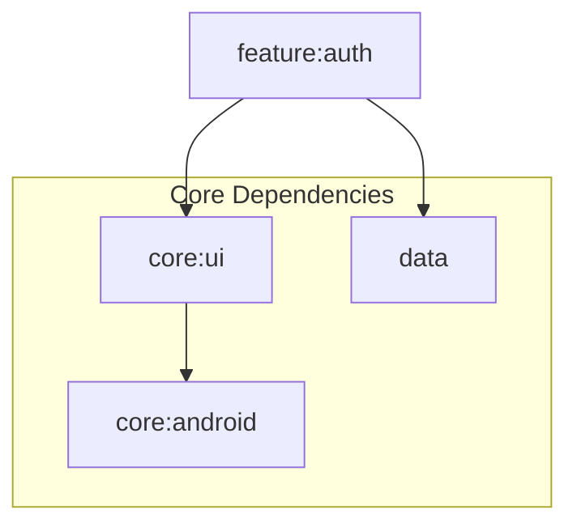

# Module :feature:auth

This module implements user authentication flows including email/password and Google Sign-In. It
provides a complete authentication UI with error handling and loading states.

## Features

- Email/Password Sign In
- Google Sign In
- Registration Flow
- Credential Management
- Form Validation
- Error Handling

## Dependencies Graph



## Usage

```kotlin
dependencies {
    implementation(project(":feature:auth"))
}
```

### Key Components

1. **SignInRoute**: Handles user sign-in

	```kotlin
	@Composable
	fun SignInRoute(
	   onSignUpClick: () -> Unit,
	   onShowSnackbar: suspend (String, SnackbarAction, Throwable?) -> Boolean,
	   signInViewModel: SignInViewModel = hiltViewModel(),
	)
	```

2. **SignUpRoute**: Handles user registration

	```kotlin
	@Composable
	fun SignUpRoute(
	   onSignInClick: () -> Unit,
	   onShowSnackbar: suspend (String, SnackbarAction, Throwable?) -> Boolean,
	   signUpViewModel: SignUpViewModel = hiltViewModel(),
	)
	```

## Related Documentation

- **[Adding a Feature Guide](../../docs/guide.md)** - Step-by-step template for creating new features
- **[State Management](../../docs/state-management.md)** - UiState pattern and ViewModel best practices
- **[Navigation Deep Dive](../../docs/navigation.md)** - Type-safe navigation implementation
- **[Firebase Authentication](../../firebase/auth/README.md)** - Firebase Auth wrapper used by this module