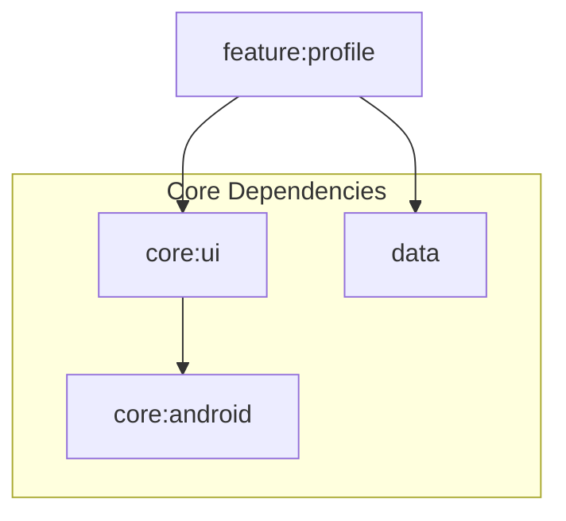

# Module :feature:profile

User profile management module with account details and preferences.

## Features

- Profile Information Display
- Avatar Management
- Account Settings
- User Stats
- Sign Out Flow

## Dependencies Graph



## Key Components

1. **Profile Screen**: Shows the user profile information

	```kotlin
	@Composable
	fun ProfileRoute(
	  onShowSnackbar: suspend (String, SnackbarAction, Throwable?) -> Boolean
	)
	```

## Related Documentation

- **[Adding a Feature Guide](../../docs/guide.md)** - Step-by-step template for creating new features
- **[State Management](../../docs/state-management.md)** - UiState pattern and ViewModel best practices
- **[Navigation Deep Dive](../../docs/navigation.md)** - Type-safe navigation implementation
- **[Firebase Authentication](../../firebase/auth/README.md)** - Authentication integration for sign-out flow