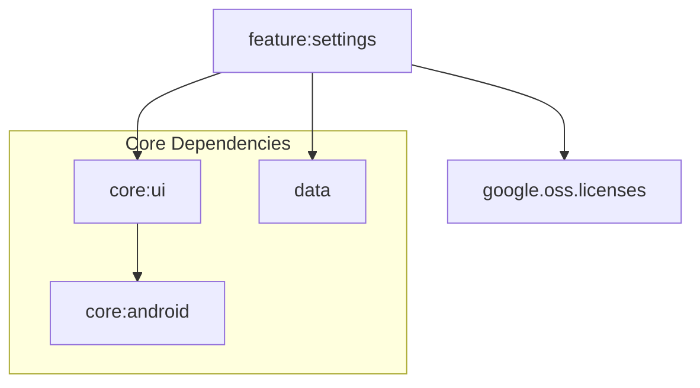

# Module :feature:settings

This module handles user preferences and app settings. It provides a UI for configuring app behavior
and managing user preferences.

## Features

- Theme Configuration (Light/Dark)
- Dynamic Color Toggle
- Open Source Licenses
- User Profile Settings
- Sign Out Option
- Preferences Persistence

## Dependencies Graph



## Usage

```kotlin
dependencies {
    implementation(project(":feature:settings"))
}
```

### Settings Dialog

```kotlin
@Composable
fun SettingsDialog(
    onDismiss: () -> Unit,
    onShowSnackbar: suspend (String, SnackbarAction, Throwable?) -> Boolean
)
```

### Key Features

1. **Theme Settings**:

	```kotlin
	@Composable
	fun ThemeSettings(
	   darkThemeConfig: DarkThemeConfig,
	   useDynamicColor: Boolean,
	   onDarkThemeConfigChange: (DarkThemeConfig) -> Unit,
	   onUseDynamicColorChange: (Boolean) -> Unit
	)
	```

2. **Profile Settings**:

	```kotlin
	@Composable
	fun ProfileSettings(
	   onSignOut: () -> Unit,
	   onShowLicenses: () -> Unit
	)
	```

The module uses DataStore Preferences for persistent storage of user settings.

## Related Documentation

- **[Adding a Feature Guide](../../docs/guide.md)** - Step-by-step template for creating new features
- **[State Management](../../docs/state-management.md)** - UiState pattern and ViewModel best practices
- **[Core Preferences](../../core/preferences/README.md)** - DataStore implementation for settings persistence