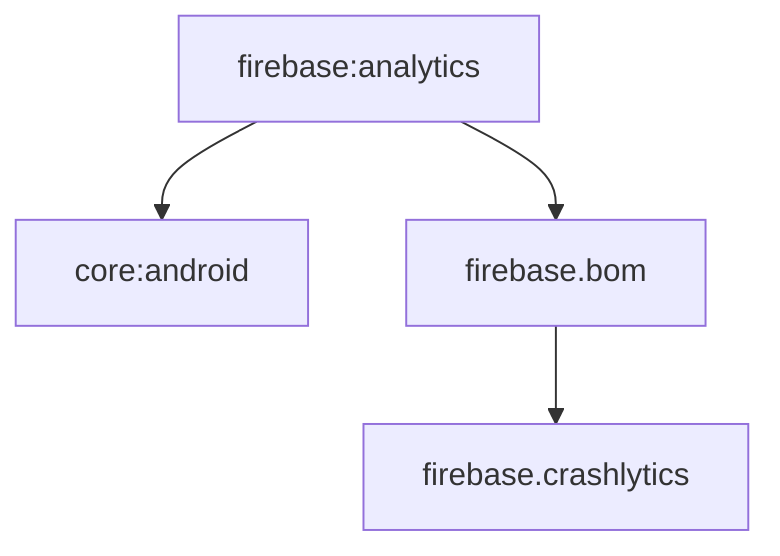

# Module :firebase:analytics

This module handles crash reporting through Firebase Crashlytics. It provides a centralized way
to track app crashes and report exceptions.

> [!NOTE]
> Despite the module name `firebase:analytics`, this module provides **Crashlytics** (crash reporting),
> not Firebase Analytics (event tracking). Firebase Analytics is not included in this template.

## Features

- Crash Reporting
- Error Tracking
- Exception Handling
- Custom Error Reports

## Dependencies Graph



## Usage

```kotlin
dependencies {
    implementation(project(":firebase:analytics"))
}
```

### Error Reporting

```kotlin
class YourClass @Inject constructor(
    private val crashReporter: CrashReporter
) {
    fun handleError(error: Throwable) {
        crashReporter.reportException(error)
    }
}
```

The module integrates with the app's error handling system to automatically report uncaught
exceptions to Firebase Crashlytics.

## Setup

> [!NOTE]
> For Firebase setup instructions, including enabling Crashlytics in the Firebase Console, see the [Firebase Setup Guide](../../docs/firebase.md).

## Related Documentation

- **[Firebase Setup Guide](../../docs/firebase.md)** - Complete Firebase Console and local project setup
- **[Troubleshooting Guide](../../docs/troubleshooting.md)** - Firebase Crashlytics issues and solutions
- **[Firebase Crashlytics Docs](https://firebase.google.com/docs/crashlytics)** - Official Firebase Crashlytics documentation