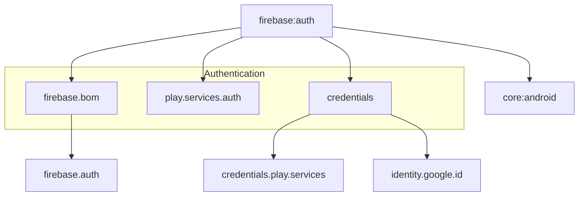

# Module :firebase:auth

This module handles user authentication using Firebase Authentication. It supports multiple sign-in
methods and integrates with Google's Identity Services.

## Features

- Email/Password Authentication
- Google Sign-In
- Credential Management
- Token Handling
- Session Management
- Identity Services Integration

## Dependencies Graph



## Usage

```kotlin
dependencies {
    implementation(project(":firebase:auth"))
}
```

### Authentication Operations

```kotlin
class AuthDataSource @Inject constructor(
    private val firebaseAuth: FirebaseAuth,
    private val credentialManager: CredentialManager
) {
    suspend fun signInWithGoogle(activity: Activity): AuthUser {
        // Google Sign-In implementation
    }

    suspend fun signInWithEmailPassword(
        email: String,
        password: String
    ): AuthUser {
        // Email/Password Sign-In implementation
    }
}
```

### Credential Management

The module uses Android's Credential Manager API for secure credential storage and retrieval.

## Setup

> [!NOTE]
> For Firebase Authentication setup instructions, including enabling Google Sign-In and Email/Password authentication in the Firebase Console, see the [Firebase Setup Guide](../../docs/firebase.md).

## Related Documentation

- **[Firebase Setup Guide](../../docs/firebase.md)** - Complete Firebase Console and local project setup
- **[Troubleshooting Guide](../../docs/troubleshooting.md)** - Firebase authentication issues and solutions