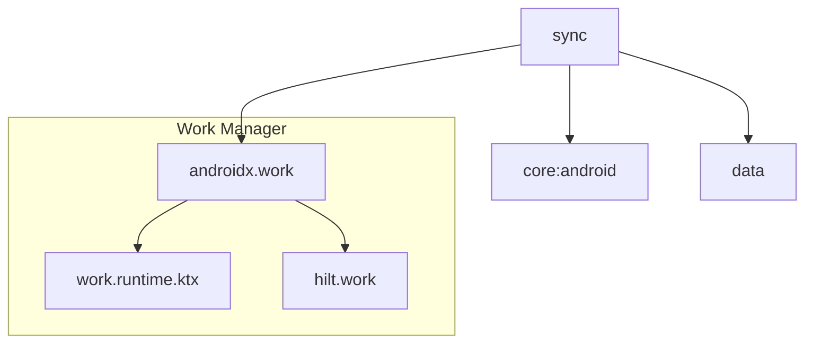

# Module :sync

This module handles background data synchronization using WorkManager. It ensures data consistency
between local and remote data sources by performing periodic and on-demand sync operations.

## Features

- Background Synchronization
- Periodic Sync Scheduling
- Work Constraints Management
- Progress Tracking
- Error Handling
- Hilt Worker Integration

## Dependencies Graph



## Usage

```kotlin
dependencies {
    implementation(project(":sync"))
}
```

### Setting Up Sync

1. Make your repository syncable:

	```kotlin
	interface YourRepository : Syncable {
	    override suspend fun sync(): Flow<SyncProgress>
	}
	```

2. Create sync worker:

	```kotlin
	@HiltWorker
	class SyncWorker @AssistedInject constructor(
	    @Assisted context: Context,
	    @Assisted params: WorkerParameters,
	    private val repository: YourRepository
	) : CoroutineWorker(context, params) {
	    override suspend fun doWork(): Result {
	        repository.sync()
	            .collect { progress ->
	                setProgress(progress.toWorkData())
	            }
	        return Result.success()
	    }
	}
	```

3. Request sync operation:

	```kotlin
	class YourRepositoryImpl @Inject constructor(
	    private val syncManager: SyncManager
	) : YourRepository {
	    fun requestSync() {
	        syncManager.requestSync()
	    }
	}
	```

### Work Constraints

The sync operation respects the following constraints:

- Network availability
- Battery not low
- Storage not low
- Device idle (for periodic sync)

### Progress Tracking

```kotlin
data class SyncProgress(
    val total: Int = 0,
    val current: Int = 0,
    val message: String? = null
)
```

The sync progress can be observed from the WorkManager's progress updates.

## Troubleshooting

This section covers common sync issues and their solutions. For general troubleshooting, see [Troubleshooting Guide](../docs/troubleshooting.md).

### Sync Not Running

**Symptom**: `isSyncing` never emits `true`, pull-to-refresh doesn't trigger sync

**Common Causes**:

1. **Network constraint not met**

	```kotlin
	// Check logcat for:
	// "Work [...] not run because constraints not met"
	```

	**Solution**: Ensure device has active network connection. The sync requires `NetworkType.CONNECTED`.

2. **WorkManager not initialized**

	**Solution**: Verify `Sync.initialize(context)` is called in `App.onCreate()`:

	```kotlin
	// In app/src/main/kotlin/dev/atick/jetpack/App.kt
	override fun onCreate() {
	    super.onCreate()
	    Sync.initialize(this) // Must be called here
	}
	```

3. **Sync already running** (duplicate request ignored)

	```kotlin
	// Check logcat for:
	// "Requesting sync"
	// WorkManager will KEEP existing work if already enqueued
	```

	**Solution**: This is expected behavior. Wait for current sync to complete.

### Sync Failing Repeatedly

**Symptom**: Sync fails after 3 retry attempts, error in logcat

**Common Causes**:

1. **Network errors during sync**

	```kotlin
	// Check logcat for:
	// "Error syncing, retrying (1/3)" or "Error syncing" with stack trace
	```

	**Solution**: Check repository's `sync()` implementation for proper error handling:

	```kotlin
	override suspend fun sync(): Flow<SyncProgress> = flow {
	    try {
	        // Pull from remote
	        val remoteData = networkDataSource.getData()
	        localDataSource.save(remoteData)

	        // Push to remote
	        val localChanges = localDataSource.getPendingChanges()
	        networkDataSource.sync(localChanges)

	        emit(SyncProgress(total = 100, current = 100))
	    } catch (e: Exception) {
	        // Don't swallow exceptions - let SyncWorker handle retries
	        throw e
	    }
	}
	```

2. **Firestore permission denied**

	**Solution**: Check Firestore security rules. See [Firebase Setup Guide](../docs/firebase.md#firestore-security-rules).

3. **Repository not implementing `Syncable`**

	**Solution**: Ensure repository extends `Syncable` interface:

	```kotlin
	interface YourRepository : Syncable {
	    override suspend fun sync(): Flow<SyncProgress>
	}
	```

### Sync Notification Not Showing

**Symptom**: Sync runs but no foreground notification appears (Android 12+)

**Common Causes**:

1. **Notification permission not granted** (Android 13+)

	**Solution**: Request notification permission in your app:

	```kotlin
	// In your activity/screen
	val permissionLauncher = rememberLauncherForActivityResult(
	    ActivityResultContracts.RequestPermission()
	) { isGranted -> /* handle result */ }

	LaunchedEffect(Unit) {
	    if (Build.VERSION.SDK_INT >= Build.VERSION_CODES.TIRAMISU) {
	        permissionLauncher.launch(Manifest.permission.POST_NOTIFICATIONS)
	    }
	}
	```

2. **Foreground service type not declared** (Android 14+)

	**Solution**: Add foreground service declaration to `AndroidManifest.xml`:

	```xml
	<service
	    android:name="androidx.work.impl.foreground.SystemForegroundService"
	    android:foregroundServiceType="dataSync"
	    tools:node="merge" />
	```

### WorkManager Constraints Not Respected

**Symptom**: Sync runs even when battery is low or device is not idle

**Solution**: Customize `SyncConstraints` in `SyncWorker.kt`:

```kotlin
val SyncConstraints = Constraints.Builder()
    .setRequiredNetworkType(NetworkType.UNMETERED) // WiFi only
    .setRequiresBatteryNotLow(true)                 // Battery not low
    .setRequiresStorageNotLow(true)                 // Storage not low
    .setRequiresDeviceIdle(true)                    // Device idle (API 23+)
    .build()
```

> [!IMPORTANT]
> Adding strict constraints may delay sync significantly. `UNMETERED` network requirement means sync will only run on WiFi.

### Sync Conflict Resolution

**Symptom**: Local changes are overwritten by remote data during sync

**Solution**: Implement conflict resolution strategy in repository:

```kotlin
override suspend fun sync(): Flow<SyncProgress> = flow {
    // 1. Pull remote changes
    val remoteItems = networkDataSource.getItems()

    // 2. Get local changes (not yet synced)
    val localChanges = localDataSource.getPendingChanges()

    // 3. Resolve conflicts (choose strategy)
    val resolvedItems = remoteItems.map { remoteItem ->
        val localChange = localChanges.find { it.id == remoteItem.id }
        when {
            localChange == null -> remoteItem // No conflict
            localChange.updatedAt > remoteItem.updatedAt -> localChange // Local wins
            else -> remoteItem // Remote wins
        }
    }

    // 4. Save resolved data locally
    localDataSource.saveAll(resolvedItems)

    // 5. Push local-only items (new items created offline)
    val localOnlyItems = localChanges.filter { local ->
        remoteItems.none { it.id == local.id }
    }
    networkDataSource.createItems(localOnlyItems)

    emit(SyncProgress(total = 1, current = 1))
}
```

> [!TIP]
> Common conflict resolution strategies:
> - **Last Write Wins**: Compare `updatedAt` timestamps
> - **Server Wins**: Always prefer remote data (simplest)
> - **Client Wins**: Always prefer local data (for offline-first apps)
> - **Manual Resolution**: Prompt user to choose (complex, better UX)

### Debugging Sync Issues

Use Timber logging to trace sync execution:

```kotlin
// In your repository's sync() method
override suspend fun sync(): Flow<SyncProgress> = flow {
    Timber.d("Sync started")
    emit(SyncProgress(total = 100, current = 0, message = "Pulling remote data..."))

    try {
        val remoteData = networkDataSource.getData()
        Timber.d("Pulled ${remoteData.size} items from remote")
        emit(SyncProgress(total = 100, current = 50, message = "Saving locally..."))

        localDataSource.save(remoteData)
        Timber.d("Saved to local database")
        emit(SyncProgress(total = 100, current = 100, message = "Sync complete"))
    } catch (e: Exception) {
        Timber.e(e, "Sync failed")
        throw e // Let SyncWorker handle retries
    }
}
```

**Check WorkManager state** via ADB:

```bash
# Dump all WorkManager jobs
adb shell dumpsys jobscheduler | grep -A 20 "androidx.work"

# View WorkManager database
adb exec-out run-as dev.atick.jetpack sqlite3 /data/data/dev.atick.jetpack/databases/androidx.work.workdb "SELECT * FROM WorkSpec;"
```

### Related Documentation

- **[Troubleshooting Guide](../docs/troubleshooting.md)** - General troubleshooting patterns
- **[Firebase Setup](../docs/firebase.md)** - Firestore setup and security rules
- **[Data Repository Patterns](../data/README.md)** - Repository implementation patterns
- **[WorkManager Documentation](https://developer.android.com/topic/libraries/architecture/workmanager)** - Official Android WorkManager guide

### Implementation Reference

- **SyncWorker**: `sync/src/main/kotlin/dev/atick/sync/worker/SyncWorker.kt`
- **SyncManager**: `sync/src/main/kotlin/dev/atick/sync/SyncManager.kt`